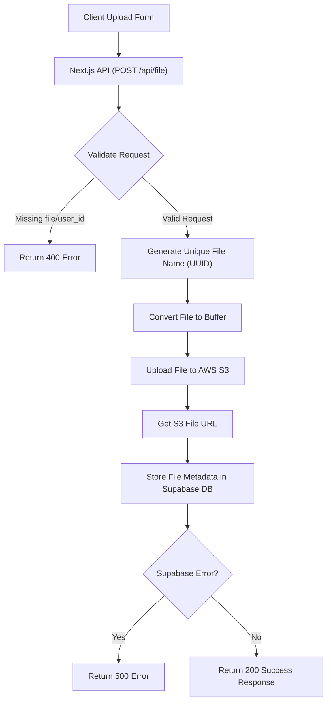

 # File Storage and Operations

This document details the core mechanisms for handling file uploads, secure storage, efficient retrieval, and comprehensive management within the application. It covers the server-side logic for interacting with cloud storage and databases, as well as the client-side pages responsible for displaying and managing user-uploaded files.

## Core Components

The file storage and operations system relies on several key technologies:

*   **AWS S3**: For scalable and secure object storage of actual file binaries.
*   **Supabase**: As the PostgreSQL database to store metadata about the uploaded files (e.g., file name, URL, user ID, type, size, S3 key).
*   **Next.js API Routes**: To expose endpoints for file upload and deletion.
*   **Redis**: For caching and tracking file analytics (views, downloads, last access).
*   **KindeAuth**: For user authentication and authorization to ensure only authenticated users can manage their files.

## File Upload Process

The file upload process is managed by a Next.js API route, `src/app/api/file/route.js`, which handles incoming file data, stores it in AWS S3, and records its metadata in Supabase.

### 1. File Upload Endpoint (`POST /api/file`)

The `POST` handler in `src/app/api/file/route.js` is responsible for receiving file uploads. It parses form data, generates a unique file name, uploads the file to S3, and then saves the file's metadata to the Supabase `files` table.

```javascript filename="src/app/api/file/route.js" {17-37}
// ...
export async function POST(req) {
  try {
    const formData = await req.formData();
    const file = formData.get("file");
    const userId = formData.get("user_id");
    const orignal_file_name = formData.get("file_name") // 👈 pass user id along with form-data

    if (!file || !userId) {
      return NextResponse.json({ error: "File and user_id required" }, { status: 400 });
    }

    const fileExt = file.name.split(".").pop();
    const fileName = `${uuidv4()}.${fileExt}`;

    const arrayBuffer = await file.arrayBuffer();
    const buffer = Buffer.from(arrayBuffer);

    await s3.send(
      new PutObjectCommand({
        Bucket: process.env.AWS_S3_BUCKET,
        Key: fileName,
        Body: buffer,
        ContentType: file.type,
      })
    );

    const fileUrl = `https://${process.env.AWS_S3_BUCKET}.s3.${process.env.AWS_REGION}.amazonaws.com/${fileName}`;
    const { data, error } = await supabase
      .from("files")
      .insert([{
        user_id: userId,
        file_name: orignal_file_name,
        file_key: fileName,
        file_url: fileUrl,
        file_type: file.type,
        file_size: file.size,
      }])
      .select();

    if (error) throw error;
    return NextResponse.json({
      message: "File uploaded successfully",
      file: data[0],
    });
  } catch (err) {
    console.error(err);
    return NextResponse.json({ error: err.message }, { status: 500 });
  }
}
// ...
```
The `s3` client configuration uses environment variables for AWS credentials and region, ensuring secure access to S3 buckets. This is defined in `src/lib/s3.js`.
[View on GitHub](https://github.com/sumedhcharjan/Track-Vault/blob/main/src/app/api/file/route.js)

```javascript filename="src/lib/s3.js"
import { S3Client } from "@aws-sdk/client-s3";

export const s3 = new S3Client({
  region: process.env.AWS_REGION,
  credentials: {
    accessKeyId: process.env.AWS_ACCESS_KEY_ID,
    secretAccessKey: process.env.AWS_SECRET_ACCESS_KEY,
  },
});
```
[View on GitHub](https://github.com/sumedhcharjan/Track-Vault/blob/main/src/lib/s3.js)

### File Upload Flow





## File Deletion Process

File deletion also occurs via the `DELETE` handler in the same `src/app/api/file/route.js` API route. This ensures both the S3 object and its corresponding metadata in Supabase are removed.

### 2. File Deletion Endpoint (`DELETE /api/file`)

The `DELETE` handler receives `file_id` and `file_key`. It first deletes the object from S3 using the `file_key` and then removes the corresponding entry from the Supabase `files` table using the `file_id`.

```javascript filename="src/app/api/file/route.js" {47-66}
// ...
export async function DELETE(req) {
  try {
    const { file_id, file_key } = await req.json();

    if (!file_id) {
      return NextResponse.json({ error: "file_id required" }, { status: 400 });
    }

    // 2. Delete from S3
    await s3.send(
      new DeleteObjectCommand({
        Bucket: process.env.AWS_S3_BUCKET,
        Key: file_key,
      })
    );

    // 3. Delete from Supabase DB
    await supabase.from("files").delete().eq("id", file_id);

    // 4. Return success
    return NextResponse.json({ message: "File deleted", file_id }, { status: 200 });

  } catch (err) {
    console.error(err);
    return NextResponse.json({ error: err.message }, { status: 500 });
  }
}
```
[View on GitHub](https://github.com/sumedhcharjan/Track-Vault/blob/main/src/app/api/file/route.js)

## File Retrieval and Management Pages

The application provides dedicated pages for users to view and manage their uploaded files, including individual file analytics and a list of all uploaded files.

### 1. All Uploaded Files Page (`src/app/uploadedfiles/page.jsx`)

This page displays a list of all files uploaded by the authenticated user. It fetches file metadata from Supabase and categorizes them into "Active Files" and "Inactive Files" using a tabbed interface.

```javascript filename="src/app/uploadedfiles/page.jsx" {22-30}
// ...
export default async function Uploadedfiles() {
  const { getUser } = getKindeServerSession();
  const user = await getUser();

  if (!user) {
    return ( /* ... login required message ... */ );
  }

  const { data: files, error } = await supabase
    .from("files")
    .select("*")
    .eq("user_id", user.id)
    .order("created_at", { ascending: false });

  if (error) {
    console.error("Error loading files", error);
    return ( /* ... error message ... */ );
  }

  if (!files || files.length === 0) {
    return ( /* ... no files message ... */ );
  }

  const activeFiles = files.filter((file) => file.is_active);
  const inactiveFiles = files.filter((file) => !file.is_active);

  return (
    <main className="container mx-auto px-4 mt-25 mb-5">
      {/* ... FlickeringGrid background ... */}
      <div className="flex flex-col items-center text-center space-y-4 mb-8">
        <h1 className="text-4xl font-bold tracking-tight">Your Files</h1>
        <p className="text-lg text-gray-500">
          Manage and track your uploaded files
        </p>
      </div>

      <Tabs defaultValue="active" className="w-full">
        <TabsList className="grid w-full max-w-md mx-auto grid-cols-2 mb-8">
          <TabsTrigger value="active">Active Files</TabsTrigger>
          <TabsTrigger value="inactive">Inactive Files</TabsTrigger>
        </TabsList>

        <TabsContent value="active">
          <Card className="p-6 backdrop-blur-lg ">
            {activeFiles.length > 0 ? (
              <div className="grid grid-cols-1 sm:grid-cols-2 lg:grid-cols-3 xl:grid-cols-4 gap-6 auto-rows-fr">
                {activeFiles.map((file) => (
                  <FileCard key={file.id} file={file} />
                ))}
              </div>
            ) : (
              <p className="text-center text-gray-500 py-8">No active files.</p>
            )}
          </Card>
        </TabsContent>

        <TabsContent value="inactive">
          <Card className="p-6 ">
            {inactiveFiles.length > 0 ? (
              <div className="grid grid-cols-1 sm:grid-cols-2 lg:grid-cols-3 xl:grid-cols-4 gap-6 auto-rows-fr">
                {inactiveFiles.map((file) => (
                  <InactiveFileCard key={file.id} file={file} />
                ))}
              </div>
            ) : (
              <p className="text-center py-8 ">No inactive files.</p>
            )}
          </Card>
        </TabsContent>
      </Tabs>
    </main>
  );
}
```
[View on GitHub](https://github.com/sumedhcharjan/Track-Vault/blob/main/src/app/uploadedfiles/page.jsx)

### 2. Individual File Analytics Page (`src/app/uploadedfiles/[id]/page.jsx`)

This dynamic page (`[id]`) provides detailed analytics and management options for a specific file. It fetches file data from Supabase and analytics data (views, downloads, last access) from Redis.

```javascript filename="src/app/uploadedfiles/[id]/page.jsx" {20-25,27-32}
// ...
export default async function FileAnalyticsPage({ params }) {
  const { id } = await params;
  const { getUser } = getKindeServerSession();
  const user = await getUser();

  if (!user) {
    redirect("/api/auth/login");
  }

  const { data: file, error } = await supabase
    .from("files")
    .select("*")
    .eq("id", id)
    .single();

  if (error) {
    console.error("Supabase error:", error);
    redirect("/uploadedfiles");
  }

  if (!file || file.user_id !== user.id) {
    redirect("/uploadedfiles");
  }

  const [views, downloads, lastAccess] = await Promise.all([
    redis.get(`file:${id}:views`),
    redis.get(`file:${id}:downloads`),
    redis.get(`file:${id}:lastAccess`),
  ]);

  return (
    <main className="relative container mx-auto px-4 pb-10 mt-25 min-h-screen">
      {/* ... FlickeringGrid background ... */}
      <div className="flex flex-col items-center text-center space-y-4 mb-8">
        <h1 className="text-4xl font-bold tracking-tight">{file.file_name}</h1>
        <p className="text-lg text-gray-500">File Analytics and Management</p>
      </div>

      <Card className="mb-8">
        <div className="grid grid-cols-1 md:grid-cols-2 gap-8 p-6">
          <div className="bg-gray-50 rounded-lg p-6 flex items-center justify-center min-h-[300px]">
            <Preview file={file} />
          </div>

          <div className="space-y-6">
            <div className="pb-4 border-b">
              <h2 className="text-2xl font-semibold mb-2">Analytics Overview</h2>
              <p className="text-sm text-gray-500">
                Track your file&apos;s performance and usage
              </p>
            </div>
            <Analytics
              views={Number(views) || 0}
              downloads={Number(downloads) || 0}
              lastAccess={lastAccess}
              file={file}
            />
          </div>
        </div>
      </Card>

      <Card className="p-6">
        <div className="pb-4 border-b">
          <h2 className="text-2xl font-semibold mb-2">Manage Settings</h2>
          <p className="text-sm text-gray-500">
            Configure and update your file settings
          </p>
        </div>
        <Editanalytics file={file} />
      </Card>
    </main>
  );
}
```
[View on GitHub](https://github.com/sumedhcharjan/Track-Vault/blob/main/src/app/uploadedfiles/[id]/page.jsx)

## Key Integration Points

*   **Authentication**: KindeAuth is used on all file-related pages and API routes to ensure that only authenticated users can upload, view, or delete their own files. This is enforced by `getUser()` calls and redirects.
*   **Data Consistency**: The API route for file deletion explicitly removes data from both AWS S3 and Supabase, maintaining data integrity across storage and database layers.
*   **Scalability**: Utilizing AWS S3 for binary storage offloads significant load from the application server and Supabase, allowing for high scalability of file storage.
*   **Performance**: Redis is integrated to serve real-time analytics data (views, downloads) quickly, reducing database queries for frequently accessed statistics.
*   **File Preview**: The `Preview` component on the individual file analytics page intelligently renders different file types (images, videos, documents) directly in the browser, enhancing user experience.

This robust system ensures secure, scalable, and manageable file operations, providing users with full control over their uploaded content.

Next: [Frontend Architecture and Pages](./3_frontend-architecture-pages.mdx)