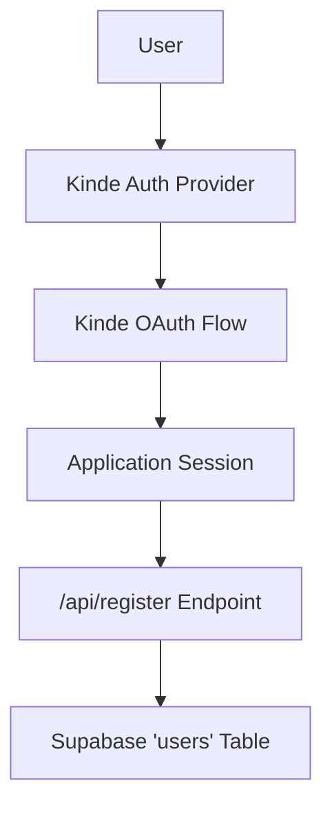

# Authentication and Authorization

Track-Vault implements a hybrid authentication and user management system utilizing **Kinde** for Identity as a Service (IDaaS) and **Supabase** for persistent user profile storage.

## Architecture Overview

The authentication flow is decoupled into two primary phases: identity verification via Kinde and user profile synchronization via a custom registration endpoint.



## Client-Side Integration

The application uses a dedicated `Providers` wrapper to inject the Kinde authentication context into the React component tree. This allows any client component to access authentication states and helper methods.

### Provider Implementation
The `KindeProvider` is configured using environment variables to ensure security across different deployment environments.

```jsx
// src/components/Provider.jsx
"use client";
import { KindeProvider } from "@kinde-oss/kinde-auth-nextjs";

export function Providers({ children }) {
  return (
    <KindeProvider
      clientId={process.env.NEXT_PUBLIC_KINDE_CLIENT_ID}
      domain={process.env.NEXT_PUBLIC_KINDE_DOMAIN}
      redirectUri={process.env.NEXT_PUBLIC_KINDE_REDIRECT_URI}
      logoutUri={process.env.NEXT_PUBLIC_KINDE_LOGOUT_URI}
    >
      {children}
    </KindeProvider>
  );
}
```

## Authentication Routes

The application leverages Next.js App Router dynamic segments to handle Kinde's OAuth callbacks and authentication requests.

### Auth Handler
The route `src/app/api/auth/[kindeAuth]/route.js` acts as the entry point for all Kinde-related authentication actions (login, logout, callback).

```javascript
import { handleAuth } from "@kinde-oss/kinde-auth-nextjs/server";

export const GET = handleAuth();
```

## User Registration and Persistence

While Kinde manages the authentication session, Track-Vault maintains a local copy of user metadata in Supabase to facilitate relational data mapping within the application.

### Registration Workflow
When a user is authenticated, the application calls the `/api/register` endpoint to synchronize the Kinde profile with the Supabase database.

**Key Logic:**
- **Session Validation:** Uses `getKindeServerSession()` to verify the current user.
- **Idempotent Upsert:** Uses Supabase `.upsert()` on the `email` column to prevent duplicate records while keeping user data current.
- **Data Mapping:** Maps Kinde's `given_name` and `family_name` to a single `name` field.

```javascript
// src/app/api/register/route.js
export async function POST() {
  const { getUser } = getKindeServerSession();
  const user = await getUser();

  if (user) {
    const { data, error } = await supabase
      .from("users")
      .upsert({
        email: user.email,
        name: user.given_name + " " + user.family_name,
        auth_user_id: user.id
      }, { onConflict: "email" });
      
    // Error handling and logging...
  }

  return NextResponse.json(user);
}
```

## Required Environment Variables

To configure the authentication layer, the following variables must be defined in the `.env` file:

| Variable | Description |
| :--- | :--- |
| `NEXT_PUBLIC_KINDE_CLIENT_ID` | The unique identifier for your Kinde application. |
| `NEXT_PUBLIC_KINDE_DOMAIN` | Your Kinde subdomain (e.g., `your-app.kinde.com`). |
| `NEXT_PUBLIC_KINDE_REDIRECT_URI` | The URL Kinde redirects to after successful login. |
| `NEXT_PUBLIC_KINDE_LOGOUT_URI` | The URL Kinde redirects to after logout. |