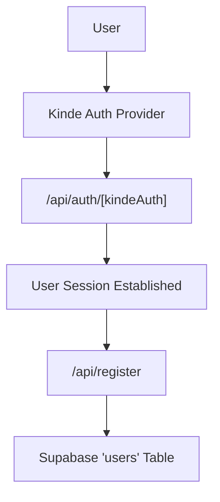

# Authentication and User Access

Track-Vault implements a decoupled authentication and user management strategy, leveraging **Kinde** for identity provider (IdP) services and **Supabase** for persistent user profile storage.

## Overview

The authentication flow is designed to ensure that identity verification is handled by a secure third-party provider while allowing the application to maintain a local reference to users for relational data integrity within the database.

## Authentication Flow

The application uses the Kinde Next.js SDK to manage sessions and OAuth flows.



## Technical Implementation

### 1. Identity Provider Integration
The authentication entry point is handled via a dynamic route that delegates all OAuth handshakes to the Kinde server-side handler.

**Route:** `src/app/api/auth/[kindeAuth]/route.js`
```javascript
import { handleAuth } from "@kinde-oss/kinde-auth-nextjs/server";

export const GET = handleAuth();
```

To enable authentication across the client-side application, the `KindeProvider` wraps the root layout, utilizing environment variables for configuration:

- `NEXT_PUBLIC_KINDE_CLIENT_ID`: The unique identifier for the Kinde application.
- `NEXT_PUBLIC_KINDE_DOMAIN`: The Kinde tenant domain.
- `NEXT_PUBLIC_KINDE_REDIRECT_URI`: The callback URL after successful login.
- `NEXT_PUBLIC_KINDE_LOGOUT_URI`: The redirect URL after logout.

### 2. User Registration and Synchronization
Once a user is authenticated via Kinde, the application synchronizes the identity data with the Supabase database. This is handled by a dedicated registration endpoint.

**Endpoint:** `POST /api/register`

The registration process follows these steps:
1. **Session Validation**: The server retrieves the current session using `getKindeServerSession()`.
2. **Identity Extraction**: The user's `email`, `given_name`, `family_name`, and `id` are extracted from the Kinde profile.
3. **Database Upsert**: The application performs an `upsert` operation on the `users` table in Supabase.

```javascript
const { data, error } = await supabase
  .from("users")
  .upsert({
    email: user.email,
    name: user.given_name + " " + user.family_name,
    auth_user_id: user.id
  }, { onConflict: "email" });
```

The `onConflict: "email"` constraint ensures that users are not duplicated if they log in multiple times, effectively treating the registration endpoint as a "sync" mechanism.

## Summary of Access Control

| Component | Responsibility | Technology |
| :--- | :--- | :--- |
| **Authentication** | JWT issuance, OAuth, Session management | Kinde |
| **User Storage** | Profile persistence, relational mapping | Supabase |
| **Client Wrapper** | Context provider for auth state | React Context / KindeProvider |
| **Sync Logic** | Mapping Kinde ID to Internal User ID | Next.js Route Handler |