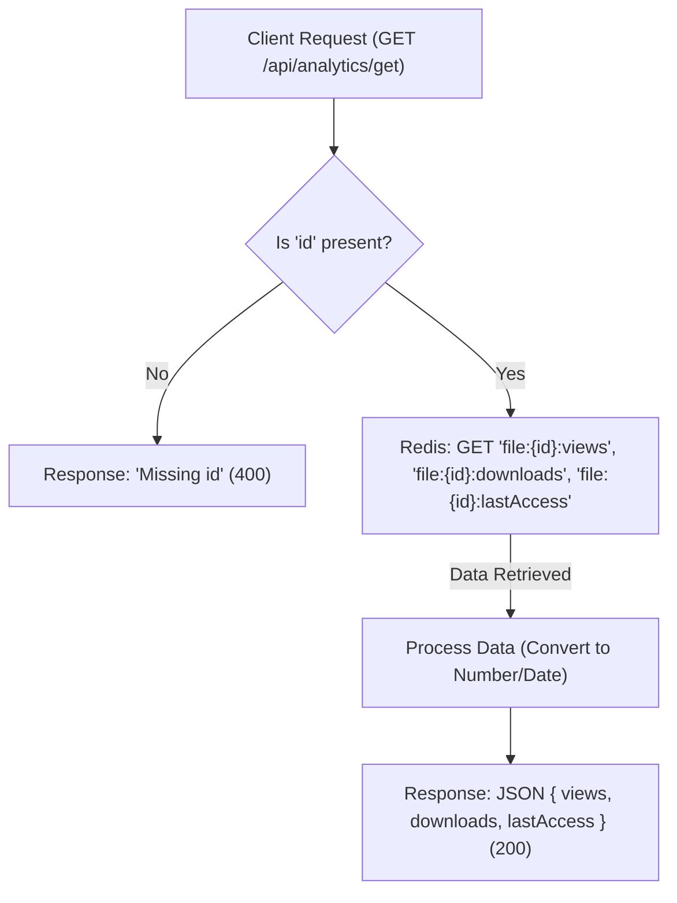
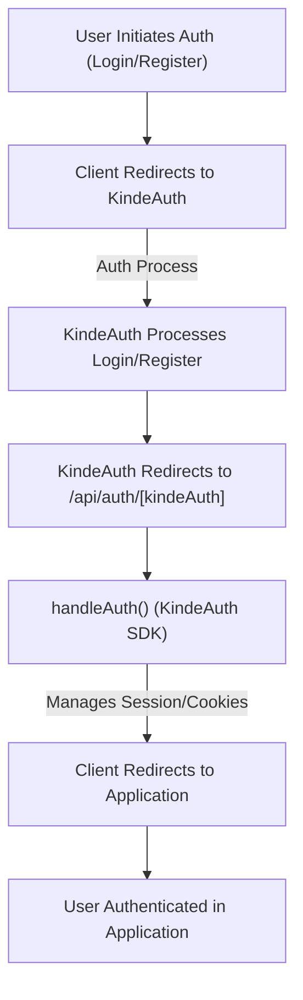

 # Backend Services and APIs

This section provides a detailed overview of the core backend API endpoints responsible for managing file analytics, authentication, and file operations within the application. These services facilitate crucial data interactions, ensuring seamless user experience and robust data handling.

## Analytics Endpoints

The analytics endpoints are crucial for tracking user interactions with uploaded files, such as views and downloads, and for setting access control policies.

### File Analytics Retrieval (`GET /api/analytics/get`)

This endpoint is responsible for retrieving real-time analytics data for a specific file. It leverages Redis for quick access to frequently updated metrics.

**Purpose:** To fetch the current view count, download count, and the timestamp of the last access for a given file ID.

**Request:**

```http
GET /api/analytics/get?id={file_id}
```

**Response (Success - 200 OK):**

```json
{
  "views": 123,
  "downloads": 45,
  "lastAccess": "2023-10-27T10:30:00.000Z"
}
```

**Response (Error - 400 Bad Request):**

```json
"Missing id"
```

**Implementation Details:**

The `GET` handler retrieves analytics data from Redis based on the provided `id`. It queries keys like `file:{id}:views`, `file:{id}:downloads`, and `file:{id}:lastAccess`.

```javascript
// src/app/api/analytics/get/route.js
import { redis } from "@/lib/redis";

export async function GET(req) {
  const { searchParams } = new URL(req.url);
  const id = searchParams.get("id");

  if (!id) {
    return new Response("Missing id", { status: 400 });
  }

  const [views, downloads, lastAccess] = await Promise.all([
    redis.get(`file:${id}:views`),
    redis.get(`file:${id}:downloads`),
    redis.get(`file:${id}:lastAccess`),
  ]);

  return Response.json({
    views: Number(views || 0),
    downloads: Number(downloads || 0),
    lastAccess: lastAccess ? new Date(Number(lastAccess)).toISOString() : null,
  });
}
```
[View on GitHub](https://github.com/sumedhcharjan/Track-Vault/blob/main/src/app/api/analytics/get/route.js)

### File Access Control Setting (`POST /api/analytics/set`)

This endpoint allows for updating various access control parameters for files, such as view/download limits, expiration dates, and password protection.

**Purpose:** To set or update access control features for a specific file, ensuring data security and controlled sharing.

**Request:**

```http
POST /api/analytics/set
Content-Type: application/json

{
  "file_id": "uuid-of-file",
  "maxViews": 100,
  "maxDownloads": 50,
  "expiresAt": "2024-12-31T23:59:59Z",
  "password": "securepassword",
  "deleteOnExpire": true,
  "deleteOnLimit": false
}
```

**Response (Success - 200 OK):**

```json
{
  "success": true,
  "message": "Access controls updated"
}
```

**Response (Error - 500 Internal Server Error):**

```json
{
  "success": false,
  "error": "Error message"
}
```

**Implementation Details:**

The `POST` handler receives a JSON payload containing `file_id` and various access control parameters. It then uses Supabase to update the corresponding file entry in the database.

```javascript
// src/app/api/analytics/set/route.js
import { supabase } from "@/lib/supabase";
import { NextResponse } from "next/server";

export async function POST(req) {
  try {
    const data = await req.json();
    const {
      file_id,
      maxViews,
      maxDownloads,
      expiresAt,
      password,
      deleteOnExpire,
      deleteOnLimit,
    } = data;

    const updateData = {};
    // ... (logic to populate updateData based on provided fields) ...

    const { error } = await supabase
      .from("files")
      .update(updateData)
      .eq("id", file_id);

    if (error) throw error;

    return NextResponse.json({
      success: true,
      message: "Access controls updated",
    });
  } catch (err) {
    console.error("Error in POST:", err);
    return NextResponse.json(
      { success: false, error: err.message },
      { status: 500 }
    );
  }
}
```
[View on GitHub](https://github.com/sumedhcharjan/Track-Vault/blob/main/src/app/api/analytics/set/route.js)

### Analytics Data Flow





## Authentication Endpoint

User authentication is handled by KindeAuth, providing a robust and secure way to manage user sessions.

### KindeAuth Callback (`GET /api/auth/[kindeAuth]`)

This endpoint is the universal callback handler for all KindeAuth-related authentication flows.

**Purpose:** To manage KindeAuth redirects, login, logout, and registration processes seamlessly.

**Request:**

```http
GET /api/auth/{action}
```
(where `{action}` could be `login`, `register`, `callback`, `logout`, etc., handled internally by KindeAuth SDK)

**Implementation Details:**

The `handleAuth` function from `@kinde-oss/kinde-auth-nextjs/server` takes care of all incoming authentication requests, abstracting away the complexities of OAuth 2.0 and OIDC.

```javascript
// src/app/api/auth/[kindeAuth]/route.js
import {handleAuth} from "@kinde-oss/kinde-auth-nextjs/server";

export const GET = handleAuth();
```
[View on GitHub](https://github.com/sumedhcharjan/Track-Vault/blob/main/src/app/api/auth/[kindeAuth]/route.js)

### Authentication Flow





## File Management Endpoints

These endpoints provide the core functionality for uploading and deleting files, integrating with both S3 for storage and Supabase for metadata management.

### File Upload (`POST /api/file`)

This endpoint facilitates the secure upload of files to an S3 bucket and records their metadata in Supabase.

**Purpose:** To allow users to upload files, generate unique identifiers, store them in cloud storage, and keep a record in the database.

**Request:**

```http
POST /api/file
Content-Type: multipart/form-data

--boundary
Content-Disposition: form-data; name="file"; filename="document.pdf"
Content-Type: application/pdf

...file content...
--boundary
Content-Disposition: form-data; name="user_id"

user-123
--boundary
Content-Disposition: form-data; name="file_name"

My Important Document
--boundary--
```

**Response (Success - 200 OK):**

```json
{
  "message": "File uploaded successfully",
  "file": {
    "id": "uuid-of-file",
    "user_id": "user-123",
    "file_name": "My Important Document",
    "file_key": "uuid.pdf",
    "file_url": "https://s3.amazonaws.com/...",
    "file_type": "application/pdf",
    "file_size": 102400
  }
}
```

**Response (Error - 400 Bad Request):**

```json
{
  "error": "File and user_id required"
}
```

**Response (Error - 500 Internal Server Error):**

```json
{
  "error": "Error message"
}
```

**Implementation Details:**

The `POST` handler processes `multipart/form-data`, extracts the file and user ID, generates a unique file name, uploads the file to S3, and then inserts its metadata into the Supabase `files` table.

```javascript
// src/app/api/file/route.js
import { NextRequest, NextResponse } from "next/server";
import { s3 } from "@/lib/s3";
import { PutObjectCommand } from "@aws-sdk/client-s3";
import { v4 as uuidv4 } from "uuid";
import { supabase } from "@/lib/supabase";

export async function POST(req) {
  try {
    const formData = await req.formData();
    const file = formData.get("file");
    const userId = formData.get("user_id");
    const orignal_file_name = formData.get("file_name");

    if (!file || !userId) {
      return NextResponse.json({ error: "File and user_id required" }, { status: 400 });
    }

    const fileExt = file.name.split(".").pop();
    const fileName = `${uuidv4()}.${fileExt}`;

    const arrayBuffer = await file.arrayBuffer();
    const buffer = Buffer.from(arrayBuffer);

    await s3.send(
      new PutObjectCommand({
        Bucket: process.env.AWS_S3_BUCKET,
        Key: fileName,
        Body: buffer,
        ContentType: file.type,
      })
    );

    const fileUrl = `https://${process.env.AWS_S3_BUCKET}.s3.${process.env.AWS_REGION}.amazonaws.com/${fileName}`;

    const { data, error } = await supabase
      .from("files")
      .insert([{
        user_id: userId,
        file_name: orignal_file_name,
        file_key: fileName,
        file_url: fileUrl,
        file_type: file.type,
        file_size: file.size,
      }])
      .select();

    if (error) throw error;

    return NextResponse.json({
      message: "File uploaded successfully",
      file: data[0],
    });
  } catch (err) {
    console.error(err);
    return NextResponse.json({ error: err.message }, { status: 500 });
  }
}
```
[View on GitHub](https://github.com/sumedhcharjan/Track-Vault/blob/main/src/app/api/file/route.js)

### File Deletion (`DELETE /api/file`)

This endpoint handles the deletion of files from both the S3 bucket and their corresponding metadata from Supabase.

**Purpose:** To permanently remove a file and its associated data from the system, ensuring data hygiene and storage management.

**Request:**

```http
DELETE /api/file
Content-Type: application/json

{
  "file_id": "uuid-of-file",
  "file_key": "uuid.pdf"
}
```

**Response (Success - 200 OK):**

```json
{
  "message": "File deleted",
  "file_id": "uuid-of-file"
}
```

**Response (Error - 400 Bad Request):**

```json
{
  "error": "file_id required"
}
```

**Response (Error - 500 Internal Server Error):**

```json
{
  "error": "Error message"
}
```

**Implementation Details:**

The `DELETE` handler receives `file_id` and `file_key`, first deletes the object from S3 using `DeleteObjectCommand`, and then removes the record from the Supabase `files` table.

```javascript
// src/app/api/file/route.js
import { NextRequest, NextResponse } from "next/server";
import { s3 } from "@/lib/s3";
import { DeleteObjectCommand } from "@aws-sdk/client-s3";
import { supabase } from "@/lib/supabase";

export async function DELETE(req) {
  try {
    const { file_id, file_key } = await req.json();

    if (!file_id) {
      return NextResponse.json({ error: "file_id required" }, { status: 400 });
    }

    // 2. Delete from S3
    await s3.send(
      new DeleteObjectCommand({
        Bucket: process.env.AWS_S3_BUCKET,
        Key: file_key,
      })
    );

    // 3. Delete from Supabase DB
    await supabase.from("files").delete().eq("id", file_id);

    // 4. Return success
    return NextResponse.json({ message: "File deleted", file_id }, { status: 200 });

  } catch (err) {
    console.error(err);
    return NextResponse.json({ error: err.message }, { status: 500 });
  }
}
```
[View on GitHub](https://github.com/sumedhcharjan/Track-Vault/blob/main/src/app/api/file/route.js)

## Key Integration Points

The backend services are designed with clear responsibilities and integrations:

*   **Data Persistence**: Supabase serves as the primary relational database for storing file metadata (e.g., file name, URL, size, user ID, access controls).
*   **Real-time Analytics**: Redis is utilized for high-speed, temporary storage of file view and download counts, providing quick access to dynamic metrics without burdening the main database.
*   **Cloud Storage**: AWS S3 is the chosen cloud storage solution for storing the actual file binaries, offering scalability and reliability.
*   **Authentication**: KindeAuth handles all user authentication and authorization flows, integrating seamlessly with Next.js API routes.
*   **API Design**: The API routes follow RESTful principles where appropriate, using standard HTTP methods (GET, POST, DELETE) for clear actions on resources. Error handling is consistent, returning JSON objects with `success` status and `error` messages.

This modular architecture allows for easy swapping of services if needed (e.g., different cloud storage provider, alternative authentication service) and promotes separation of concerns.

Next: [Authentication and User Management](./2.1_authentication-user-management.mdx)