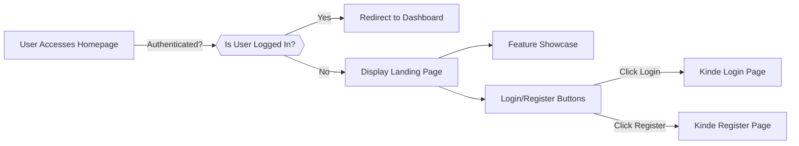
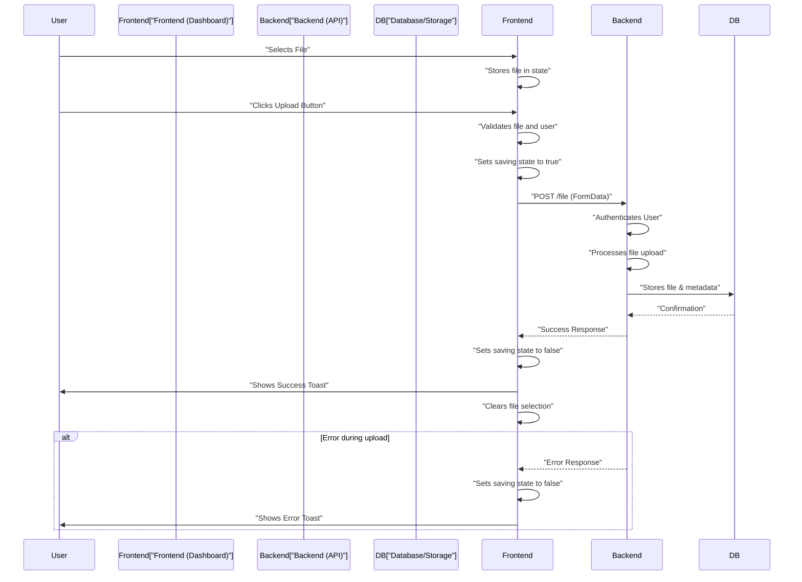

 # Core Features and User Interface

This document delves into the foundational components and user-facing aspects of the application, focusing on how users interact with the system, from initial access to core functionalities like file uploads. We'll explore the main pages and shared UI elements, providing insights into their structure and purpose.

## Application Layout and Global Elements (`src/app/layout.jsx`)

The `src/app/layout.jsx` file defines the root structure of the entire application, acting as the wrapper for all pages. It sets up global styles, font, and integrates key providers and shared UI components like the navigation bar and footer.

This layout ensures a consistent user experience across the application, managing aspects like authentication providers and global notifications.

```jsx
// src/app/layout.jsx
import Footer from "@/components/Footer";
import "../styles/globals.css";
import Navbar from "@/components/Navbar";
import { Providers } from "@/components/Provider";
import { Inter } from "next/font/google";
import { cn } from "@/lib/utils";
import { Toaster } from "sonner"; // Global toast notifications

// ... (font definition)

export const metadata = {
  title: "Track Vault - Secure File Sharing",
  description: "Share files securely with expiry rules and real-time analytics",
};

export default function RootLayout({ children }) {
  return (
    <html lang="en" suppressHydrationWarning>
      <body
        className={cn(
          "min-h-screen flex flex-col bg-background font-sans antialiased",
          inter.className
        )}
      >
        <Providers>
            <Toaster/> {/* Integrates global toast notification system */}
          <Navbar /> {/* Persistent navigation bar */}
          <main className="flex-1">{children}</main> {/* Main content area */}
          <Footer /> {/* Global footer */}
        </Providers>
      </body>
    </html>
  );
}
```

This snippet illustrates the hierarchical structure where `Providers` wrap the entire application, enabling context sharing for authentication and other services. The `Navbar` and `Footer` components are rendered universally, while the `{children}` prop dynamically loads page-specific content. The `Toaster` component from `sonner` is also integrated here to provide global, consistent feedback to the user.

[View on GitHub](https://github.com/sumedhcharjan/Track-Vault/blob/main/src/app/layout.jsx)

## Global Navigation (`src/components/Navbar.jsx`)

The `src/components/Navbar.jsx` component is crucial for user navigation and displays authentication status. It dynamically adjusts its content based on whether a user is logged in, showing either login/registration options or user-specific links and a logout button.

```jsx
// src/components/Navbar.jsx
import Link from "next/link";
import { LoginLink, LogoutLink } from "@kinde-oss/kinde-auth-nextjs/components";
import { Avatar, AvatarFallback, AvatarImage } from "@/components/ui/avatar";
import { getKindeServerSession } from "@kinde-oss/kinde-auth-nextjs/server";
import { Button } from "./ui/button";

export default async function Navbar() {
  const { isAuthenticated, getUser } = getKindeServerSession();
  const loggedIn = await isAuthenticated(); // Check authentication status
  const user = loggedIn ? await getUser() : null; // Get user details if authenticated

  return (
    <div className="w-full fixed top-0 left-0 right-0 z-50 flex justify-center p-4">
      <nav className="w-full max-w-6xl flex justify-between items-center px-6 py-2 rounded-full border border-border/40 backdrop-blur-lg shadow-lg">
        <Link
          href={loggedIn ? "/dashboard" : "/"} // Dynamic home link based on login status
          className="text-xl font-bold text-foreground hover:text-primary transition-colors"
        >
          Track Vault
        </Link>

        {!loggedIn ? (
          <div className="flex gap-6 items-center">
            <Link
              href="/about"
              className="text-muted-foreground hover:text-foreground font-medium transition-colors"
            >
              About
            </Link>
            <LoginLink>
              <Button variant="secondary" className="shadow-sm rounded-full">
                Login
              </Button>
            </LoginLink>
          </div>
        ) : (
          <div className="flex items-center gap-6">
            <Link href="/uploadedfiles">
              <Button variant="secondary" className="shadow-sm rounded-full">
                Your Files
              </Button>
            </Link>

            <div className="flex items-center gap-4">
              <Avatar className="h-8 w-8 ring-2 ring-border/50">
                <AvatarImage src={user?.picture ?? ""} />
                <AvatarFallback>{user?.given_name?.[0] ?? "U"}</AvatarFallback>
              </Avatar>
              <LogoutLink>
                <Button 
                  variant="ghost" 
                  className="text-destructive rounded-full hover:text-destructive/90 hover:bg-destructive/10"
                >
                  Logout
                </Button>
              </LogoutLink>
            </div>
          </div>
        )}
      </nav>
    </div>
  );
}
```

This snippet highlights the use of Kinde Auth's `isAuthenticated` and `getUser` functions to conditionally render navigation items. Authenticated users see their avatar and a "Your Files" link, while unauthenticated users are presented with "Login" and "About" options.

[View on GitHub](https://github.com/sumedhcharjan/Track-Vault/blob/main/src/components/Navbar.jsx)

## Public Homepage (`src/app/page.jsx`)

The `src/app/page.jsx` file serves as the public landing page for the application. Its primary responsibilities include checking for an authenticated user and redirecting them to the dashboard, or showcasing the application's core features to new visitors with calls to action for login or registration.

```jsx
// src/app/page.jsx
import { getKindeServerSession } from "@kinde-oss/kinde-auth-nextjs/server";
import { redirect } from "next/navigation";
import { RegisterLink, LoginLink } from "@kinde-oss/kinde-auth-nextjs/components";
import { Button } from "@/components/ui/button";
import { Card } from "@/components/ui/card";
import { ArrowRight, ShieldCheck, BarChart, Zap } from "lucide-react";
import { FlickeringGrid } from "@/components/ui/flickering-grid";

export default async function Home() {
  const { getUser } = getKindeServerSession();
  const user = await getUser();

  if (user) {
    redirect("/dashboard"); // Redirects authenticated users to their dashboard
  }

  return (
    <main className="relative flex flex-col items-center justify-center min-h-screen overflow-hidden bg-background pt-16">
      <div className="absolute inset-0 z-0">
        <FlickeringGrid
          squareSize={6}
          gridGap={5}
          className="w-full h-full opacity-70"
          color="#1a17b3"
          maxOpacity={0.2}
        />
      </div>

      <div className="relative z-10 px-6 py-24 w-full">
        <section className="text-center max-w-4xl mx-auto mb-24">
          <h1 className="text-6xl font-bold tracking-tight mb-6 bg-clip-text text-transparent bg-gradient-to-r from-primary to-primary/60">
            Share Files with Power & <span className="text-primary">Security</span>
          </h1>
          <p className="text-xl text-muted-foreground mb-12 max-w-2xl mx-auto">
            Upload, share, and control your files with enterprise-grade security features
            and real-time analytics.
          </p>
          <div className="flex gap-6 justify-center">
            <LoginLink> {/* Kinde Auth Login component */}
              <Button size="lg" className="h-12 px-8 font-medium">
                Get Started
                <ArrowRight className="ml-2 h-5 w-5" />
              </Button>
            </LoginLink>
            <RegisterLink> {/* Kinde Auth Register component */}
              <Button
                size="lg"
                variant="outline"
                className="h-12 px-8 font-medium border-2"
              >
                Create Account
              </Button>
            </RegisterLink>
          </div>
        </section>

        <section className="grid grid-cols-1 md:grid-cols-3 gap-8 max-w-6xl mx-auto">
          <Card className="p-6 backdrop-blur-sm bg-card/50 border-2">
            <ShieldCheck className="h-12 w-12 mb-5 text-primary" />
            <h3 className="text-2xl font-semibold mb-3">Access Control</h3>
            <p className="text-muted-foreground">
              Set passwords, expiry dates, and one-time links to keep your files secure.
            </p>
          </Card>
          {/* ... other feature cards (Analytics, Self-Destruct) ... */}
        </section>
      </div>
    </main>
  );
}
```

The authentication check and subsequent redirection are handled at the server component level, ensuring that authenticated users bypass the marketing page. The `LoginLink` and `RegisterLink` components are provided by Kinde Auth for seamless integration.

[View on GitHub](https://github.com/sumedhcharjan/Track-Vault/blob/main/src/app/page.jsx)

### User Authentication Flow (Homepage)





## User Dashboard (`src/app/dashboard/page.jsx`)

The `src/app/dashboard/page.jsx` file is the central hub for authenticated users, primarily featuring the secure file upload functionality. It interacts with the backend API to handle file submissions and provides real-time feedback to the user.

```jsx
// src/app/dashboard/page.jsx
"use client" // Client-side component for interactivity
import { Button } from "@/components/ui/button"
import { useKindeAuth } from "@kinde-oss/kinde-auth-nextjs" // Kinde Auth hook
import { useEffect, useState } from "react"
import api from "@/lib/axios" // Axios instance for API calls
import { Input } from "@/components/ui/input"
import {
  Card,
  CardHeader,
  CardTitle,
  CardDescription,
  CardContent,
  CardFooter,
} from "@/components/ui/card"
import { Label } from "@/components/ui/label"
import { toast } from "sonner" // Toast notifications
import { FlickeringGrid } from "@/components/ui/flickering-grid" // Background effect

export default function Dashboard() {
  const { user } = useKindeAuth(); // Get authenticated user details
  const [file, setFile] = useState();
  const [saving, setSaving] = useState(false);

  const handleFileSubmit = async () => {
    if (!file) {
      alert("Please select a file first!");
      return;
    }

    if (!user?.id) {
      alert("Login first!");
      return;
    }

    setSaving(true); // Indicate saving state

    try {
      const formData = new FormData();
      formData.append("file", file);
      formData.append("user_id", user.id);
      formData.append("file_name", file.name);

      const res = await api.post("/file", formData, { // API call to upload file
        headers: {
          "Content-Type": "multipart/form-data",
        },
      });

      console.log("File upload success:", res.data);
      toast("File uploaded successfully!", { // Success notification
        description: file.name + " has been uploaded.",
      });
      setFile(undefined); // Clear the upload field
    } catch (err) {
      toast("File upload error:", err.response?.data || err.message); // Error notification
    } finally {
      setSaving(false); // Reset saving state
    }
  };

  useEffect(() => {
    // Example API call on component mount (e.g., to register user with backend)
    api.post("/register")
      .then((res) => console.log("Register response:", res.data))
      .catch((err) => console.error("Error:", err.response?.data || err.message));
  }, [user]); // Re-run if user object changes

  return (
    <main className="relative flex flex-col items-center justify-center min-h-screen px-4 bg-white">
    <div className="absolute inset-0 z-0">
        <FlickeringGrid
          squareSize={6}
          gridGap={5}
          className="w-full h-full opacity-70"
          color="#1a17b3"
          maxOpacity={0.2}
        />
      </div>
      <Card className="relative z-10 w-full max-w-md backdrop-blur-lg  border border-gray-700 rounded-3xl shadow-2xl hover:shadow-gray-900/30 transition-all duration-500 ease-in-out">
        <CardHeader>
          <CardTitle className="text-3xl font-extrabold text-center bg-gradient-to-r from-gray-200 to-gray-400 bg-clip-text  tracking-tight">
            Secure File Upload
          </CardTitle>
        </CardHeader>
        <CardContent>
          <div className="relative group border border-dashed border-gray-500 rounded-xl p-6 text-center cursor-pointer hover:border-gray-300 hover:bg-white/5 transition-all duration-300 ease-in-out">
            <Label htmlFor="file-upload" className="block text-lg font-medium text-gray-400 group-hover:text-gray-700 mb-2 cursor-pointer">
              {file ? file.name : "Drag & Drop or Click to Browse"}
            </Label>
            <Input
              id="file-upload"
              type="file"
              onChange={(e) => setFile(e.target.files[0])}
              className="absolute inset-0 opacity-0 cursor-pointer"
            />
            {/* ... SVG icon and file display ... */}
          </div>
        </CardContent>
        <CardFooter>
          <Button
            onClick={handleFileSubmit}
            className="w-full bg-gradient-to-r from-gray-900 to-gray-700 hover:from-black hover:to-gray-800 text-white font-semibold py-3 rounded-xl shadow-lg hover:shadow-gray-900/50 transition-all duration-300 ease-in-out transform hover:scale-[1.01]"
            disabled={saving}
          >
            {saving ? (
              <span className="flex items-center justify-center gap-2">
                <svg className="animate-spin h-5 w-5 text-white" viewBox="0 0 24 24">
                  <circle className="opacity-25" cx="12" cy="12" r="10" stroke="currentColor" strokeWidth="4" fill="none"></circle>
                  <path className="opacity-75" fill="currentColor" d="M4 12a8 8 0 018-8V0C5.373 0 0 5.373 0 12h4zm2 5.291A7.962 7.962 0 014 12H0c0 3.042 1.135 5.824 3 7.938l3-2.647z"></path>
                </svg>
                Uploading...
              </span>
            ) : (
              "Upload File"
            )}
          </Button>
        </CardFooter>
      </Card>
    </main>
  )
}
```

This code illustrates a client-side component using React's `useState` and `useEffect` hooks. It leverages the `useKindeAuth` hook to access user information and `axios` for secure API communication to upload files. UI components like `Card`, `Input`, and `Button` from a UI library are used to build an interactive file upload form. Visual feedback is provided through a loading spinner on the button and `sonner` toasts.

[View on GitHub](https://github.com/sumedhcharjan/Track-Vault/blob/main/src/app/dashboard/page.jsx)

### File Upload Process





## Key Integration Points

*   **Kinde Auth**: Integrated throughout the application for robust authentication. The `getKindeServerSession` (server-side) and `useKindeAuth` (client-side) ensure seamless user management, including redirection based on login status and access to user profiles.
*   **Axios for API Calls**: The `src/lib/axios.js` (implied by `api` import) instance likely centralizes API communication, handling headers, error logging, and potentially authentication tokens for all backend interactions. This promotes a clean and maintainable approach to data fetching.
*   **Shadcn/ui Components**: The UI leverages components like `Button`, `Card`, `Input`, `Label`, and `Avatar` from a component library (likely Shadcn/ui), providing a consistent and aesthetically pleasing user interface.
*   **Sonner for Notifications**: Global `Toaster` component from `sonner` in `layout.jsx` combined with `toast()` calls in `dashboard/page.jsx` provides a consistent and user-friendly way to display notifications and feedback.
*   **Next.js Server and Client Components**: The application effectively uses Next.js 13+ app directory features by separating server components (`page.jsx`, `layout.jsx`, `Navbar.jsx` with `async` functions and direct Kinde server session access) from client components (`dashboard/page.jsx` with `"use client"` directive and React hooks) to optimize performance and interactivity.
*   **FlickeringGrid Background**: A custom `FlickeringGrid` component is used on both the homepage and dashboard, adding a unique and consistent visual theme across key user-facing pages, demonstrating reusability of UI elements.