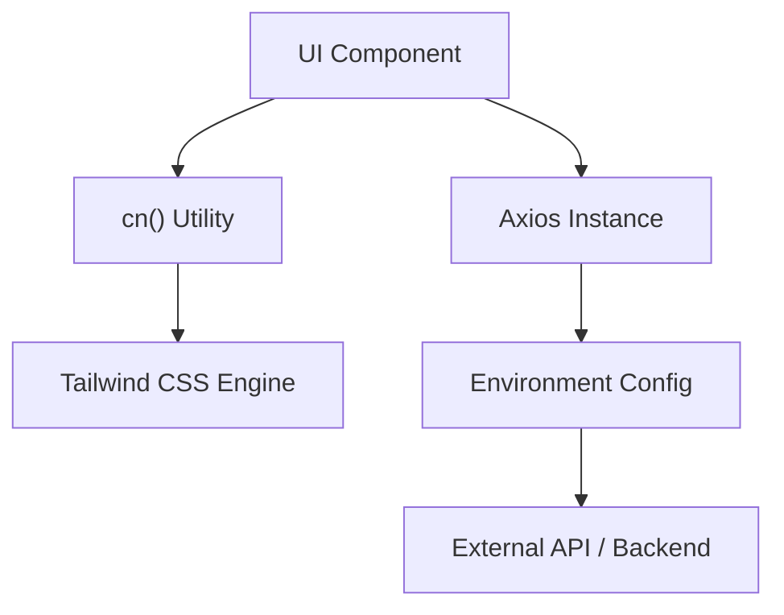

# Core Infrastructure

The Track-Vault architecture relies on a streamlined set of libraries and utilities designed to ensure type-safe styling, consistent API communication, and scalable state management. This section details the core technical foundations.

## Data Fetching Layer

Track-Vault utilizes a centralized **Axios** instance to handle all asynchronous HTTP requests. By encapsulating the configuration in a dedicated library file, the application maintains a single point of truth for network settings.

### API Client Configuration
The client is configured in `src/lib/axios.js` to handle environment-specific routing and authentication:

- **Base URL**: Dynamically switches between the production environment (`NEXT_PUBLIC_API_URL`) and the local development server (`http://localhost:3000/api`).
- **Credentials**: `withCredentials: true` is enabled to ensure that cookies and authorization headers are transmitted across cross-origin requests.

```javascript
import axios from "axios";

const api = axios.create({
  baseURL: process.env.NEXT_PUBLIC_API_URL || "http://localhost:3000/api",
  withCredentials: true,
});

export default api;
```

## Styling & Utility Layer

To manage dynamic Tailwind CSS classes without style collisions, Track-Vault implements a utility helper known as the `cn` function.

### The `cn` Utility
Located in `src/lib/utils.js`, this function combines two industry-standard libraries:
1. **`clsx`**: Allows for conditional class assignment using object or array syntax.
2. **`tailwind-merge`**: Ensures that the final CSS class string is optimized by merging overlapping Tailwind utility classes (preventing conflicts).

```javascript
import { clsx } from "clsx";
import { twMerge } from "tailwind-merge"

export function cn(...inputs) {
  return twMerge(clsx(inputs));
}
```

## Infrastructure Workflow

The following diagram illustrates how the frontend interacts with the core infrastructure to communicate with the backend services.



## Dependency Summary

| Library | Purpose | Implementation Site |
| :--- | :--- | :--- |
| `axios` | HTTP Client | `src/lib/axios.js` |
| `clsx` | Conditional Class Logic | `src/lib/utils.js` |
| `tailwind-merge` | CSS Class Conflict Resolution | `src/lib/utils.js` |