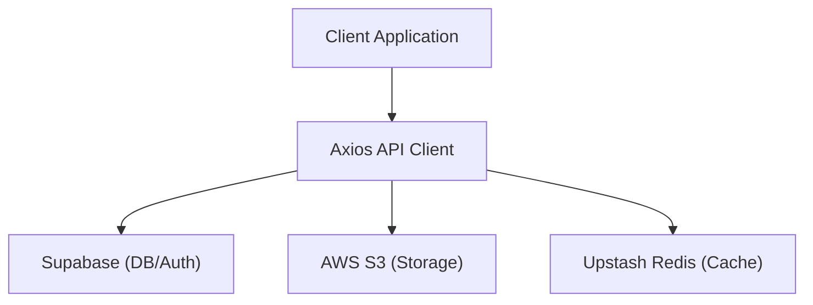

# Infrastructure & Integration

Track-Vault utilizes a modular architecture to handle data persistence, file storage, and caching. By decoupling these services, the application ensures high availability and scalability.

## System Architecture

The following diagram illustrates how the application interfaces with external infrastructure providers through the centralized library layer.

## Service Implementations

### Supabase (Database & Authentication)
Supabase provides the primary backend for user authentication and relational data storage. The integration is handled via the `@supabase/supabase-js` SDK.

**Implementation:**
`src/lib/supabase.js` initializes a singleton client using public environment variables, allowing for both client-side and server-side interactions.

### AWS S3 (Object Storage)
For scalable file and asset storage, Track-Vault integrates with Amazon S3 using the AWS SDK v3.

**Implementation:**
`src/lib/s3.js` configures the `S3Client` with region-specific settings and secure credentials. This client is used for uploading, retrieving, and managing vault assets.

### Upstash Redis (Caching)
To optimize performance and handle transient data or rate limiting, the application uses Upstash Redis via a REST-based client.

**Implementation:**
`src/lib/redis.js` establishes a connection using a REST URL and token, ensuring low-latency access to cached data without requiring a persistent TCP connection.

### Axios (API Communication)
A centralized Axios instance is used to standardize all HTTP requests across the application.

**Implementation:**
`src/lib/axios.js` configures a base URL and enables `withCredentials`, ensuring that session cookies and authorization headers are consistently passed to the backend.

## Configuration Reference

To integrate these services, the following environment variables must be configured in your `.env` file:

| Variable | Service | Description |
| :--- | :--- | :--- |
| `NEXT_PUBLIC_API_URL` | Axios | The base URL for API requests |
| `NEXT_PUBLIC_SUPABASE_URL` | Supabase | Your Supabase project URL |
| `NEXT_PUBLIC_SUPABASE_ANON_KEY` | Supabase | Your Supabase anonymous public key |
| `AWS_REGION` | AWS S3 | The AWS region (e.g., `us-east-1`) |
| `AWS_ACCESS_KEY_ID` | AWS S3 | IAM Access Key ID |
| `AWS_SECRET_ACCESS_KEY` | AWS S3 | IAM Secret Access Key |
| `UPSTASH_REDIS_REST_URL` | Upstash | The Redis REST endpoint |
| `UPSTASH_REDIS_REST_TOKEN` | Upstash | The Redis authentication token |