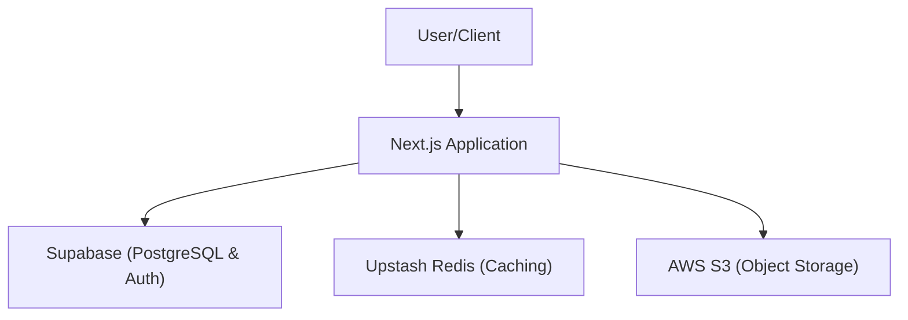

# Infrastructure & Integration

Track-Vault utilizes a decoupled backend architecture, leveraging managed cloud services to ensure scalability, high availability, and efficient data retrieval. The infrastructure is divided into three primary layers: relational data management, distributed caching, and object storage.

## Architectural Overview

The following diagram illustrates how the application interacts with the backend service providers.



## Service Implementations

### Database & Authentication: Supabase
Supabase serves as the primary data store and authentication provider. It provides a PostgreSQL database with real-time capabilities and a simplified API layer for client-side and server-side interactions.

**Implementation:**
The client is initialized using the `@supabase/supabase-js` library, utilizing public environment variables for client-side access.

```javascript
import { createClient } from '@supabase/supabase-js'

export const supabase = createClient(
  process.env.NEXT_PUBLIC_SUPABASE_URL,
  process.env.NEXT_PUBLIC_SUPABASE_ANON_KEY
)
```

### Caching & State: Upstash Redis
To optimize performance and reduce database load, Track-Vault implements a serverless Redis layer via Upstash. This is primarily used for caching frequently accessed data and managing rate limits.

**Implementation:**
The integration uses the `@upstash/redis` SDK, connecting via a REST API to maintain compatibility with serverless environments (Edge Functions).

```javascript
import { Redis } from "@upstash/redis";

export const redis = new Redis({
  url: process.env.UPSTASH_REDIS_REST_URL,
  token: process.env.UPSTASH_REDIS_REST_TOKEN,
});
```

### Object Storage: AWS S3
For storing large binary files, assets, and user uploads, the application integrates with Amazon S3. This ensures that the database remains lean by storing only the references (URLs) to the actual files.

**Implementation:**
The `@aws-sdk/client-s3` is used to establish a secure connection using IAM credentials.

```javascript
import { S3Client } from "@aws-sdk/client-s3";

export const s3 = new S3Client({
  region: process.env.AWS_REGION,
  credentials: {
    accessKeyId: process.env.AWS_ACCESS_KEY_ID,
    secretAccessKey: process.env.AWS_SECRET_ACCESS_KEY,
  },
});
```

## Environment Configuration

To integrate these services, the following environment variables must be configured in your `.env.local` file:

| Variable | Service | Description |
| :--- | :--- | :--- |
| `NEXT_PUBLIC_SUPABASE_URL` | Supabase | The unique project URL provided by Supabase. |
| `NEXT_PUBLIC_SUPABASE_ANON_KEY` | Supabase | The anonymous public key for client-side requests. |
| `UPSTASH_REDIS_REST_URL` | Upstash | The REST endpoint for the Redis instance. |
| `UPSTASH_REDIS_REST_TOKEN` | Upstash | The authentication token for Redis access. |
| `AWS_REGION` | AWS S3 | The physical region where the S3 bucket is hosted. |
| `AWS_ACCESS_KEY_ID` | AWS S3 | The IAM user access key. |
| `AWS_SECRET_ACCESS_KEY` | AWS S3 | The IAM user secret access key. |