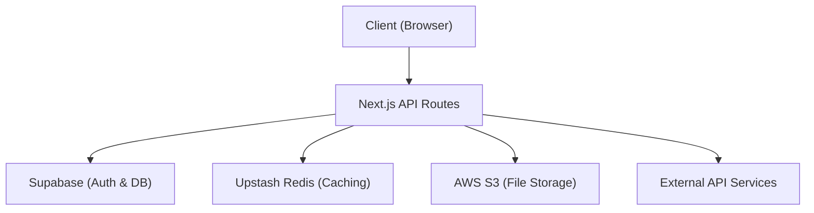

# System Architecture

Track-Vault utilizes a modern, serverless-first architecture designed for scalability, low latency, and robust data persistence. The system is built on a decoupled infrastructure where the application logic interfaces with specialized external services via a centralized utility layer.

## High-Level Overview

The architecture follows a client-server model where a Next.js frontend communicates with a backend API, which in turn orchestrates data flow between the database, cache, and object storage.

## Technical Stack

### Data Persistence & Authentication
**Supabase** serves as the primary Backend-as-a-Service (BaaS). It handles relational data storage and user authentication.
- **Implementation**: The `src/lib/supabase.js` module initializes the Supabase client using environment variables, providing a singleton instance for database queries and session management across the application.

### Serverless Caching
**Upstash Redis** is integrated to handle high-speed data retrieval and temporary state management, reducing the load on the primary database.
- **Implementation**: Configured via `@upstash/redis` in `src/lib/redis.js`, utilizing a REST-based connection to ensure compatibility with serverless environments.

### Object Storage
**AWS S3** is utilized for the storage and retrieval of large binary objects (blobs), such as user uploads or system assets.
- **Implementation**: The `src/lib/s3.js` module employs the `@aws-sdk/client-s3` library to manage secure uploads and downloads using AWS IAM credentials.

### Network Layer
**Axios** is used as the standardized HTTP client for internal and external API communication.
- **Implementation**: A customized instance is exported from `src/lib/axios.js`, featuring:
    - **Dynamic Base URL**: Switches between local development and production via `NEXT_PUBLIC_API_URL`.
    - **Credential Handling**: `withCredentials: true` ensures that cookies and authorization headers are persisted across requests.

## Infrastructure Integration Summary

| Service | Utility Library | Purpose | Key Configuration |
| :--- | :--- | :--- | :--- |
| **Supabase** | `@supabase/supabase-js` | Database & Auth | `SUPABASE_URL`, `SUPABASE_ANON_KEY` |
| **Upstash** | `@upstash/redis` | Distributed Caching | `REDIS_REST_URL`, `REDIS_REST_TOKEN` |
| **AWS S3** | `@aws-sdk/client-s3` | File Storage | `AWS_REGION`, `AWS_ACCESS_KEY_ID` |
| **Axios** | `axios` | API Orchestration | `NEXT_PUBLIC_API_URL` |