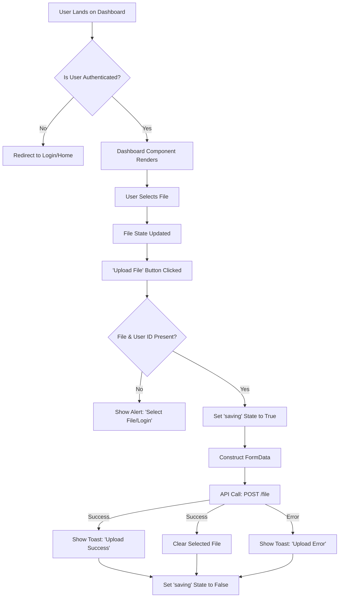

 # Dashboard and User Interface

The Dashboard and its accompanying UI components form the core interaction hub for users within the Track Vault application. This section details the structure, functionality, and key user experience elements involved in file management and navigation.

The main dashboard (`src/app/dashboard/page.jsx`) provides a secure file upload interface, leveraging a modern UI framework and robust authentication. It is wrapped by a `DashboardLayout` for consistent page structure and complemented by a global `Navbar` and `Footer` for navigation and persistent information.

## Dashboard Layout

The `DashboardLayout` component provides a foundational structure for the dashboard page, ensuring consistent rendering of child components.

*   **Path:** `src/app/dashboard/layout.jsx`
*   **Purpose:** Acts as a simple wrapper to contain dashboard-specific content. Currently, it's a minimal container but can be extended for shared dashboard elements like sidebars or banners in the future.

```jsx
// src/app/dashboard/layout.jsx
export default function DashboardLayout({ children }) {
  return (
    <div className="">
      {children}
    </div>
  );
}
```
[View on GitHub](https://github.com/sumedhcharjan/Track-Vault/blob/main/src/app/dashboard/layout.jsx)

## Main Dashboard Page

The `Dashboard` component is the central page where authenticated users can upload files. It integrates several UI components for a seamless user experience, including form inputs, buttons, cards, and notification toasts.

*   **Path:** `src/app/dashboard/page.jsx`
*   **Purpose:** Handles file selection, upload logic, and displays UI feedback.
*   **Authentication:** Utilizes `@kinde-oss/kinde-auth-nextjs` for user authentication and authorization.

### Key Features

*   **Secure File Upload:** Users can select a file via drag-and-drop or browsing, then upload it to the backend.
*   **User Context:** Leverages KindeAuth to identify the logged-in user and associate uploaded files with their `user.id`.
*   **API Integration:** Communicates with a backend API (`/file` endpoint) for file storage.
*   **Loading State:** Provides visual feedback during the file upload process using a spinner and disabled button.
*   **Toast Notifications:** Uses `sonner` for ephemeral messages to indicate upload success or failure.
*   **Dynamic UI:** Displays the selected file's name or a prompt if no file is chosen.
*   **Background Visuals:** Incorporates a `FlickeringGrid` component for an aesthetic background effect.

### File Upload Logic

The `handleFileSubmit` function orchestrates the entire file upload process.

```jsx
// src/app/dashboard/page.jsx - Snippet for handleFileSubmit
const handleFileSubmit = async () => {
  if (!file) {
    alert("Please select a file first!");
    return;
  }

  if (!user?.id) {
    alert("Login first!");
    return;
  }

  setSaving(true);

  try {
    const formData = new FormData();
    formData.append("file", file);
    formData.append("user_id", user.id);
    formData.append("file_name", file.name);

    const res = await api.post("/file", formData, {
      headers: {
        "Content-Type": "multipart/form-data",
      },
    });

    console.log("File upload success:", res.data);
    toast("File uploaded successfully!", {
      description: file.name + " has been uploaded.",
    });
    setFile(undefined); // Clear the upload field
  } catch (err) {
    toast("File upload error:", err.response?.data || err.message);
  } finally {
    setSaving(false);
  }
};
```
[View on GitHub](https://github.com/sumedhcharjan/Track-Vault/blob/main/src/app/dashboard/page.jsx#L30-L65)

This snippet demonstrates:
*   **Pre-upload Checks:** Validates if a file is selected and if the user is logged in.
*   **`FormData` Construction:** Creates a `FormData` object to send the file and associated metadata (`user_id`, `file_name`).
*   **API Call:** Uses an Axios instance (`api`) to make a POST request to the `/file` endpoint, specifying `multipart/form-data` content type.
*   **Success/Error Handling:** Displays `sonner` toasts based on the API response and resets the file input on success.

### Initial Registration Call

An `useEffect` hook ensures a registration call is made to the backend upon component mount or user change. This might be used for initial user setup or logging.

```jsx
// src/app/dashboard/page.jsx - Snippet for useEffect
useEffect(() => {
  api.post("/register")
    .then((res) => console.log("Register response:", res.data))
    .catch((err) => console.error("Error:", err.response?.data || err.message));
}, [user]);
```
[View on GitHub](https://github.com/sumedhcharjan/Track-Vault/blob/main/src/app/dashboard/page.jsx#L67-L71)

### Dashboard File Upload Flow





## Navigation Bar

The `Navbar` component provides global navigation and user authentication status display. It dynamically changes its content based on the user's login status.

*   **Path:** `src/components/Navbar.jsx`
*   **Purpose:** Offers access to the application title, login/logout actions, and navigation links.
*   **Authentication:** Uses `getKindeServerSession` for server-side authentication checks to determine logged-in status and user details.

### Key Functionality

*   **Dynamic Links:** The "Track Vault" logo links to the dashboard if logged in, otherwise to the home page.
*   **Auth Actions:** Displays "Login" button for unauthenticated users and "Your Files" link, user avatar, and "Logout" button for authenticated users.
*   **User Avatar:** Shows the user's profile picture or an initial fallback if unavailable.
*   **Responsive Design:** Designed to be a fixed, centered component at the top of the viewport.

```jsx
// src/components/Navbar.jsx - Snippet for authentication handling
export default async function Navbar() {
  const { isAuthenticated, getUser } = getKindeServerSession();
  const loggedIn = await isAuthenticated();
  const user = loggedIn ? await getUser() : null;

  return (
    <div className="w-full fixed top-0 left-0 right-0 z-50 flex justify-center p-4">
      <nav className="w-full max-w-6xl flex justify-between items-center px-6 py-2 rounded-full border border-border/40 backdrop-blur-lg shadow-lg">
        <Link
          href={loggedIn ? "/dashboard" : "/"}
          className="text-xl font-bold text-foreground hover:text-primary transition-colors"
        >
          Track Vault
        </Link>

        {!loggedIn ? (
          <div className="flex gap-6 items-center">
            <Link
              href="/about"
              className="text-muted-foreground hover:text-foreground font-medium transition-colors"
            >
              About
            </Link>
            <LoginLink>
              <Button variant="secondary" className="shadow-sm rounded-full">
                Login
              </Button>
            </LoginLink>
          </div>
        ) : (
          // ... authenticated user links
        )}
      </nav>
    </div>
  );
}
```
[View on GitHub](https://github.com/sumedhcharjan/Track-Vault/blob/main/src/components/Navbar.jsx#L8-L47)

## Footer Component

The `Footer` component provides persistent information at the bottom of every page, typically including copyright details and essential links.

*   **Path:** `src/components/Footer.jsx`
*   **Purpose:** Displays copyright information and a link to the project's GitHub repository.

### Footer Content

*   **Copyright Notice:** Displays the current year and project name.
*   **GitHub Link:** A prominently displayed link to the project's source code on GitHub, using an icon for quick recognition.

```jsx
// src/components/Footer.jsx - Snippet for Footer content
import Link from "next/link";
import { Github } from "lucide-react";

export default function Footer() {
  return (
    <footer className="w-full border-t border-border/40 bg-background/95 backdrop-blur supports-[backdrop-filter]:bg-background/60">
      <div className="max-w-7xl mx-auto px-6 py-8 flex flex-col md:flex-row items-center justify-between gap-4">
        <p className="text-sm text-muted-foreground">
          © {new Date().getFullYear()} Track Vault. All rights reserved.
        </p>

        <div className="flex items-center gap-4">
          <Link
            href="https://github.com/sumedhcharjan/Track-Vault.git"
            target="_blank"
            className="flex items-center gap-2 text-muted-foreground hover:text-foreground transition group"
          >
            <Github className="h-5 w-5 transition-transform group-hover:scale-110" />
            <span className="text-sm font-medium">GitHub</span>
          </Link>
        </div>
      </div>
    </footer>
  );
}
```
[View on GitHub](https://github.com/sumedhcharjan/Track-Vault/blob/main/src/components/Footer.jsx#L4-L29)

## Key Integration Points

The dashboard and its UI components are crucial for user interaction and overall application flow.

*   **Authentication Flow:** `Navbar` and `Dashboard` directly integrate with KindeAuth for a seamless login/logout experience and user identification. The server-side check in `Navbar` ensures proper rendering based on authentication status, while the client-side `useKindeAuth` in `Dashboard` provides user data for API calls.
*   **API Interaction:** The `Dashboard` component is the primary client-side interface for sending user-uploaded files to the backend, acting as a gateway to the file storage and processing logic. The `useEffect` for `/register` hints at potential user lifecycle management on the backend.
*   **UI Consistency:** `DashboardLayout`, `Navbar`, and `Footer` work together to create a consistent application shell, ensuring that core navigation and branding elements are always present, contributing to a predictable user experience.
*   **Feedback Mechanism:** The integration of `sonner` toasts provides immediate and non-intrusive feedback to the user regarding the success or failure of critical operations like file uploads, improving usability.

Next: [File Management UI](./3.2_file-management-ui.mdx)