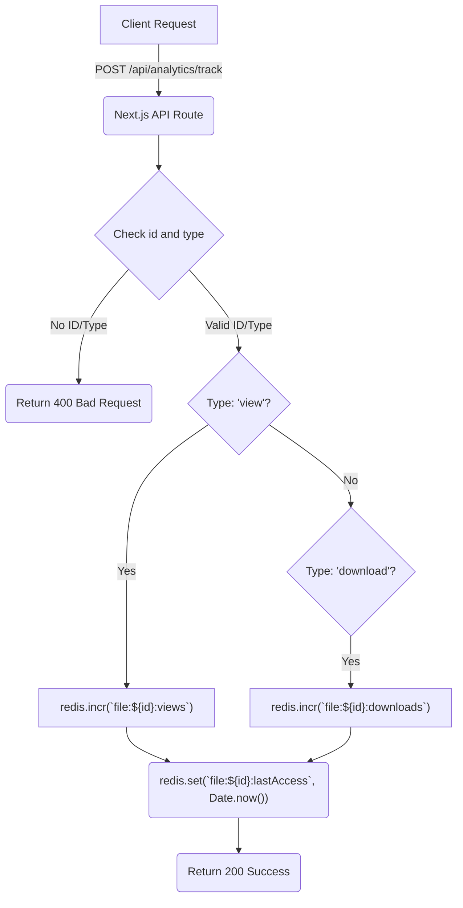
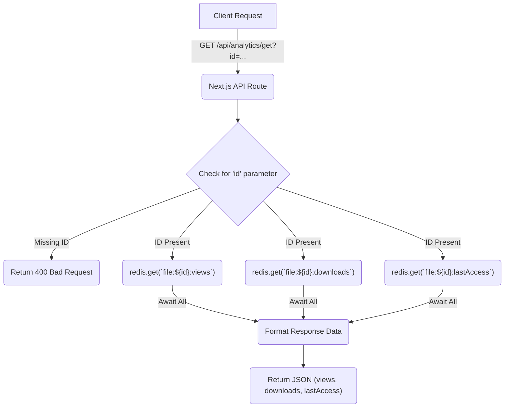

 # Analytics Data Handling

The analytics system within Track-Vault is designed to provide insights into file usage, specifically tracking views and downloads. This document details the APIs responsible for tracking these metrics, retrieving them, and managing the associated access controls and limits for files. The system leverages Redis for high-performance, real-time metric storage and Supabase for persistent file configuration, including access limits.

## Overview of Analytics Data

Track-Vault tracks essential metrics for shared files to help users understand their engagement. The primary metrics include:

*   **Views**: The total number of times a file has been accessed or viewed.
*   **Downloads**: The total number of times a file has been downloaded.
*   **Last Access**: The timestamp of the most recent interaction with a file.

These metrics are stored in Redis for quick access and real-time updates, while file-specific access controls (like `maxViews` or `expiresAt`) are managed in a persistent database (Supabase).

## Tracking Analytics

The `/api/analytics/track` endpoint is responsible for incrementing file usage statistics. It's a `POST` endpoint that accepts a `file_id` and a `type` (either "view" or "download").

When a request is made to this endpoint, the corresponding counter in Redis is incremented. Additionally, the `lastAccess` timestamp for the file is updated to reflect its most recent interaction.

```javascript
// src/app/api/analytics/track/route.js
import { redis } from "@/lib/redis";

export async function POST(req) {
  const { id, type } = await req.json();
  if (!id || !type) {
    return new Response("Missing params", { status: 400 });
  }

  if (type === "view") {
    await redis.incr(`file:${id}:views`);
  }
  if (type === "download") {
    await redis.incr(`file:${id}:downloads`);
  }

  // always update last accessed
  await redis.set(`file:${id}:lastAccess`, Date.now());

  return Response.json({ success: true });
}
```

This snippet demonstrates how Redis's `incr` command is used to atomicallly increment view and download counts, and `set` updates the `lastAccess` timestamp.
[View on GitHub](https://github.com/sumedhcharjan/Track-Vault/blob/main/src/app/api/analytics/track/route.js)

### Analytics Tracking Flow

The tracking process is straightforward, focusing on quick updates to in-memory storage.





## Retrieving Analytics Data

The `/api/analytics/get` endpoint allows for the retrieval of a file's current analytics data. This is a `GET` endpoint that requires an `id` query parameter, representing the `file_id`.

Upon receiving a request, the API queries Redis for the `views`, `downloads`, and `lastAccess` metrics associated with the provided file ID. The retrieved values are then formatted and returned as a JSON response.

```javascript
// src/app/api/analytics/get/route.js
import { redis } from "@/lib/redis";

export async function GET(req) {
  const { searchParams } = new URL(req.url);
  const id = searchParams.get("id");

  if (!id) {
    return new Response("Missing id", { status: 400 });
  }

  const [views, downloads, lastAccess] = await Promise.all([
    redis.get(`file:${id}:views`),
    redis.get(`file:${id}:downloads`),
    redis.get(`file:${id}:lastAccess`),
  ]);

  return Response.json({
    views: Number(views || 0),
    downloads: Number(downloads || 0),
    lastAccess: lastAccess ? new Date(Number(lastAccess)).toISOString() : null,
  });
}
```

This snippet demonstrates using `Promise.all` to fetch multiple Redis keys concurrently, optimizing the response time. Default values of `0` are used if a key doesn't exist. The `lastAccess` timestamp is converted to an ISO string for standard formatting.
[View on GitHub](https://github.com/sumedhcharjan/Track-Vault/blob/main/src/app/api/analytics/get/route.js)

### Analytics Data Retrieval Flow

Retrieving data involves a simple lookup in Redis, ensuring low latency.





## Setting Access Controls and Limits

The `/api/analytics/set` endpoint is a `POST` endpoint used to configure various access controls and limits for a file. While its name might suggest directly *setting* analytics values, it primarily focuses on managing the *rules* that influence how a file can be accessed, which in turn can impact its analytics. These rules are stored in Supabase, a persistent database.

Parameters that can be updated include:

*   `file_id`: The ID of the file to update.
*   `maxViews`: The maximum number of views allowed before access is restricted.
*   `maxDownloads`: The maximum number of downloads allowed.
*   `expiresAt`: A timestamp indicating when the file link will expire.
*   `password`: An optional password for accessing the file.
*   `deleteOnExpire`: A boolean to indicate if the file should be deleted upon expiry.
*   `deleteOnLimit`: A boolean to indicate if the file should be deleted when `maxViews` or `maxDownloads` are reached.

```javascript
// src/app/api/analytics/set/route.js
import { supabase } from "@/lib/supabase";
import { NextResponse } from "next/server";

export async function POST(req) {
  try {
    const data = await req.json();
    const {
      file_id,
      maxViews,
      maxDownloads,
      expiresAt,
      password,
      deleteOnExpire,
      deleteOnLimit,
    } = data;

    const updateData = {};

    if (maxViews !== null && maxViews !== undefined) {
      updateData.max_views = maxViews;
    }

    if (maxDownloads !== null && maxDownloads !== undefined) {
      updateData.max_downloads = maxDownloads;
    }

    if (expiresAt) {
      updateData.expires_at = expiresAt;
    }

    if (password) {
      updateData.file_password = password;
    }

    if (typeof deleteOnExpire === "boolean") {
      updateData.delete_on_expire = deleteOnExpire;
    }

    if (typeof deleteOnLimit === "boolean") {
      updateData.delete_on_limit = deleteOnLimit;
    }

    const { error } = await supabase
      .from("files")
      .update(updateData)
      .eq("id", file_id);

    if (error) throw error;

    return NextResponse.json({
      success: true,
      message: "Access controls updated",
    });
  } catch (err) {
    console.error("Error in POST:", err);
    return NextResponse.json(
      { success: false, error: err.message },
      { status: 500 }
    );
  }
}
```

This snippet shows how the endpoint constructs an `updateData` object based on provided fields and then performs an update operation on the `files` table in Supabase. It only updates fields that are explicitly provided and not null/undefined, ensuring partial updates are handled correctly.
[View on GitHub](https://github.com/sumedhcharjan/Track-Vault/blob/main/src/app/api/analytics/set/route.js)

## Redis Integration

Redis is fundamental to the real-time analytics tracking system. It serves as a fast, in-memory data store for volatile, frequently updated metrics like views, downloads, and last access timestamps.

The `src/lib/redis.js` file exports a pre-configured `Redis` client instance from `@upstash/redis`, making it easy to interact with the Upstash Redis service throughout the application.

```javascript
// src/lib/redis.js
import { Redis } from "@upstash/redis";

export const redis = new Redis({
  url: process.env.UPSTASH_REDIS_REST_URL,
  token: process.env.UPSTASH_REDIS_REST_TOKEN,
});
```

This configuration ensures that any part of the application importing `redis` from this library will use the same connection settings, drawing credentials from environment variables for security and flexibility.
[View on GitHub](https://github.com/sumedhcharjan/Track-Vault/blob/main/src/lib/redis.js)

## Key Integration Points

The analytics system integrates closely with the core file handling logic to provide real-time metrics and enforce access policies.

1.  **Real-time Tracking with Redis**: The `track` API uses Redis's atomic increment operations (`incr`) for views and downloads, and `set` for `lastAccess`. This ensures that metrics are updated instantly and consistently, even under high concurrency. Redis's speed makes it ideal for these write-heavy operations.
2.  **Efficient Retrieval**: The `get` API leverages Redis for quick retrieval of all three key metrics in a single, parallelized operation (`Promise.all`). This design minimizes latency when fetching analytics for display in the user interface.
3.  **Persistent Access Control with Supabase**: Unlike the real-time analytics data, which is volatile and frequently updated, file access controls (`maxViews`, `expiresAt`, `password`, etc.) are critical and require persistence. The `set` API uses Supabase (a PostgreSQL-backed service) to store these configurations reliably. This separation ensures that even if Redis data is lost (e.g., due to cache eviction or service restart, though Upstash Redis provides durability features), the fundamental rules governing file access remain intact.
4.  **Implicit Analytics-Driven Logic**: Although not explicitly shown in these snippets, the `maxViews` and `maxDownloads` set via the `/api/analytics/set` endpoint would typically be checked against the current view/download counts (retrieved from Redis) during actual file access attempts. This check would determine if a file should still be accessible or if limits have been reached, potentially triggering deletion if `deleteOnLimit` is true.

**Best Practices and Considerations**:

*   **Data Consistency**: While Redis provides high performance, it's essential to consider its role as a cache or a transient data store versus a primary source of truth. For critical, non-volatile data, Supabase is used.
*   **Rate Limiting**: To prevent abuse and ensure fair resource usage, the `track` endpoint could benefit from rate limiting on client requests.
*   **Monitoring**: Implementing robust monitoring for Redis metrics (e.g., memory usage, hit ratio) and API endpoint performance is crucial for maintaining a healthy analytics system.
*   **Security**: Ensure that `file_id`s passed to analytics endpoints are properly validated and authorized to prevent unauthorized access or modification of analytics data. For the `set` endpoint, robust authentication and authorization checks are paramount, as it modifies critical file access configurations.
*   **Scalability**: The use of Redis for real-time counts naturally scales well for high read/write loads of individual counters. Supabase (PostgreSQL) is also designed for scalability, handling the persistent configuration data.