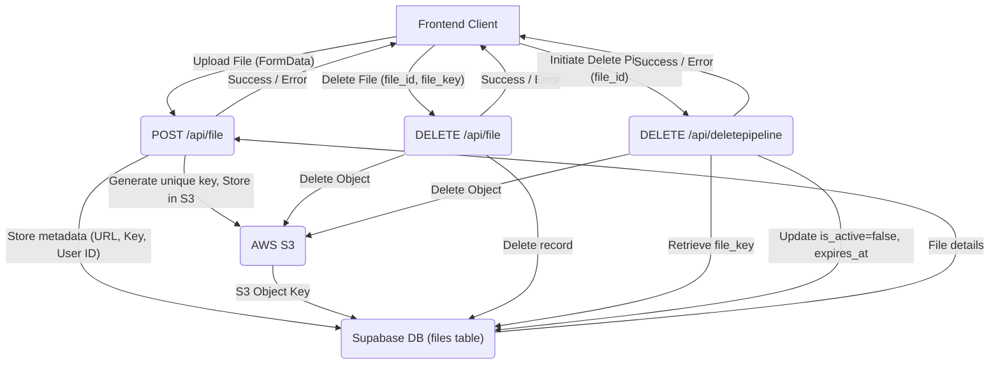
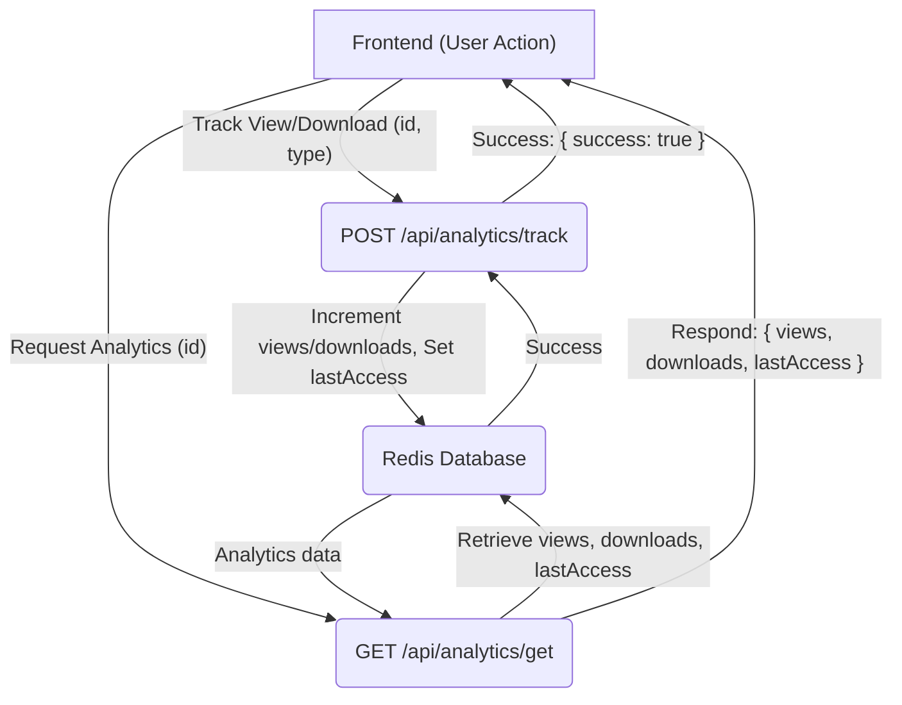

 # API Endpoints and Backend Logic

This section provides comprehensive documentation of the server-side API endpoints within the TrackVault application. These endpoints are crucial for handling file uploads, deletions, and managing analytics data, orchestrating interactions between the frontend, Supabase for metadata, AWS S3 for storage, and Redis for real-time analytics.

## Core Data Flow Endpoints

The following endpoints manage the primary file lifecycle, from initial upload to eventual deletion. They interact with Supabase for persistent metadata, AWS S3 for object storage, and Redis for ephemeral or frequently accessed data.

### Endpoint: `/api/file`

This endpoint facilitates the upload and direct deletion of files. It serves as the primary interface for users to manage their stored content.

#### `POST` /api/file: File Upload

This handler manages the secure upload of files to AWS S3 and records their metadata in Supabase. It's a critical component for enabling users to store their documents and media.

**Purpose:** Upload a new file to S3 and record its metadata in the Supabase `files` table.
**Method:** `POST`
**Request Body:** `FormData` containing:
*   `file`: The file to be uploaded.
*   `user_id`: The ID of the user uploading the file.
*   `file_name`: The original name of the file.

**Process:**
1.  Receives `FormData` containing the file, user ID, and original file name.
2.  Generates a unique filename using `uuidv4` to prevent naming conflicts in S3.
3.  Converts the file into a buffer suitable for S3 upload.
4.  Sends the file to AWS S3 using `PutObjectCommand`.
5.  Constructs the public URL of the uploaded file.
6.  Inserts file metadata (user ID, original name, S3 key, URL, type, size) into the Supabase `files` table.
7.  Returns the uploaded file's metadata to the client.

**Success Response (200 OK):**
```json
{
  "message": "File uploaded successfully",
  "file": {
    "id": "uuid",
    "user_id": "uuid",
    "file_name": "example.pdf",
    "file_key": "unique-uuid.pdf",
    "file_url": "https://your-s3-bucket.s3.region.amazonaws.com/unique-uuid.pdf",
    "file_type": "application/pdf",
    "file_size": 102400,
    "created_at": "ISO Date String"
  }
}
```

**Error Response (400 Bad Request / 500 Internal Server Error):**
```json
{
  "error": "File and user_id required"
}
```
or
```json
{
  "error": "Database insert failed"
}
```

**Code Snippet (`POST` Handler):**
```javascript
// src/app/api/file/route.js
export async function POST(req) {
  try {
    const formData = await req.formData();
    const file = formData.get("file");
    const userId = formData.get("user_id");
    const orignal_file_name = formData.get("file_name") 

    if (!file || !userId) {
      return NextResponse.json({ error: "File and user_id required" }, { status: 400 });
    }

    const fileExt = file.name.split(".").pop();
    const fileName = `${uuidv4()}.${fileExt}`;

    const arrayBuffer = await file.arrayBuffer();
    const buffer = Buffer.from(arrayBuffer);

    await s3.send(
      new PutObjectCommand({
        Bucket: process.env.AWS_S3_BUCKET,
        Key: fileName,
        Body: buffer,
        ContentType: file.type,
      })
    );

    const fileUrl = `https://${process.env.AWS_S3_BUCKET}.s3.${process.env.AWS_REGION}.amazonaws.com/${fileName}`;

    const { data, error } = await supabase
      .from("files")
      .insert([{
        user_id: userId,
        file_name: orignal_file_name,
        file_key: fileName,
        file_url: fileUrl,
        file_type: file.type,
        file_size: file.size,
      }])
      .select();

    if (error) throw error;

    return NextResponse.json({
      message: "File uploaded successfully",
      file: data[0],
    });
  } catch (err) {
    console.error(err);
    return NextResponse.json({ error: err.message }, { status: 500 });
  }
}
```
[View on GitHub](https://github.com/sumedhcharjan/Track-Vault/blob/main/src/app/api/file/route.js#L14-L68)

#### `DELETE` /api/file: Direct File Deletion

This handler provides a direct mechanism to delete a file from both S3 and Supabase. While `deletepipeline` handles soft-deletes and lifecycle management, this endpoint is for immediate, permanent removal.

**Purpose:** Permanently delete a file from AWS S3 and its corresponding record from the Supabase `files` table.
**Method:** `DELETE`
**Request Body:** `application/json` containing:
*   `file_id`: The unique ID of the file to be deleted (from Supabase).
*   `file_key`: The S3 key (filename) of the file to be deleted.

**Process:**
1.  Receives `file_id` and `file_key` from the request body.
2.  Deletes the object from AWS S3 using `DeleteObjectCommand`.
3.  Deletes the corresponding record from the Supabase `files` table using the `file_id`.
4.  Returns a success message confirming the deletion.

**Success Response (200 OK):**
```json
{
  "message": "File deleted",
  "file_id": "uuid"
}
```

**Error Response (400 Bad Request / 500 Internal Server Error):**
```json
{
  "error": "file_id required"
}
```
or
```json
{
  "error": "S3 or Supabase deletion failed"
}
```

**Code Snippet (`DELETE` Handler):**
```javascript
// src/app/api/file/route.js
export async function DELETE(req) {
  try {
    const { file_id, file_key } = await req.json();

    if (!file_id) {
      return NextResponse.json({ error: "file_id required" }, { status: 400 });
    }

    // 2. Delete from S3
    await s3.send(
      new DeleteObjectCommand({
        Bucket: process.env.AWS_S3_BUCKET,
        Key: file_key,
      })
    );

    // 3. Delete from Supabase DB
    await supabase.from("files").delete().eq("id", file_id);

    // 4. Return success
    return NextResponse.json({ message: "File deleted", file_id }, { status: 200 });

  } catch (err) {
    console.error(err);
    return NextResponse.json({ error: err.message }, { status: 500 });
  }
}
```
[View on GitHub](https://github.com/sumedhcharjan/Track-Vault/blob/main/src/app/api/file/route.js#L71-L98)

### Endpoint: `/api/deletepipeline`

This endpoint orchestrates a "soft delete" or lifecycle management for files, marking them as inactive and setting an expiration date rather than immediate permanent deletion. This is useful for retention policies or a trash bin-like functionality.

#### `DELETE` /api/deletepipeline

**Purpose:** Mark a file as inactive in the Supabase database and delete its corresponding object from AWS S3. This endpoint implements a soft-delete mechanism, ensuring files are removed from storage while their metadata reflects an inactive state.
**Method:** `DELETE`
**Request Body:** `application/json` containing:
*   `file_id`: The unique ID of the file to be processed.

**Process:**
1.  Receives `file_id` from the request body.
2.  Fetches file metadata from Supabase using the `file_id` to retrieve the `file_key` for S3 deletion.
3.  Deletes the file object from AWS S3 using `DeleteObjectCommand`.
4.  Updates the `files` table in Supabase, setting `is_active` to `false` and `expires_at` to the current timestamp.
5.  Returns a success message.

**Success Response (200 OK):**
```json
{
  "success": true,
  "message": "File deleted from S3 and marked inactive in DB"
}
```

**Error Response (400 Bad Request / 404 Not Found / 500 Internal Server Error):**
```json
{
  "success": false,
  "error": "file_id is required"
}
```
or
```json
{
  "success": false,
  "error": "File not found"
}
```
or
```json
{
  "success": false,
  "error": "Failed to delete file from S3",
  "details": "S3 error message"
}
```

**Code Snippet (`DELETE` Handler):**
```javascript
// src/app/api/deletepipeline/route.js
export async function DELETE(req) {
    try {
        const { file_id } = await req.json();

        if (!file_id) {
            return NextResponse.json(
                { success: false, error: "file_id is required" },
                { status: 400 }
            );
        }

        const { data: fileMeta, error: fetchError } = await supabase
            .from("files")
            .select("*")
            .eq("id", file_id)
            .single();

        if (fetchError || !fileMeta) {
            return NextResponse.json(
                { success: false, error: "File not found" },
                { status: 404 }
            );
        }

        try {
            await s3.send(
                new DeleteObjectCommand({
                    Bucket: process.env.AWS_S3_BUCKET,
                    Key: fileMeta.file_key,
                })
            );
            console.log("✅ S3 delete success:", fileMeta.file_key);
        } catch (s3Err) {
            console.error("❌ S3 delete error:", {
                message: s3Err.message,
                code: s3Err.name,
                stack: s3Err.stack,
                key: fileMeta.file_key,
            });
            return NextResponse.json(
                { success: false, error: "Failed to delete file from S3", details: s3Err.message },
                { status: 500 }
            );
        }

        const { error: updateError } = await supabase
            .from("files")
            .update({
                is_active: false,
                expires_at: new Date().toISOString(),
            })
            .eq("id", file_id);

        if (updateError) throw updateError;

        return NextResponse.json({
            success: true,
            message: "File deleted from S3 and marked inactive in DB",
        });
    } catch (err) {
        console.error("Error in DELETE:", err);
        return NextResponse.json(
            { success: false, error: err.message },
            { status: 500 }
        );
    }
}
```
[View on GitHub](https://github.com/sumedhcharjan/Track-Vault/blob/main/src/app/api/deletepipeline/route.js#L11-L91)

### File Lifecycle Flow

The diagram below illustrates the typical flow for file management within TrackVault, encompassing both initial upload and deletion processes.





## Analytics Endpoints

These endpoints are responsible for tracking and retrieving usage statistics for files, leveraging Redis for fast, real-time counters and access logs.

### Endpoint: `/api/analytics/track`

This endpoint is used to increment file interaction metrics such as views and downloads.

#### `POST` /api/analytics/track

**Purpose:** Increment view or download counters for a specific file and update its last access timestamp in Redis.
**Method:** `POST`
**Request Body:** `application/json` containing:
*   `id`: The ID of the file being tracked.
*   `type`: The type of event to track ("view" or "download").

**Process:**
1.  Receives `id` and `type` from the request body.
2.  If `type` is "view", increments the `file:{id}:views` counter in Redis.
3.  If `type` is "download", increments the `file:{id}:downloads` counter in Redis.
4.  Always updates the `file:{id}:lastAccess` timestamp in Redis with the current time.
5.  Returns a success response.

**Success Response (200 OK):**
```json
{
  "success": true
}
```

**Error Response (400 Bad Request):**
```json
{
  "error": "Missing params"
}
```

**Code Snippet (`POST` Handler):**
```javascript
// src/app/api/analytics/track/route.js
import { redis } from "@/lib/redis";

export async function POST(req) {
  const { id, type } = await req.json();
  if (!id || !type) {
    return new Response("Missing params", { status: 400 });
  }

  if (type === "view") {
    await redis.incr(`file:${id}:views`);
  }
  if (type === "download") {
    await redis.incr(`file:${id}:downloads`);
  }

  // always update last accessed
  await redis.set(`file:${id}:lastAccess`, Date.now());

  return Response.json({ success: true });
}
```
[View on GitHub](https://github.com/sumedhcharjan/Track-Vault/blob/main/src/app/api/analytics/track/route.js#L4-L23)

### Endpoint: `/api/analytics/get`

This endpoint retrieves the tracked analytics data for a specific file.

#### `GET` /api/analytics/get

**Purpose:** Retrieve the total views, downloads, and last access timestamp for a given file ID from Redis.
**Method:** `GET`
**Query Parameters:**
*   `id`: The ID of the file for which to retrieve analytics.

**Process:**
1.  Extracts the `id` from the URL query parameters.
2.  Fetches `file:{id}:views`, `file:{id}:downloads`, and `file:{id}:lastAccess` from Redis concurrently.
3.  Parses the retrieved values, converting them to numbers and an ISO date string for `lastAccess`. Defaults to 0 for views/downloads if not found.
4.  Returns the analytics data.

**Success Response (200 OK):**
```json
{
  "views": 150,
  "downloads": 25,
  "lastAccess": "2023-10-27T10:30:00.000Z"
}
```

**Error Response (400 Bad Request):**
```json
{
  "error": "Missing id"
}
```

**Code Snippet (`GET` Handler):**
```javascript
// src/app/api/analytics/get/route.js
import { redis } from "@/lib/redis";

export async function GET(req) {
  const { searchParams } = new URL(req.url);
  const id = searchParams.get("id");

  if (!id) {
    return new Response("Missing id", { status: 400 });
  }

  const [views, downloads, lastAccess] = await Promise.all([
    redis.get(`file:${id}:views`),
    redis.get(`file:${id}:downloads`),
    redis.get(`file:${id}:lastAccess`),
  ]);

  return Response.json({
    views: Number(views || 0),
    downloads: Number(downloads || 0),
    lastAccess: lastAccess ? new Date(Number(lastAccess)).toISOString() : null,
  });
}
```
[View on GitHub](https://github.com/sumedhcharjan/Track-Vault/blob/main/src/app/api/analytics/get/route.js#L4-L25)

### Analytics Data Flow

This diagram illustrates how file analytics are tracked and retrieved within the system, utilizing Redis for high-performance caching and counters.





## Key Integration Points

*   **Loose Coupling with External Services:** The design clearly separates concerns. Supabase handles relational data, S3 handles object storage, and Redis handles analytics. Each service is accessed via its dedicated client (`@/lib/supabase`, `@/lib/s3`, `@/lib/redis`), promoting modularity.
*   **Next.js API Routes:** Leveraging Next.js API routes (`route.js`) simplifies the creation of backend endpoints within the same codebase as the frontend, enabling full-stack development.
*   **Error Handling and Robustness:** Each endpoint includes `try-catch` blocks for robust error handling, returning informative JSON error responses with appropriate HTTP status codes. This ensures a predictable API contract for consumers.
*   **Scalable Analytics:** Using Redis for view and download tracking provides a highly performant and scalable solution for real-time analytics. Redis's `INCR` command is atomic and efficient for counter operations, reducing load on the primary database for frequently updated metrics.
*   **File Lifecycle Management:** The distinction between `DELETE /api/file` (permanent removal) and `DELETE /api/deletepipeline` (soft-delete with archival) offers flexibility in managing file lifecycles, catering to different application requirements like a trash bin or retention policies.
*   **Data Consistency Considerations:** While Redis is used for ephemeral analytics, core file metadata (active status, expiration) remains in Supabase. This ensures data persistence and consistency for critical file properties, while non-critical, high-volume metrics are handled by Redis.
*   **Security Best Practices:** Though not explicitly shown in the snippets, in a production environment, these endpoints would require robust authentication and authorization checks (e.g., verifying `user_id` against the authenticated user, checking file ownership before deletion) to prevent unauthorized access or manipulation.