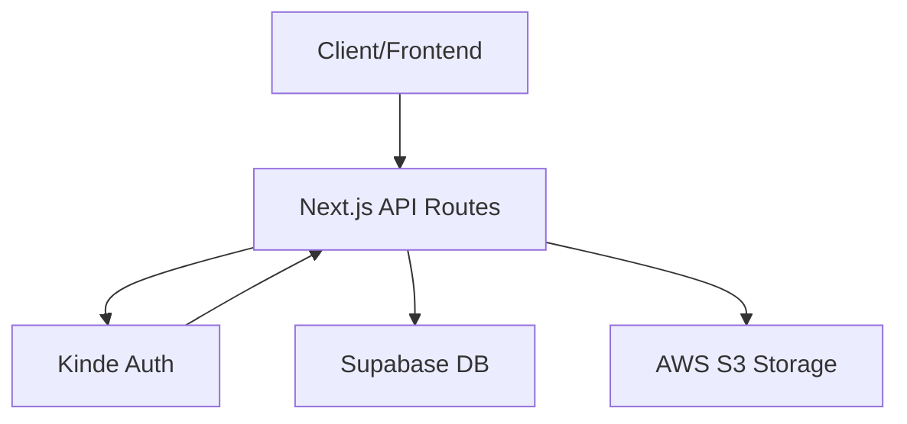

# API Reference

The Track-Vault backend provides a set of RESTful endpoints to manage user authentication, profile registration, and secure file storage orchestration between AWS S3 and Supabase.

## System Architecture

The following diagram illustrates the interaction between the client, the API layer, and the external service providers.



## Authentication

Track-Vault utilizes Kinde for identity management.

### Auth Handler
`GET /api/auth/[kindeAuth]`

Handles the authentication lifecycle, including login, callback, and logout redirects.

| Parameter | Type | Description |
| :--- | :--- | :--- |
| `kindeAuth` | Path Param | The specific auth action (e.g., `login`, `callback`, `logout`) |

---

## User Management

### Register User
`POST /api/register`

Syncs the authenticated Kinde session with the internal Supabase database. This endpoint performs an `upsert` operation based on the user's email.

**Authentication Required:** Yes (Kinde Session)

**Response**
- `200 OK`: Returns the Kinde user object upon successful registration or update.

---

## File Management

### Upload File
`POST /api/file`

Uploads a binary file to AWS S3 and stores the resulting metadata in the database.

**Content-Type:** `multipart/form-data`

**Request Body**
| Field | Type | Required | Description |
| :--- | :--- | :--- | :--- |
| `file` | File | Yes | The binary file to upload |
| `user_id` | String | Yes | The unique identifier of the owner |
| `file_name` | String | Yes | The original name of the file |

**Response**
- `200 OK`: Returns the created file record including `file_url` and `file_key`.
- `400 Bad Request`: Missing `file` or `user_id`.
- `500 Internal Server Error`: S3 or Database failure.

### Delete File (Hard Delete)
`DELETE /api/file`

Permanently removes the file from S3 and deletes the corresponding metadata record from Supabase.

**Request Body**
```json
{
  "file_id": "string",
  "file_key": "string"
}
```

**Response**
- `200 OK`: File successfully deleted.
- `400 Bad Request`: `file_id` is missing.

---

## Pipeline Management

### Deactivate File Pipeline
`DELETE /api/deletepipeline`

Performs a managed deletion by removing the object from S3 and marking the database record as inactive (soft delete).

**Request Body**
```json
{
  "file_id": "string"
}
```

**Workflow**
1. **Validation**: Checks if `file_id` exists in the `files` table.
2. **S3 Purge**: Deletes the object using the `file_key` associated with the ID.
3. **DB Update**: Sets `is_active: false` and updates `expires_at` to the current timestamp.

**Response**
- `200 OK`: File removed from S3 and marked inactive in DB.
- `404 Not Found`: File record not found in database.
- `500 Internal Server Error`: Failed to communicate with S3.

## Error Codes Reference

| Status Code | Meaning | Description |
| :--- | :--- | :--- |
| `400` | Bad Request | Required parameters are missing from the request body. |
| `404` | Not Found | The requested `file_id` does not exist in the system. |
| `500` | Server Error | An unexpected error occurred during S3 upload/deletion or DB operations. |