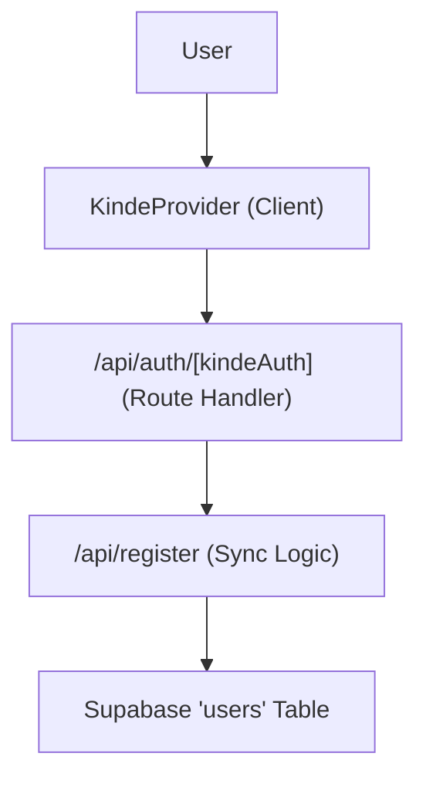

# Authentication

Track-Vault implements a decoupled authentication and user management system. It leverages **Kinde Auth** for identity provider services (OAuth/OpenID Connect) and **Supabase** for persistent user profile storage.

## Authentication Flow

The authentication process follows a hybrid flow where Kinde handles the secure handshake and session management, while a custom registration hook synchronizes the identity data into the application database.



## Implementation Details

### 1. Identity Provider Configuration
The application is wrapped in a `KindeProvider` to enable authentication context across the client-side tree. This provider consumes environment variables to communicate with the Kinde domain.

**File:** `src/components/Provider.jsx`

```jsx
<KindeProvider
  clientId={process.env.NEXT_PUBLIC_KINDE_CLIENT_ID}
  domain={process.env.NEXT_PUBLIC_KINDE_DOMAIN}
  redirectUri={process.env.NEXT_PUBLIC_KINDE_REDIRECT_URI}
  logoutUri={process.env.NEXT_PUBLIC_KINDE_LOGOUT_URI}
>
  {children}
</KindeProvider>
```

### 2. Auth Route Handler
A dynamic API route is used to handle all Kinde-specific callbacks, logins, and logouts. The `handleAuth()` function from the Kinde SDK manages the underlying OIDC flow.

**File:** `src/app/api/auth/[kindeAuth]/route.js`

```javascript
import { handleAuth } from "@kinde-oss/kinde-auth-nextjs/server";

export const GET = handleAuth();
```

### 3. User Registration & Synchronization
To ensure user data is available for relational queries within Supabase, the application utilizes a registration endpoint. This endpoint acts as a bridge between Kinde's identity session and the Supabase database.

**File:** `src/app/api/register/route.js`

The process follows these steps:
1. **Session Retrieval**: Calls `getKindeServerSession()` to verify the authenticated user.
2. **Data Extraction**: Extracts `email`, `given_name`, `family_name`, and the unique Kinde `id`.
3. **Upsert Logic**: Uses a Supabase `.upsert()` operation on the `users` table. This prevents duplicate records by using the `email` column as the conflict target.

```javascript
const { data, error } = await supabase
  .from("users")
  .upsert({
    email: user.email,
    name: user.given_name + " " + user.family_name,
    auth_user_id: user.id
  }, { onConflict: "email" });
```

## Required Environment Variables

To configure authentication, ensure the following variables are set in your `.env` file:

| Variable | Description |
| :--- | :--- |
| `NEXT_PUBLIC_KINDE_CLIENT_ID` | The unique client ID from Kinde dashboard |
| `NEXT_PUBLIC_KINDE_DOMAIN` | Your Kinde project domain |
| `NEXT_PUBLIC_KINDE_REDIRECT_URI` | The URL to redirect to after login |
| `NEXT_PUBLIC_KINDE_LOGOUT_URI` | The URL to redirect to after logout |