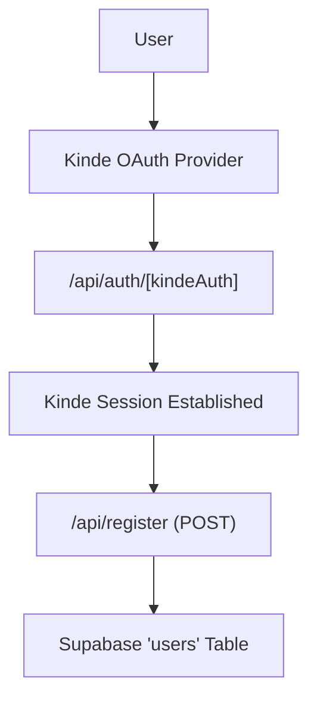

# Authentication & Security

Track-Vault implements a hybrid authentication architecture, leveraging **Kinde** for identity management and **Supabase** for user profile persistence. This ensures secure, industry-standard OAuth flows while maintaining a relational record of users within the application's primary database.

## Authentication Architecture

The system separates identity verification (Authentication) from user data management (Authorization/Persistence). 




## Implementation Details

### 1. Identity Provider Configuration
The application is wrapped in a `KindeProvider` to manage authentication state globally. This provider utilizes environment variables to ensure security across different deployment environments.

```jsx
// src/components/Provider.jsx
export function Providers({ children }) {
  return (
    <KindeProvider
      clientId={process.env.NEXT_PUBLIC_KINDE_CLIENT_ID}
      domain={process.env.NEXT_PUBLIC_KINDE_DOMAIN}
      redirectUri={process.env.NEXT_PUBLIC_KINDE_REDIRECT_URI}
      logoutUri={process.env.NEXT_PUBLIC_KINDE_LOGOUT_URI}
    >
      {children}
    </KindeProvider>
  );
}
```

### 2. Authentication Routing
The dynamic route `src/app/api/auth/[kindeAuth]/route.js` acts as the handler for all Kinde-related authentication events, including login, logout, and callback processing.

```javascript
import { handleAuth } from "@kinde-oss/kinde-auth-nextjs/server";

export const GET = handleAuth();
```

### 3. User Registration & Synchronization
To maintain a local copy of the user for relational data mapping (e.g., linking vaults to specific users), Track-Vault uses a synchronization endpoint. 

When a user successfully authenticates via Kinde, a request is sent to `/api/register`. This endpoint performs an `upsert` operation in Supabase, ensuring that the user exists in the database without creating duplicate entries.

**Key Logic in `src/app/api/register/route.js`:**
- **Session Verification**: Uses `getKindeServerSession()` to retrieve the authenticated user's details server-side.
- **Data Upsert**: Maps Kinde's identity fields to the Supabase `users` table.
- **Conflict Handling**: Uses the `email` field as the unique constraint to prevent duplicate registrations.

```javascript
const { data, error } = await supabase
  .from("users")
  .upsert({
    email: user.email,
    name: user.given_name + " " + user.family_name,
    auth_user_id: user.id
  }, { onConflict: "email" });
```

## Security Summary

| Component | Responsibility | Tool |
| :--- | :--- | :--- |
| **Identity** | JWT issuance, OAuth2 flow, MFA | Kinde |
| **Persistence** | User profiles, Relation mapping | Supabase |
| **State** | Client-side auth context | KindeProvider |
| **Verification** | Server-side session validation | `getKindeServerSession` |