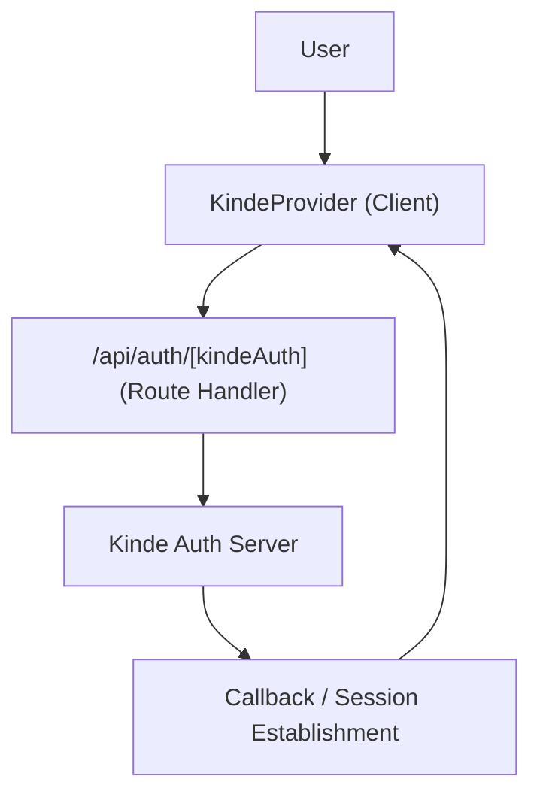

# Authentication & Security

Track-Vault implements a robust identity management system powered by **Kinde**, ensuring secure user authentication and authorization across the application. The implementation utilizes a combination of Next.js API route handlers and a client-side provider context to manage session states.

## Authentication Flow

The application follows the OAuth 2.0 / OpenID Connect (OIDC) standard. The flow is managed by the Kinde SDK, which handles the redirection between the application and the Kinde identity server.



## Implementation Details

### 1. Auth Route Handler
The application defines a dynamic API route to handle all authentication requests (login, callback, and logout). This route delegates the heavy lifting to the Kinde server-side handler.

**File:** `src/app/api/auth/[kindeAuth]/route.js`

```javascript
import { handleAuth } from "@kinde-oss/kinde-auth-nextjs/server";

export const GET = handleAuth();
```

### 2. Global Auth Provider
To ensure authentication state is accessible throughout the component tree, the application is wrapped in a `KindeProvider`. This provider leverages environment variables to connect the frontend to the specific Kinde tenant.

**File:** `src/components/Provider.jsx`

```jsx
"use client";
import { KindeProvider } from "@kinde-oss/kinde-auth-nextjs";

export function Providers({ children }) {
  return (
    <KindeProvider
      clientId={process.env.NEXT_PUBLIC_KINDE_CLIENT_ID}
      domain={process.env.NEXT_PUBLIC_KINDE_DOMAIN}
      redirectUri={process.env.NEXT_PUBLIC_KINDE_REDIRECT_URI}
      logoutUri={process.env.NEXT_PUBLIC_KINDE_LOGOUT_URI}
    >
      {children}
    </KindeProvider>
  );
}
```

## Configuration

The authentication system relies on the following environment variables. These must be configured in your `.env.local` file:

| Variable | Description |
| :--- | :--- |
| `NEXT_PUBLIC_KINDE_CLIENT_ID` | The unique identifier for your Kinde application. |
| `NEXT_PUBLIC_KINDE_DOMAIN` | Your Kinde tenant domain (e.g., `yourdomain.kinde.com`). |
| `NEXT_PUBLIC_KINDE_REDIRECT_URI` | The URL where Kinde redirects users after successful login. |
| `NEXT_PUBLIC_KINDE_LOGOUT_URI` | The URL where Kinde redirects users after logging out. |

## Security Considerations

- **Client-Side State**: The `KindeProvider` allows components to reactively update based on the user's authentication status.
- **Route Protection**: By using the `handleAuth` route, the application ensures that token exchanges occur securely on the server side, minimizing the exposure of sensitive credentials.
- **Environment Isolation**: All sensitive Kinde configuration is managed via environment variables to prevent accidental leakage into version control.