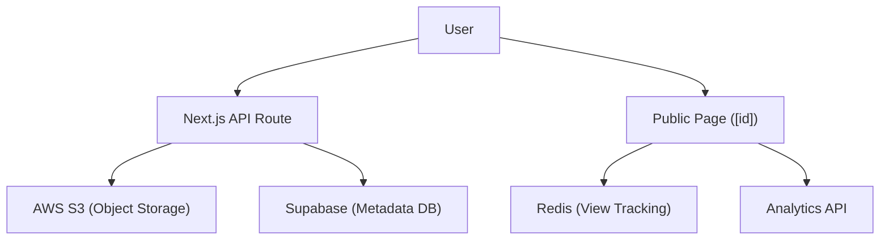

# File Management System

The File Management System in Track-Vault provides a secure pipeline for uploading, storing, and distributing files. It utilizes a hybrid architecture combining **AWS S3** for binary object storage and **Supabase** for metadata persistence, ensuring scalable storage and fast query performance.

## System Architecture

The system follows a decoupled flow where the API acts as a gateway between the client, the object store, and the database.



## File Upload Pipeline

Files are processed through the `POST /api/file` endpoint. To prevent filename collisions in the S3 bucket, the system implements a unique naming strategy.

### Upload Workflow
1. **Payload Processing**: The API extracts `file`, `user_id`, and `file_name` from the `formData`.
2. **Unique Key Generation**: A `uuidv4` is generated and appended with the original file extension to create a unique `file_key`.
3. **S3 Storage**: The file is converted to a Buffer and uploaded using the `@aws-sdk/client-s3` `PutObjectCommand`.
4. **Metadata Persistence**: A record is created in the Supabase `files` table containing:
   - `user_id`: Owner of the file.
   - `file_key`: The S3 object key for retrieval/deletion.
   - `file_url`: The public AWS S3 URL.
   - `file_type` & `file_size`: Used for frontend rendering and validation.

## Management Dashboard

The `/uploadedfiles` page serves as the administrative hub for users to track their assets.

- **Authentication**: Integrated with **Kinde Auth** to ensure users can only access files associated with their unique `user_id`.
- **State Management**: Files are categorized into **Active** and **Inactive** using a filter on the `is_active` boolean flag from the database.
- **Dynamic Rendering**: The dashboard utilizes a grid layout with `FileCard` and `InactiveFileCard` components to provide a visual distinction between available and disabled files.

## Public Access & Delivery

The public delivery system (`/public/[id]`) implements several layers of access control and tracking before granting file access.

### 1. Access Validation (Server-Side)
Using `getServerSideProps`, the system performs the following checks:
- **Existence**: Verifies the file ID exists in Supabase.
- **Expiration**: Checks `expires_at`. If expired and `delete_on_expire` is true, it triggers the deletion pipeline.
- **View Limits**: Increments a counter in **Redis**. If `max_views` is exceeded, access is denied and the file may be deleted based on `delete_on_limit`.

### 2. Client-Side Security
- **Password Protection**: If `file_password` is present, the UI renders a password input. The file preview and download buttons are hidden until the password is verified.
- **Content Rendering**: 
  - Images are rendered via `` tags.
  - PDFs are embedded using `<iframe>`.
  - Other file types display a "Preview not available" placeholder.

### 3. Tracked Downloads
Downloads are not direct links. The `handleDownload` function:
1. Sends a request to `/api/analytics/track` to log the download event.
2. Fetches the file as a `blob` from S3.
3. Generates a temporary object URL to trigger the browser download.

## File Deletion

Deletion is handled via the `DELETE /api/file` endpoint to ensure no orphaned files remain in storage.

```javascript
// Logic sequence for deletion
await s3.send(new DeleteObjectCommand({
  Bucket: process.env.AWS_S3_BUCKET,
  Key: file_key,
}));

await supabase.from("files").delete().eq("id", file_id);
```

This dual-action approach ensures that both the physical binary in S3 and the corresponding metadata in Supabase are removed simultaneously.