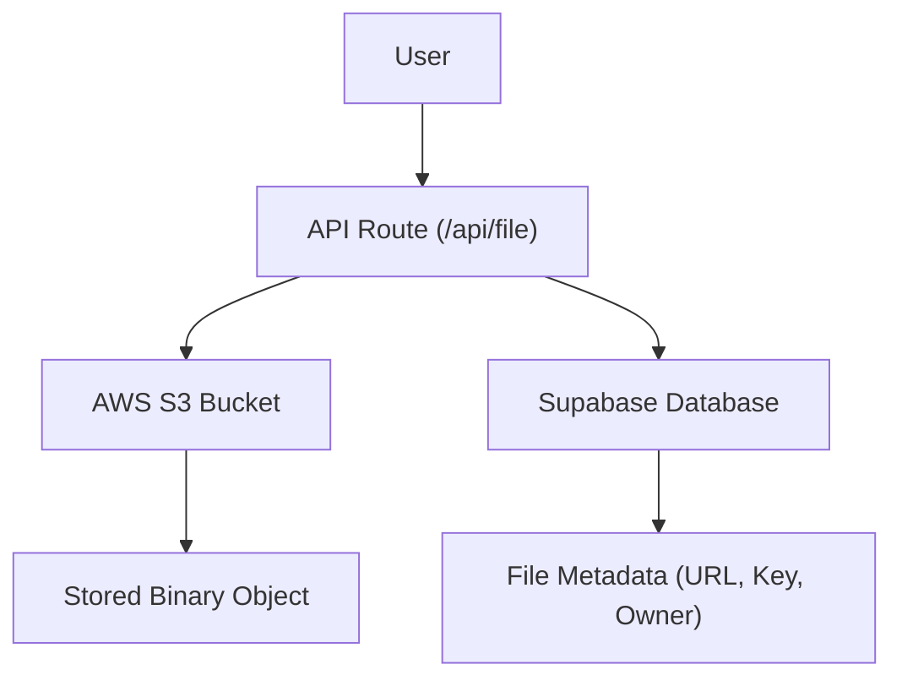

# File Management System

The File Management System in Track-Vault handles the end-to-end lifecycle of user assets, from secure upload to cloud storage and eventual deletion. It leverages a decoupled architecture using AWS S3 for binary storage and Supabase for metadata management.

## System Architecture

The pipeline ensures that files are renamed to prevent collisions and that metadata is strictly linked to the authenticated user.

## File Upload Pipeline

The upload process is handled by the `POST` handler in `src/app/api/file/route.js`. 

### Workflow
1. **Request Handling**: The API extracts `file`, `user_id`, and `file_name` from the `formData`.
2. **Unique Identification**: To prevent filename collisions in S3, a `uuidv4()` is generated. The original extension is preserved.
3. **Binary Transfer**: The file is converted to an `ArrayBuffer` and then a `Buffer` before being streamed to S3 via the `PutObjectCommand`.
4. **Metadata Persistence**: Upon successful S3 upload, a record is created in the Supabase `files` table containing:
   - `file_key`: The UUID-based name used in S3.
   - `file_url`: The public S3 URL.
   - `file_size` & `file_type`: For client-side rendering and validation.

## Storage Integration

### AWS S3 Configuration
The system utilizes the `@aws-sdk/client-s3` library. The client is initialized in `src/lib/s3.js` using environment variables for region and credentials, ensuring secure access to the bucket.

### Database Schema
The `files` table in Supabase acts as the source of truth for asset management, tracking ownership via `user_id` and availability via the `is_active` boolean flag.

## Asset Management & Lifecycle

Track-Vault implements two distinct deletion strategies to provide flexibility in how assets are removed.

### 1. Hard Deletion (`/api/file` DELETE)
This is a permanent removal process:
- **S3**: Deletes the object using `DeleteObjectCommand`.
- **Database**: Completely removes the row from the `files` table.

### 2. Pipeline Deletion (`/api/deletepipeline` DELETE)
This implements a "soft-delete" or "expiration" pattern:
- **Verification**: Fetches file metadata from Supabase to locate the `file_key`.
- **Physical Removal**: Deletes the file from S3 to free up space.
- **Logical Mark**: Instead of deleting the DB record, it updates `is_active: false` and sets `expires_at` to the current timestamp. This preserves the audit trail of the file's existence.

## User Interface & Asset Tracking

The `/uploadedfiles` page provides a management dashboard for users to track their assets.

- **Authentication**: Uses Kinde Server Sessions to ensure users can only access files associated with their `user_id`.
- **Categorization**: Files are split into two views using a Tab system:
    - **Active Files**: Files where `is_active` is true.
    - **Inactive Files**: Files that have been processed through the delete pipeline.
- **Dynamic Rendering**: Uses `FileCard` and `InactiveFileCard` components to differentiate the visual state of the assets.