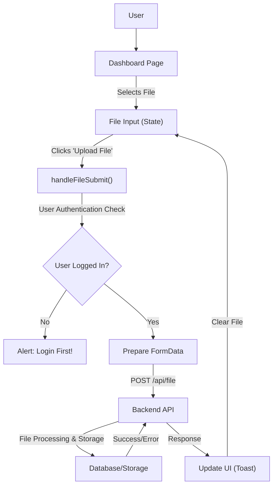
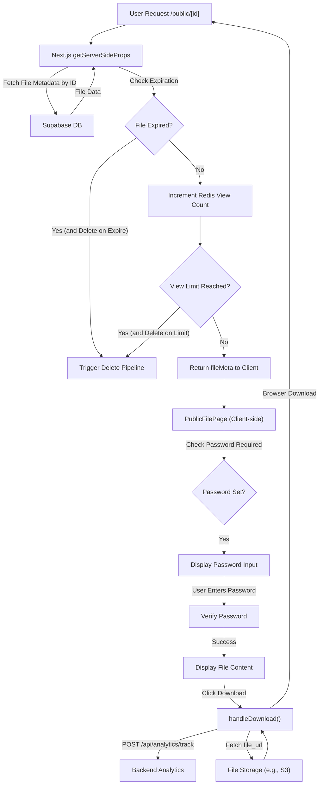

 
---
title: "Frontend Architecture and Pages"
description: "An overview of the client-side structure, major pages, and their functionalities."
---

# Frontend Architecture and Pages

The frontend of the application is built with Next.js, leveraging both the App Router (for authenticated dashboards) and the Pages Router (for public file access) to optimize for specific use cases like server-side rendering and static content delivery. This section details the core components and pages that users interact with.

## Core Structure and Technologies

The application's client-side architecture primarily utilizes:

*   **Next.js:** For routing, server-side rendering (SSR), client-side rendering (CSR), and API routes.
*   **React:** For building user interfaces.
*   **Tailwind CSS:** For utility-first styling.
*   **Shadcn/ui:** A component library built on top of Tailwind CSS and Radix UI for accessible and customizable UI components.
*   **KindeAuth:** For secure user authentication.
*   **Axios:** For making HTTP requests to backend API routes.
*   **Supabase Client:** For interacting with the Supabase database directly from the server-side components (e.g., in `getServerSideProps` or server components).

### Frontend Routing Strategy

The project employs a hybrid routing strategy:

*   **App Router (`src/app`):** Used for authenticated sections like the dashboard and uploaded files page. This allows for React Server Components, shared layouts, and more flexible data fetching.
*   **Pages Router (`src/pages`):** Used for public, dynamic pages such as `src/pages/public/[id].jsx`, enabling `getServerSideProps` for dynamic content fetching at request time, which is crucial for public file access with checks for expiration, password protection, and view limits.

## Dashboard Section

The dashboard (`src/app/dashboard`) serves as the primary hub for authenticated users to upload and manage their files.

### Dashboard Layout

The `src/app/dashboard/layout.jsx` file defines a simple layout wrapper for all pages within the `/dashboard` route. This layout can be extended to include navigation bars, footers, or other persistent UI elements.

```jsx title="src/app/dashboard/layout.jsx"
// src/app/dashboard/layout.tsx (or .jsx)
export default function DashboardLayout({ children }) {
  return (
    <div className="">
      {children}
    </div>
  );
}
```

This component simply renders its `children`, providing a wrapper for dashboard pages.
[View on GitHub](https://github.com/sumedhcharjan/Track-Vault/blob/main/src/app/dashboard/layout.jsx)

### Dashboard Page

The `src/app/dashboard/page.jsx` component is the main file upload interface. It's a client-side component (indicated by `"use client"`) that handles file selection, user authentication, and the upload process.

#### Key Features and Logic:

*   **File Upload Form:** Utilizes `Input` and `Button` components from Shadcn/ui to create an interactive file upload area with drag-and-drop functionality.
*   **State Management:** `useState` hooks manage the selected `file` and `saving` (upload status).
*   **User Authentication:** The `useKindeAuth` hook from `@kinde-oss/kinde-auth-nextjs` is used to get the current `user`'s information, ensuring only authenticated users can upload files.
*   **API Interaction:** The `handleFileSubmit` function sends the selected file to the backend using `api.post("/file")` via `FormData`.
*   **Error Handling and Feedback:** `toast` notifications provide real-time feedback on upload success or failure.
*   **Initial User Registration:** An `useEffect` hook triggers a `api.post("/register")` call once on component mount, likely for initial user setup on the backend.

```jsx title="src/app/dashboard/page.jsx" {4-6,18-20,38-66}
"use client"
import { Button } from "@/components/ui/button"
import { useKindeAuth } from "@kinde-oss/kinde-auth-nextjs"
import { useEffect, useState } from "react"
import api from "@/lib/axios"
import { Input } from "@/components/ui/input"
import {
  Card,
  CardHeader,
  CardTitle,
  CardDescription,
  CardContent,
  CardFooter,
} from "@/components/ui/card"
import { Label } from "@/components/ui/label"
import { toast } from "sonner"
import { FlickeringGrid } from "@/components/ui/flickering-grid"

export default function Dashboard() {
  const { user } = useKindeAuth();
  const [file, setFile] = useState();
  const [saving, setSaving] = useState(false);

  const handleFileSubmit = async () => {
    if (!file) {
      alert("Please select a file first!");
      return;
    }

    if (!user?.id) {
      alert("Login first!");
      return;
    }

    setSaving(true);

    try {
      const formData = new FormData();
      formData.append("file", file);
      formData.append("user_id", user.id);
      formData.append("file_name", file.name);

      const res = await api.post("/file", formData, {
        headers: {
          "Content-Type": "multipart/form-data",
        },
      });

      console.log("File upload success:", res.data);
      toast("File uploaded successfully!", {
        description: file.name + " has been uploaded.",
      });
      setFile(undefined); // Clear the upload field
    } catch (err) {
      toast("File upload error:", err.response?.data || err.message);
    } finally {
      setSaving(false);
    }
  };

  // ... (rest of the component)
}
```
[View on GitHub](https://github.com/sumedhcharjan/Track-Vault/blob/main/src/app/dashboard/page.jsx#L4-L66)

The `handleFileSubmit` function demonstrates the client-side logic for initiating a file upload, packaging the file and user data into a `FormData` object, and sending it to the backend.





## Uploaded Files Page

The `src/app/uploadedfiles/page.jsx` component allows authenticated users to view and manage their uploaded files. This page is a Next.js Server Component, ensuring that file data is fetched securely on the server before being sent to the client.

#### Key Features and Logic:

*   **Server-Side Data Fetching:** `getKindeServerSession` is used to authenticate the user on the server. `supabase.from("files").select("*")` fetches all files associated with the authenticated user directly from Supabase.
*   **Dynamic Rendering:** `export const dynamic = "force-dynamic";` ensures that the page is rendered dynamically on each request, reflecting the latest file data.
*   **Conditional Rendering:** The page displays different content based on whether the user is logged in, if there are errors fetching files, or if no files have been uploaded.
*   **File Categorization:** Files are separated into "Active Files" and "Inactive Files" based on the `is_active` property, displayed using Shadcn/ui `Tabs`.
*   **File Cards:** `FileCard` and `InactiveFileCard` components are used to display individual file details.

```jsx title="src/app/uploadedfiles/page.jsx" {5-6,14-15,31-33,65-71}
import FileCard from "@/components/filecard/Filecard";
import InactiveFileCard from "@/components/filecard/InactiveFileCard";
import { getKindeServerSession } from "@kinde-oss/kinde-auth-nextjs/server";
import { supabase } from "@/lib/supabase";
import { Card } from "@/components/ui/card";
import { Tabs, TabsContent, TabsList, TabsTrigger } from "@/components/ui/tabs";
import { Separator } from "@/components/ui/separator";
import { FlickeringGrid } from "@/components/ui/flickering-grid";

export const dynamic = "force-dynamic";

export default async function Uploadedfiles() {
  const { getUser } = getKindeServerSession();
  const user = await getUser();

  if (!user) {
    return (
      <main className="container mx-auto px-4 py-16 mt-20">
        <Card className="p-8 text-center">
          <p className="text-red-500 font-medium">
            You must be logged in to view files.
          </p>
        </Card>
      </main>
    );
  }

  const { data: files, error } = await supabase
    .from("files")
    .select("*")
    .eq("user_id", user.id)
    .order("created_at", { ascending: false });

  // ... (rest of the component)
}
```
[View on GitHub](https://github.com/sumedhcharjan/Track-Vault/blob/main/src/app/uploadedfiles/page.jsx#L5-L71)

This snippet highlights the use of server-side authentication and direct Supabase interaction for secure and efficient data retrieval for the logged-in user.

## Public File Page

The `src/pages/public/[id].jsx` component handles public access to shared files. This page uses Next.js Pages Router with `getServerSideProps` for robust server-side logic, including critical security and access checks.

#### Key Features and Logic:

*   **`getServerSideProps`:** This function is crucial for fetching file metadata (`fileMeta`) at request time. It performs several critical checks:
    *   **File Existence:** Checks if the file exists in the Supabase database.
    *   **Expiration:** Determines if the file has expired based on `expires_at`.
    *   **View Limits:** Uses Redis (`redis.incr`) to track file views and checks against `max_views`. If the limit is reached, the file is marked as expired or deleted.
    *   **Delete on Expire/Limit:** If `delete_on_expire` or `delete_on_limit` flags are set, it triggers a backend deletion pipeline (`api.delete("/deletepipeline")`).
*   **Client-Side Password Verification:** If `file_password` is set, the client-side component prompts the user for a password before allowing access.
*   **File Preview:** Displays image and PDF files directly in the browser.
*   **Download Functionality:** The `handleDownload` function initiates file download and tracks download events via `/api/analytics/track`.

```jsx title="src/pages/public/[id].jsx" {3-4, 82-87, 182-225}
"use client";

import { supabase } from "@/lib/supabase";
import { redis } from "@/lib/redis"; // Note: redis import is server-side only, this file is client-side.
import api from "@/lib/axios";
import { useState } from "react";
import "@/styles/globals.css"

import { Button } from "@/components/ui/button";
import { Input } from "@/components/ui/input";
import {
  Card,
  CardHeader,
  CardTitle,
  CardContent,
} from "@/components/ui/card";
import { FlickeringGrid } from "@/components/ui/flickering-grid";

export default function PublicFilePage({ fileMeta }) {
  const [file, setFile] = useState(fileMeta);
  const [passwordRequired, setPasswordRequired] = useState(!!file.file_password);
  const [password, setPassword] = useState("");
  const [error, setError] = useState("");
  const [loading, setLoading] = useState(false);

  const verifyPassword = async () => {
    setLoading(true);
    try {
      if (password === file.file_password) {
        setPasswordRequired(false);
        setError("");
      } else {
        setError("Invalid password. Please try again.");
      }
    } finally {
      setLoading(false);
    }
  };

  const triggerDeletePipeline = async (fileId) => {
    try {
      await api.delete("/deletepipeline", {
        data: { file_id: fileId },
      });
    } catch (err) {
      console.error("Delete pipeline error:", err.message);
    }
  };

  const handleDownload = async () => {
    try {
      // Track the download event
      const res = await fetch("/api/analytics/track", {
        method: "POST",
        headers: { "Content-Type": "application/json" },
        body: JSON.stringify({ id: file.id, type: "download" }),
      });
      const data = await res.json();
      if (!res.ok || !data.success) {
        alert("Download tracking failed. Limit might be reached.");
        return;
      }
      // Fetch the actual file
      const fileRes = await fetch(file.file_url);
      if (!fileRes.ok) throw new Error("File download failed");
      const blob = await fileRes.blob();
      const url = window.URL.createObjectURL(blob);
      const link = document.createElement("a");
      link.href = url;
      link.download = file.file_name || "download";
      document.body.appendChild(link);
      link.click();
      document.body.removeChild(link);
      window.URL.revokeObjectURL(url);
    } catch (err) {
      console.error("Download error:", err);
      alert("Something went wrong. Please try again.");
    }
  };

  if (!file) {
    return (
      <Card className="max-w-md mx-auto mt-20 shadow-sm rounded-2xl">
        <CardContent className="p-6 text-center text-gray-600">
          File not found.
        </CardContent>
      </Card>
    );
  }

  // ... (rest of component rendering)

}

export async function getServerSideProps({ params }) {
  const { id } = params;
  try {
    const { data: file, error } = await supabase
      .from("files")
      .select("*")
      .eq("id", id)
      .single();

    if (error || !file) return { notFound: true };

    if (file.expires_at && new Date(file.expires_at).getTime() <= Date.now()) {
      if (file.delete_on_expire) {
        try {
          await api.delete("/deletepipeline", { data: { file_id: file.id } });
        } catch (err) {
          console.error("Delete pipeline (expire) failed:", err.message);
        }
      }
      return { props: { fileMeta: { ...file, expired: true } } };
    }

    const views = await redis.incr(`file:${id}:views`);
    await redis.set(`file:${id}:lastAccess`, Date.now());

    if (file.max_views && views > file.max_views) {
      await redis.decr(`file:${id}:views`);
      if (file.delete_on_limit && views >= file.max_views) {
        try {
          await api.delete("/deletepipeline", {
            data: { file_id: file.id },
          });
        } catch (err) {
          console.error("Delete pipeline (limit) failed:", err.message);
        }
      }
      return { props: { fileMeta: { ...file, expired: true } } };
    }

    return { props: { fileMeta: file } };
  } catch {
    return { notFound: true };
  }
}
```
[View on GitHub](https://github.com/sumedhcharjan/Track-Vault/blob/main/src/pages/public/%5Bid%5D.jsx#L3-L4)
[View on GitHub](https://github.com/sumedhcharjan/Track-Vault/blob/main/src/pages/public/%5Bid%5D.jsx#L82-L87)
[View on GitHub](https://github.com/sumedhcharjan/Track-Vault/blob/main/src/pages/public/%5Bid%5D.jsx#L182-L225)

The `getServerSideProps` function is critical for implementing server-side checks and interactions with Supabase and Redis, enforcing file access rules before rendering the page content to the user.





## Key Integration Points

*   **Authentication Flow:** KindeAuth is deeply integrated into both client-side components (`useKindeAuth`) and server-side functions (`getKindeServerSession`) to manage user sessions and protect routes/data.
*   **Data Fetching Strategy:** A clear distinction is made between client-side fetching (e.g., file upload, analytics tracking) using `axios` and server-side fetching (e.g., user files list, public file metadata) using direct Supabase client and `getServerSideProps` for security and performance.
*   **Background Processing:** The `triggerDeletePipeline` function, called from both client-side and `getServerSideProps`, illustrates how frontend interactions can initiate complex backend processes for file management.
*   **Real-time Feedback:** The use of `sonner` for toast notifications provides a consistent and user-friendly way to communicate asynchronous operation statuses.
*   **Security & Access Control:** `getServerSideProps` for public files centralizes critical access checks (expiration, view limits, password presence), preventing unauthorized or expired file access before the client-side component even renders. This is a robust security measure.

Next: [Dashboard and User Interface](./3.1_dashboard-user-interface.mdx)
```