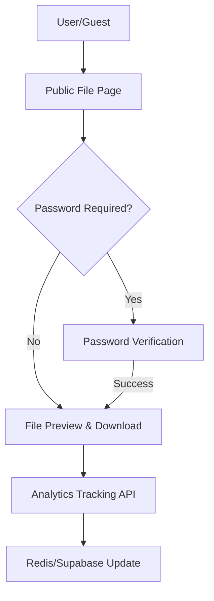

# File Interaction UI

The File Interaction UI provides a seamless bridge between file management for the uploader and the consumption experience for the end-user. It consists of dynamic preview components and a secure public access layer.

## Architecture Overview

The interaction flow is split between the administrative view (where files are managed) and the public view (where files are accessed).

## Component Breakdown

### 1. FileCard Component
The `FileCard` is the primary visual representation of a stored file. It utilizes a smart thumbnail system to provide context based on the file extension.

#### Thumbnail Logic
The component dynamically determines the preview based on the file's extension:

| Category | Extensions | Preview Method |
| :--- | :--- | :--- |
| **Images** | `jpg, jpeg, png, gif, webp` | Direct `` render |
| **PDFs** | `pdf` | Google Docs Viewer embedded thumbnail |
| **Videos** | `mp4, webm, ogg` | `<video>` element with metadata preload |
| **Documents** | `txt, doc, docx` | `FileText` icon (Blue) |
| **Spreadsheets** | `csv, xlsx, xls` | `FileSpreadsheet` icon (Emerald) |
| **Code** | `js, ts, py, java, cpp, html, css` | `FileCode` icon (Indigo) |
| **Archives** | `zip, rar, 7z, tar, gz` | `FileArchive` icon (Orange) |
| **Data** | `json, xml` | `FileJson` icon (Yellow) |

### 2. File Options
The `Options` component provides the file owner with management capabilities:

- **Copy URL**: Generates a shareable link combining the origin URL, file ID, and the associated password.
- **Download**: Triggers a direct browser download using the `file_url`.
- **Delete**: Sends a `DELETE` request to the `/file` endpoint using the `file_id` and `file_key`.
- **Analytics & Edit**: Redirects the user to the detailed management page for a specific file.

---

## Public Viewing Experience

The public page (`/public/[id]`) implements a multi-stage validation pipeline to ensure file security and limit enforcement.

### Server-Side Validation (`getServerSideProps`)
Before the page renders, the following checks are performed:
1. **Existence**: Verifies the file exists in the Supabase `files` table.
2. **Expiration**: Checks `expires_at`. If expired and `delete_on_expire` is true, it triggers the deletion pipeline.
3. **View Limits**: 
   - Increments the view count in **Redis**.
   - If `max_views` is exceeded and `delete_on_limit` is true, the file is deleted.

### Client-Side Access Control
- **Password Protection**: If `file_password` is present, the UI locks the content behind a password input field. Access is granted only upon a string match.
- **Dynamic Rendering**:
  - **Images**: Rendered directly in the card.
  - **PDFs**: Rendered via an `iframe` for an interactive reading experience.
  - **Other**: Displays a "Preview not available" message with a download option.

### Download Tracking
Downloads are not linked directly. Instead, they follow this sequence:
1. Call `/api/analytics/track` to log the download event.
2. Validate if the download limit has been reached.
3. Fetch the file as a `blob`.
4. Create a temporary object URL to trigger the browser save dialog.