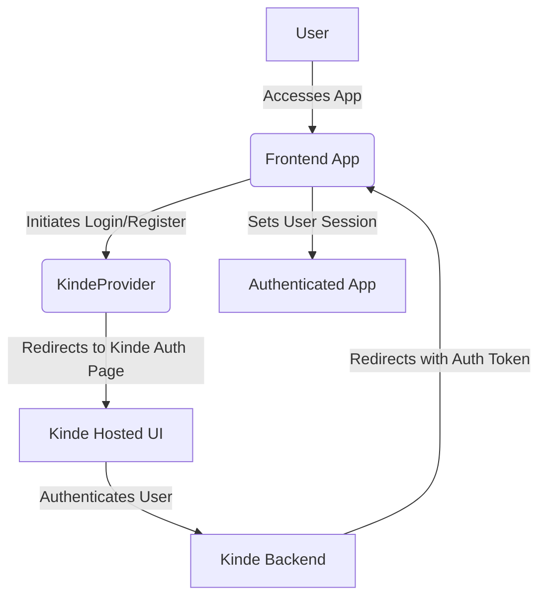
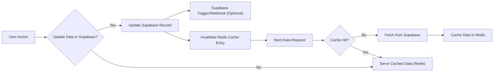

 # Third-Party Integrations

This document provides a comprehensive overview of the third-party services integrated into the application, focusing on their configuration, usage patterns, and how they enhance the application's capabilities. We leverage services like Kinde for authentication, Supabase for database management, AWS S3 for object storage, and Upstash Redis for caching and real-time data needs. Each integration is designed to be robust, scalable, and secure, ensuring a smooth and efficient user experience.

The architecture emphasizes modularity, with dedicated utility files for each service, making them easy to maintain, update, and replace if necessary. This approach streamlines development and allows for independent scaling of different components based on demand.

## Authentication with Kinde

Authentication is a critical component of any modern application, and we've chosen Kinde for its robust and developer-friendly authentication as a service (Auth-as-a-Service) platform. Kinde handles user registration, login, session management, and other authentication flows, freeing developers to focus on core application logic.

### Configuration

The `KindeProvider` wraps the application's components, making authentication state and functions available throughout the app. This is typically configured in a top-level provider file, like `src/components/Provider.jsx`. Environment variables are used to securely store and access Kinde's credentials.

```jsx
// app/providers.js
"use client";
import { KindeProvider } from "@kinde-oss/kinde-auth-nextjs";

export function Providers({ children }) {
  return (
    <KindeProvider
      clientId={process.env.NEXT_PUBLIC_KINDE_CLIENT_ID}
      domain={process.env.NEXT_PUBLIC_KINDE_DOMAIN}
      redirectUri={process.env.NEXT_PUBLIC_KINDE_REDIRECT_URI}
      logoutUri={process.env.NEXT_PUBLIC_KINDE_LOGOUT_URI}
    >
      {children}
    </KindeProvider>
  );
}
```
**Explanation:** This snippet shows the `KindeProvider` wrapping the application's children, making authentication services available globally. It relies on environment variables for sensitive configuration details.
[View on GitHub](https://github.com/sumedhcharjan/Track-Vault/blob/main/src/components/Provider.jsx)

### Kinde Authentication Flow

The authentication process with Kinde typically involves redirecting users to Kinde's hosted UI for login/registration and then redirecting them back to the application with an authenticated session.





**Explanation:** This diagram illustrates the typical flow of user authentication using Kinde, from the user accessing the application to a successful authenticated session.

## Data Persistence with Supabase

Supabase is an open-source Firebase alternative that provides a PostgreSQL database, real-time subscriptions, authentication, and storage functionalities. We utilize its PostgreSQL database for robust and scalable data storage.

### Client Initialization

The Supabase client is initialized in `src/lib/supabase.js`, using environment variables for the project URL and anonymous key. This setup allows for secure and dynamic configuration, enabling easy switching between development and production environments.

```javascript
import { createClient } from '@supabase/supabase-js'

export const  supabase = createClient(
  process.env.NEXT_PUBLIC_SUPABASE_URL,
  process.env.NEXT_PUBLIC_SUPABASE_ANON_KEY
)
```
**Explanation:** This code initializes the Supabase client, providing an interface to interact with the Supabase backend, including database queries, authentication, and storage operations.
[View on GitHub](https://github.com/sumedhcharjan/Track-Vault/blob/main/src/lib/supabase.js)

### Common Supabase Operations

With the `supabase` client, developers can perform various operations, such as fetching data, inserting records, updating entries, and handling user authentication (though Kinde is used for primary auth, Supabase can also manage user profiles).

```javascript
// Example: Fetching data from a Supabase table
async function fetchData() {
  const { data, error } = await supabase
    .from('items') // Assuming 'items' is a table name
    .select('*')
    .limit(10);

  if (error) {
    console.error('Error fetching data:', error);
    return null;
  }
  return data;
}

// Example: Inserting a new record
async function insertItem(item) {
  const { data, error } = await supabase
    .from('items')
    .insert([item]);

  if (error) {
    console.error('Error inserting item:', error);
    return null;
  }
  return data;
}
```
**Explanation:** These snippets demonstrate basic data retrieval and insertion operations using the initialized Supabase client. This pattern is common across the application for interacting with the database.

## Object Storage with AWS S3

For storing large binary objects like images, videos, or documents, we utilize Amazon S3 (Simple Storage Service). S3 provides highly scalable, durable, and secure object storage, making it ideal for managing user-generated content and application assets.

### S3 Client Configuration

The S3 client is configured in `src/lib/s3.js` using AWS SDK v3. It requires the region and AWS credentials (access key ID and secret access key), all securely loaded from environment variables.

```javascript
// lib/s3.js
import { S3Client } from "@aws-sdk/client-s3";

export const s3 = new S3Client({
  region: process.env.AWS_REGION,
  credentials: {
    accessKeyId: process.env.AWS_ACCESS_KEY_ID,
    secretAccessKey: process.env.AWS_SECRET_ACCESS_KEY,
  },
});
```
**Explanation:** This snippet initializes the AWS S3 client, which is then used throughout the application to interact with S3 buckets for object storage and retrieval.
[View on GitHub](https://github.com/sumedhcharjan/Track-Vault/blob/main/src/lib/s3.js)

### S3 Object Operations

Once the S3 client is initialized, operations like uploading, downloading, and deleting objects become straightforward. Pre-signed URLs are often used to grant temporary, time-limited access to private objects without exposing AWS credentials.

```javascript
import { PutObjectCommand, GetObjectCommand } from "@aws-sdk/client-s3";
import { getSignedUrl } from "@aws-sdk/s3-request-presigner";

// Example: Uploading an object to S3
async function uploadFileToS3(bucketName, key, body, contentType) {
  const command = new PutObjectCommand({
    Bucket: bucketName,
    Key: key,
    Body: body,
    ContentType: contentType,
  });
  try {
    const response = await s3.send(command);
    console.log("File uploaded successfully:", response);
    return response;
  } catch (error) {
    console.error("Error uploading file:", error);
    throw error;
  }
}

// Example: Generating a pre-signed URL for an object
async function getSignedDownloadUrl(bucketName, key) {
  const command = new GetObjectCommand({
    Bucket: bucketName,
    Key: key,
  });
  try {
    const url = await getSignedUrl(s3, command, { expiresIn: 3600 }); // URL valid for 1 hour
    return url;
  } catch (error) {
    console.error("Error generating signed URL:", error);
    throw error;
  }
}
```
**Explanation:** These functions illustrate how to upload a file to an S3 bucket and generate a pre-signed URL for downloading an object, enhancing security and access control.

## Caching and Real-time with Upstash Redis

Upstash Redis is a serverless Redis solution that provides a fully managed, low-latency key-value store. We leverage it for caching frequently accessed data, managing real-time states, and implementing rate limiting or session management.

### Redis Client Initialization

The Upstash Redis client is initialized in `src/lib/redis.js` using the `@upstash/redis` package. It requires the REST URL and token, both sourced from environment variables for secure access.

```javascript
import { Redis } from "@upstash/redis";

export const redis = new Redis({
  url: process.env.UPSTASH_REDIS_REST_URL,
  token: process.env.UPSTASH_REDIS_REST_TOKEN,
});
```
**Explanation:** This code sets up the Upstash Redis client, making it ready to perform various caching and data storage operations.
[View on GitHub](https://github.com/sumedhcharjan/Track-Vault/blob/main/src/lib/redis.js)

### Common Redis Operations

Redis offers a rich set of data structures and commands. For common use cases like caching, we primarily use `set` to store data and `get` to retrieve it, often with an expiration time (`EX` parameter).

```javascript
// Example: Storing data in Redis with an expiration
async function setCache(key, value, expirySeconds = 3600) { // Default 1 hour expiry
  try {
    await redis.set(key, JSON.stringify(value), { ex: expirySeconds });
    console.log(`Key '${key}' set in cache.`);
  } catch (error) {
    console.error("Error setting cache:", error);
    throw error;
  }
}

// Example: Retrieving data from Redis
async function getCache(key) {
  try {
    const cachedData = await redis.get(key);
    if (cachedData) {
      console.log(`Key '${key}' retrieved from cache.`);
      return JSON.parse(cachedData);
    }
    console.log(`Key '${key}' not found in cache.`);
    return null;
  } catch (error) {
    console.error("Error getting cache:", error);
    throw error;
  }
}
```
**Explanation:** These functions demonstrate how to set and retrieve data from Redis, utilizing JSON serialization for complex objects and an expiration mechanism for efficient cache management.

### Cache Invalidation Flow

Efficient caching strategies often involve invalidation. For example, when data in Supabase is updated, the corresponding cache entry in Redis should be invalidated or updated to ensure data consistency.





**Explanation:** This flowchart illustrates a typical data flow that includes caching with Redis and how cache invalidation might occur when the underlying data in Supabase is updated. This ensures that users always receive fresh data when necessary, while also leveraging the speed of cached data.

## Key Integration Points

The integration of these third-party services forms a robust and scalable backend for the application. Each service is selected for its specialized capabilities, allowing the application to offload critical functionalities to highly optimized platforms.

-   **Modular Configuration:** Each service is configured through dedicated utility files (`src/lib/*.js`), promoting code organization and ease of maintenance. All sensitive credentials are handled via environment variables, ensuring secure deployment.
-   **Performance and Scalability:**
    -   **Kinde:** Provides scalable authentication infrastructure without managing servers.
    -   **Supabase:** Offers a performant PostgreSQL database that can scale with application needs, along with real-time capabilities.
    -   **AWS S3:** Delivers virtually unlimited storage for objects, ensuring high availability and durability.
    -   **Upstash Redis:** Serves as a fast in-memory data store for caching, reducing database load and improving response times.
-   **Security Best Practices:** Environment variables are strictly used for all API keys and secrets. Authentication flows are managed by Kinde, which handles security aspects like password hashing and session management. Access to S3 and Supabase is controlled via credentials and policies.
-   **Developer Experience:** By using well-documented libraries (AWS SDK, Supabase JS client, Upstash Redis), developers can quickly integrate and utilize these services, leveraging a familiar API surface. The modular setup also makes it easier to test individual components.

These integrations collectively empower the application with a powerful set of tools for authentication, data management, file storage, and performance optimization, all while adhering to modern development and security standards.