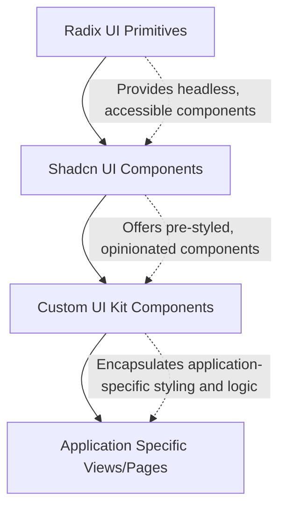
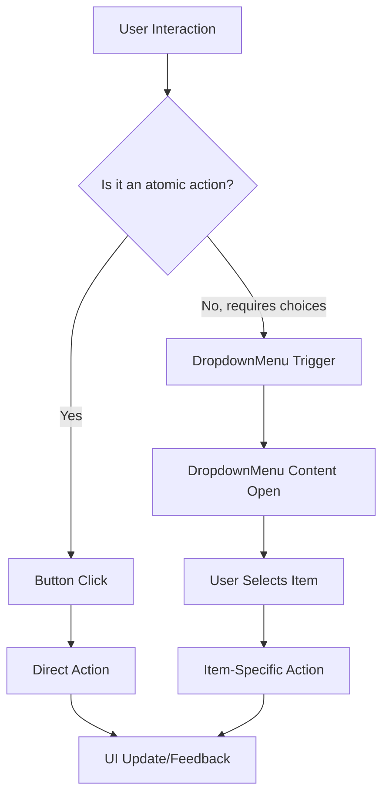

 # UI Kit and Reusable Components

This section provides a detailed overview of the UI components used across the application. These components are built upon Shadcn UI primitives, enhanced with custom styling and functionalities to ensure a consistent and accessible user experience. The modular design promotes reusability and maintainability, making it easier to develop and scale the application's user interface.

## Core Component Principles

Our UI Kit adheres to several core principles:

*   **Composability**: Components are designed to be combined in various ways to build complex UIs.
*   **Accessibility (A11y)**: Built on [Radix UI primitives](https://www.radix-ui.com/), ensuring a high degree of accessibility.
*   **Theming**: Utilizes Tailwind CSS for styling, making it highly customizable through `tailwind.config.js`.
*   **Type Safety**: Components are typically typed with TypeScript (though examples here are JSX for brevity) to provide better developer experience and reduce errors.
*   **Utility-First**: Leverages the `cn` utility function for conditional class merging, facilitating dynamic styling.

The following diagram illustrates the foundational relationship between Radix UI, Shadcn UI, and our custom components:





## Button Component

The `Button` component, located at `src/components/ui/button.jsx`, is a highly versatile and customizable element used for interactive actions throughout the application. It leverages `class-variance-authority` (cva) for managing different visual variants and sizes, ensuring consistent styling while remaining flexible.

### Key Features

*   **Variants**: Supports different visual styles like `default`, `destructive`, `outline`, `secondary`, `ghost`, and `link`.
*   **Sizes**: Defines various dimensions such as `default`, `sm`, `lg`, and `icon`.
*   **Accessibility**: Built with `Slot` from `@radix-ui/react-slot`, allowing it to render as a different HTML tag or component while retaining its styles and behavior.
*   **Responsiveness**: Uses Tailwind CSS for responsive breakpoints and utility classes.

### Usage Example

```jsx
// src/components/ExampleComponent.jsx
import { Button } from "@/components/ui/button";
import { PlusIcon, SaveIcon } from "lucide-react"; // Assuming lucide-react is installed

function ExampleComponent() {
  return (
    <div className="flex gap-4 p-4">
      <Button variant="default">
        <PlusIcon /> Add Item
      </Button>
      <Button variant="outline" size="sm">
        Save Draft
      </Button>
      <Button variant="destructive">Delete</Button>
      <Button variant="ghost" asChild>
        <a href="/settings">Go to Settings</a>
      </Button>
      <Button size="icon">
        <SaveIcon />
      </Button>
    </div>
  );
}
```
[View Button on GitHub](https://github.com/sumedhcharjan/Track-Vault/blob/main/src/components/ui/button.jsx)

### `buttonVariants` Configuration

The core of the button's styling flexibility comes from `buttonVariants` defined using `cva`. This function allows for a declarative way to manage component variations.

```jsx
// src/components/ui/button.jsx
const buttonVariants = cva(
  "inline-flex items-center justify-center gap-2 whitespace-nowrap rounded-md text-sm font-medium transition-all disabled:pointer-events-none disabled:opacity-50 [&_svg]:pointer-events-none [&_svg:not([class*='size-'])]:size-4 shrink-0 [&_svg]:shrink-0 outline-none focus-visible:border-ring focus-visible:ring-ring/50 focus-visible:ring-[3px] aria-invalid:ring-destructive/20 dark:aria-invalid:ring-destructive/40 aria-invalid:border-destructive",
  {
    variants: {
      variant: {
        default:
          "bg-primary text-primary-foreground shadow-xs hover:bg-primary/90",
        destructive:
          "bg-destructive text-white shadow-xs hover:bg-destructive/90 focus-visible:ring-destructive/20 dark:focus-visible:ring-destructive/40 dark:bg-destructive/60",
        // ... other variants
      },
      size: {
        default: "h-9 px-4 py-2 has-[>svg]:px-3",
        sm: "h-8 rounded-md gap-1.5 px-3 has-[>svg]:px-2.5",
        // ... other sizes
      },
    },
    defaultVariants: {
      variant: "default",
      size: "default",
    },
  }
)
```
This snippet highlights how base styles are applied universally, and then `variants` define specific class sets for different visual configurations. `defaultVariants` ensure a fallback style if no `variant` or `size` prop is provided.

## Input Component

The `Input` component, located at `src/components/ui/input.jsx`, provides a standardized input field with consistent styling and focus management. It's designed to be used for various text-based inputs, email fields, and password fields.

### Key Features

*   **Consistent Styling**: Applies a unified look and feel for all input fields.
*   **Focus Management**: Includes `focus-visible` styles for clear indication when an input is focused via keyboard navigation.
*   **Accessibility**: Handles disabled states and `aria-invalid` states for clear user feedback.
*   **File Input Styling**: Provides specific styles for file input types.

### Usage Example

```jsx
// src/components/ExampleForm.jsx
import { Input } from "@/components/ui/input";

function ExampleForm() {
  const [value, setValue] = React.useState("");

  return (
    <div className="flex flex-col gap-4 p-4 max-w-sm">
      <label htmlFor="name-input" className="block text-sm font-medium text-foreground">
        Your Name
      </label>
      <Input
        id="name-input"
        type="text"
        placeholder="Enter your name"
        value={value}
        onChange={(e) => setValue(e.target.value)}
      />
      <label htmlFor="email-input" className="block text-sm font-medium text-foreground">
        Email Address
      </label>
      <Input
        id="email-input"
        type="email"
        placeholder="your@example.com"
        aria-invalid={!value.includes('@')} // Example of dynamic invalid state
      />
      <label htmlFor="file-upload" className="block text-sm font-medium text-foreground">
        Upload Document
      </label>
      <Input id="file-upload" type="file" />
    </div>
  );
}
```
[View Input on GitHub](https://github.com/sumedhcharjan/Track-Vault/blob/main/src/components/ui/input.jsx)

### Core Styling

The `Input` component combines multiple utility classes to achieve its visual and interactive properties.

```jsx
// src/components/ui/input.jsx
function Input({
  className,
  type,
  ...props
}) {
  return (
    <input
      type={type}
      data-slot="input"
      className={cn(
        "file:text-foreground placeholder:text-muted-foreground selection:bg-primary selection:text-primary-foreground dark:bg-input/30 border-input flex h-9 w-full min-w-0 rounded-md border bg-transparent px-3 py-1 text-base shadow-xs transition-[color,box-shadow] outline-none file:inline-flex file:h-7 file:border-0 file:bg-transparent file:text-sm file:font-medium disabled:pointer-events-none disabled:cursor-not-allowed disabled:opacity-50 md:text-sm",
        "focus-visible:border-ring focus-visible:ring-ring/50 focus-visible:ring-[3px]",
        "aria-invalid:ring-destructive/20 dark:aria-invalid:ring-destructive/40 aria-invalid:border-destructive",
        className
      )}
      {...props} />
  );
}
```
This snippet demonstrates the extensive use of Tailwind CSS classes for styling everything from backgrounds and borders to focus states and disabled appearances. The `cn` utility ensures that custom `className` props merge correctly without conflicts.

## Card Component

The `Card` component suite, located at `src/components/ui/card.jsx`, provides a flexible container for grouping related content and actions. It includes sub-components for headers, titles, descriptions, content, actions, and footers, allowing for structured and visually distinct content blocks.

### Key Features

*   **Structured Content**: Offers dedicated components like `CardHeader`, `CardTitle`, `CardDescription`, `CardContent`, `CardAction`, and `CardFooter`.
*   **Flexibility**: Allows for various layouts within the card using combinations of its sub-components.
*   **Styling**: Provides a clean, bordered, and shadowed appearance by default, consistent with the application's design language.
*   **Container Query Support**: `CardHeader` uses `@container/card-header` for responsive styling based on its own width, not just the viewport.

### Usage Example

```jsx
// src/components/ExampleDashboard.jsx
import {
  Card,
  CardHeader,
  CardTitle,
  CardDescription,
  CardContent,
  CardFooter,
  CardAction,
} from "@/components/ui/card";
import { Button } from "@/components/ui/button";
import { InfoIcon } from "lucide-react";

function ExampleDashboard() {
  return (
    <div className="grid grid-cols-1 md:grid-cols-2 lg:grid-cols-3 gap-6 p-6">
      <Card className="max-w-md">
        <CardHeader>
          <CardTitle>Welcome Back!</CardTitle>
          <CardDescription>Your personal dashboard overview.</CardDescription>
          <CardAction>
            <Button variant="ghost" size="icon">
              <InfoIcon />
            </Button>
          </CardAction>
        </CardHeader>
        <CardContent>
          <p>Here's a summary of your recent activities and notifications.</p>
        </CardContent>
        <CardFooter>
          <Button>View Details</Button>
        </CardFooter>
      </Card>

      <Card className="max-w-md">
        <CardHeader>
          <CardTitle>Project Status</CardTitle>
        </CardHeader>
        <CardContent>
          <ul>
            <li>Task 1: In Progress</li>
            <li>Task 2: Completed</li>
            <li>Task 3: Pending Review</li>
          </ul>
        </CardContent>
      </Card>
    </div>
  );
}
```
[View Card on GitHub](https://github.com/sumedhcharjan/Track-Vault/blob/main/src/components/ui/card.jsx)

### `CardAction` Positioning

The `CardAction` component is specifically designed to be placed within `CardHeader` and automatically positions itself in the top-right corner, making it ideal for buttons or menus related to the card's title.

```jsx
// src/components/ui/card.jsx
function CardAction({
  className,
  ...props
}) {
  return (
    <div
      data-slot="card-action"
      className={cn(
        "col-start-2 row-span-2 row-start-1 self-start justify-self-end",
        className
      )}
      {...props} />
  );
}
```
This snippet shows the use of CSS Grid (`col-start-2`, `row-span-2`, `row-start-1`) to position the action element within the `CardHeader`'s grid layout.

## DropdownMenu Component

The `DropdownMenu` component suite, located at `src/components/ui/dropdown-menu.jsx`, provides accessible and customizable context menus, navigation menus, and more. It is built on Radix UI's DropdownMenu primitive, offering a rich set of sub-components for various dropdown functionalities.

### Key Features

*   **Comprehensive Sub-Components**: Includes `DropdownMenuTrigger`, `DropdownMenuContent`, `DropdownMenuItem`, `DropdownMenuCheckboxItem`, `DropdownMenuRadioItem`, `DropdownMenuLabel`, `DropdownMenuSeparator`, `DropdownMenuShortcut`, `DropdownMenuSub`, and more.
*   **Accessibility**: Inherits accessibility features from Radix UI, including keyboard navigation and ARIA attributes.
*   **Animations**: Features smooth enter/exit animations for content, improving user experience.
*   **Positioning**: Automatically handles content positioning relative to the trigger.

### Usage Example

```jsx
// src/components/ExampleNavbar.jsx
import {
  DropdownMenu,
  DropdownMenuTrigger,
  DropdownMenuContent,
  DropdownMenuItem,
  DropdownMenuLabel,
  DropdownMenuSeparator,
  DropdownMenuShortcut,
  DropdownMenuCheckboxItem,
  DropdownMenuSub,
  DropdownMenuSubTrigger,
  DropdownMenuSubContent,
} from "@/components/ui/dropdown-menu";
import { Button } from "@/components/ui/button";
import { SettingsIcon, UserIcon, LogOutIcon, MoreVerticalIcon } from "lucide-react";

function ExampleNavbar() {
  const [showStatusBar, setShowStatusBar] = React.useState(true);
  const [theme, setTheme] = React.useState("light");

  return (
    <nav className="p-4 border-b flex justify-end">
      <DropdownMenu>
        <DropdownMenuTrigger asChild>
          <Button variant="ghost" size="icon">
            <MoreVerticalIcon />
          </Button>
        </DropdownMenuTrigger>
        <DropdownMenuContent className="w-56">
          <DropdownMenuLabel>My Account</DropdownMenuLabel>
          <DropdownMenuSeparator />
          <DropdownMenuItem>
            <UserIcon className="mr-2 h-4 w-4" />
            <span>Profile</span>
            <DropdownMenuShortcut>⇧⌘P</DropdownMenuShortcut>
          </DropdownMenuItem>
          <DropdownMenuItem>
            <SettingsIcon className="mr-2 h-4 w-4" />
            <span>Settings</span>
            <DropdownMenuShortcut>⌘S</DropdownMenuShortcut>
          </DropdownMenuItem>
          <DropdownMenuSeparator />
          <DropdownMenuCheckboxItem
            checked={showStatusBar}
            onCheckedChange={setShowStatusBar}
          >
            Show Status Bar
          </DropdownMenuCheckboxItem>
          <DropdownMenuSub>
            <DropdownMenuSubTrigger>
              Theme
            </DropdownMenuSubTrigger>
            <DropdownMenuSubContent>
              <DropdownMenuItem onClick={() => setTheme("light")}>Light</DropdownMenuItem>
              <DropdownMenuItem onClick={() => setTheme("dark")}>Dark</DropdownMenuItem>
              <DropdownMenuItem onClick={() => setTheme("system")}>System</DropdownMenuItem>
            </DropdownMenuSubContent>
          </DropdownMenuSub>
          <DropdownMenuSeparator />
          <DropdownMenuItem variant="destructive">
            <LogOutIcon className="mr-2 h-4 w-4" />
            <span>Log out</span>
            <DropdownMenuShortcut>⇧⌘Q</DropdownMenuShortcut>
          </DropdownMenuItem>
        </DropdownMenuContent>
      </DropdownMenu>
    </nav>
  );
}
```
[View DropdownMenu on GitHub](https://github.com/sumedhcharjan/Track-Vault/blob/main/src/components/ui/dropdown-menu.jsx)

### `DropdownMenuContent` Animations

The `DropdownMenuContent` component incorporates a rich set of animation classes to provide a smooth user experience. These classes are applied based on the `data-state` attribute (open/closed) and `data-side` attribute (bottom, left, right, top).

```jsx
// src/components/ui/dropdown-menu.jsx
function DropdownMenuContent({
  className,
  sideOffset = 4,
  ...props
}) {
  return (
    <DropdownMenuPrimitive.Portal>
      <DropdownMenuPrimitive.Content
        data-slot="dropdown-menu-content"
        sideOffset={sideOffset}
        className={cn(
          "bg-popover text-popover-foreground data-[state=open]:animate-in data-[state=closed]:animate-out data-[state=closed]:fade-out-0 data-[state=open]:fade-in-0 data-[state=closed]:zoom-out-95 data-[state=open]:zoom-in-95 data-[side=bottom]:slide-in-from-top-2 data-[side=left]:slide-in-from-right-2 data-[side=right]:slide-in-from-left-2 data-[side=top]:slide-in-from-bottom-2 z-50 max-h-(--radix-dropdown-menu-content-available-height) min-w-[8rem] origin-(--radix-dropdown-menu-content-transform-origin) overflow-x-hidden overflow-y-auto rounded-md border p-1 shadow-md",
          className
        )}
        {...props} />
    </DropdownMenuPrimitive.Portal>
  );
}
```
This excerpt shows how `data-[state=open/closed]` and `data-[side=...]` are used to trigger different Tailwind CSS animations (`fade-in-0`, `zoom-in-95`, `slide-in-from-top-2`, etc.), creating a dynamic and engaging dropdown experience.

## Key Integration Points

The UI Kit components are foundational to how users interact with the application. Their consistent design and behavior are critical for a predictable and intuitive user experience.

*   **Forms**: `Input` components are integrated into all data entry forms, often alongside `Button` components for submission or cancellation actions. Validation states (e.g., `aria-invalid`) are crucial for providing immediate feedback.
*   **Navigation & Actions**: `Button` and `DropdownMenu` components are heavily utilized in headers, sidebars, and data tables for navigation, context-specific actions, and user profile management.
*   **Information Display**: `Card` components serve as the primary containers for displaying grouped information, statistics, or actionable insights on dashboards and detail pages.

The interaction flow for an action within a typical UI component often follows a pattern:





### Best Practices

*   **Prop Consistency**: Always refer to the component's defined props (`variant`, `size`, `className`, etc.) to ensure proper styling and behavior.
*   **Semantic HTML**: Utilize `asChild` for `Button` or ensure `DropdownMenu` items render appropriate semantic elements when necessary (e.g., `<a>` for links).
*   **Accessibility Testing**: Regularly test components with keyboard navigation and screen readers to ensure full accessibility.
*   **Theme Adherence**: Use the provided variants and extend the `tailwind.config.js` for custom colors or sizes rather than inline styles to maintain theme consistency.

Next: [External Service Integrations](./4.2_external-service-integrations.mdx)