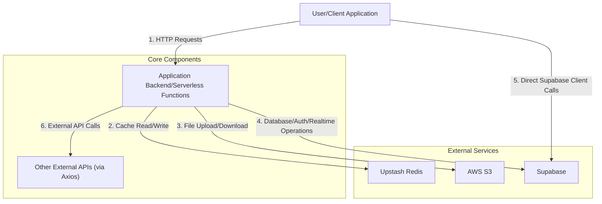

 # External Service Integrations

Modern web applications often rely on a robust ecosystem of external services to handle specialized tasks efficiently, ranging from data storage and caching to authentication and file management. This document details the core external service integrations within the application, outlining their purpose, configuration, and how they enhance the system's capabilities. We utilize services like Redis for high-performance data caching, AWS S3 for scalable object storage, Supabase for backend-as-a-service functionalities, and a custom Axios instance for streamlined API communication.

## Core API Client

The application's interaction with its own backend API, or any RESTful service, is standardized through a custom configured Axios instance. This approach centralizes common configurations, such as the base URL and credential handling, ensuring consistency and ease of maintenance across all API requests.

### Configuration (`src/lib/axios.js`)

The `axios.js` file sets up a default Axios instance. It dynamically determines the API base URL based on environment variables, falling back to a local development URL if `NEXT_PUBLIC_API_URL` is not set. The `withCredentials` option is crucial for applications that rely on cookies or session tokens for authentication across different domains, ensuring that credentials like HTTP cookies are sent with cross-site requests.

```javascript
// src/lib/axios.js
import axios from "axios";

const api = axios.create({
  baseURL: process.env.NEXT_PUBLIC_API_URL || "http://localhost:3000/api",
  withCredentials: true, // useful if you’re using cookies/auth
});

export default api;
```

This snippet defines the `api` client, configuring its `baseURL` for either production (via `NEXT_PUBLIC_API_URL`) or local development, and enabling `withCredentials` for secure, stateful API interactions. It acts as the primary interface for making HTTP requests throughout the application.

[View on GitHub](https://github.com/sumedhcharjan/Track-Vault/blob/main/src/lib/axios.js)

### Usage

This `api` instance is typically imported wherever the application needs to communicate with its backend. For example, fetching data, submitting forms, or authenticating users would all leverage this pre-configured client, simplifying the request logic and ensuring consistent headers and error handling.

## Redis Integration (Upstash)

Redis is an open-source, in-memory data structure store used as a database, cache, and message broker. For serverless and edge environments, services like Upstash Redis provide a durable and globally distributed Redis experience without the operational overhead. This application integrates Upstash Redis primarily for caching and potentially for managing real-time data or session states.

### Configuration (`src/lib/redis.js`)

The `redis.js` file initializes the Redis client using `@upstash/redis`. It securely connects to the Upstash Redis instance by leveraging environment variables for the REST URL and authentication token, ensuring that sensitive credentials are not hardcoded.

```javascript
// src/lib/redis.js
import { Redis } from "@upstash/redis";

export const redis = new Redis({
  url: process.env.UPSTASH_REDIS_REST_URL,
  token: process.env.UPSTASH_REDIS_REST_TOKEN,
});
```

This snippet demonstrates the instantiation of the `Redis` client from `@upstash/redis`, using `UPSTASH_REDIS_REST_URL` and `UPSTASH_REDIS_REST_TOKEN` to establish a secure connection. This client can then be used across the application for various caching strategies.

[View on GitHub](https://github.com/sumedhcharjan/Track-Vault/blob/main/src/lib/redis.js)

### Role in the Application

Redis is vital for improving application performance by caching frequently accessed data, reducing the load on primary databases, and speeding up response times. It can also be utilized for real-time leaderboards, rate limiting, or managing short-lived session data in a distributed environment.

## AWS S3 Integration

Amazon S3 (Simple Storage Service) is a highly scalable, durable, and secure object storage service. It is widely used for storing static assets, user-generated content, backups, and large files. Integrating S3 allows the application to offload file storage and retrieval, ensuring high availability and robust data management.

### Configuration (`src/lib/s3.js`)

The `s3.js` file configures the AWS S3 client using the `@aws-sdk/client-s3` package. It requires the AWS region, access key ID, and secret access key, all sourced from environment variables, to securely authenticate and interact with S3 buckets.

```javascript
// lib/s3.js
import { S3Client } from "@aws-sdk/client-s3";

export const s3 = new S3Client({
  region: process.env.AWS_REGION,
  credentials: {
    accessKeyId: process.env.AWS_ACCESS_KEY_ID,
    secretAccessKey: process.env.AWS_SECRET_ACCESS_KEY,
  },
});
```

This snippet initializes the `S3Client`, configuring it with the AWS region and credentials retrieved from environment variables. This setup allows the application to perform operations like uploading, downloading, and managing files in S3 buckets.

[View on GitHub](https://github.com/sumedhcharjan/Track-Vault/blob/main/src/lib/s3.js)

### Role in the Application

S3 integration is crucial for any application dealing with user-uploaded files, such as profile pictures, document storage, or media. It provides a reliable and cost-effective solution for storing large volumes of data, which can be easily retrieved or served directly to users.

## Supabase Integration

Supabase offers an open-source alternative to Firebase, providing a suite of backend services including a PostgreSQL database, authentication, real-time subscriptions, and storage. It simplifies backend development, allowing developers to focus on the frontend and core business logic.

### Configuration (`src/lib/supabase.js`)

The `supabase.js` file initializes the Supabase client. It uses `createClient` from `@supabase/supabase-js`, taking the Supabase project URL and anonymous public key from environment variables. These keys are essential for the client-side library to connect and interact with your Supabase project.

```javascript
// src/lib/supabase.js
import { createClient } from '@supabase/supabase-js'

export const  supabase = createClient(
  process.env.NEXT_PUBLIC_SUPABASE_URL,
  process.env.NEXT_PUBLIC_SUPABASE_ANON_KEY
)
```

This snippet creates the `supabase` client instance, using `NEXT_PUBLIC_SUPABASE_URL` and `NEXT_PUBLIC_SUPABASE_ANON_KEY` for connection. This client provides methods to interact with Supabase's database, authentication, storage, and real-time features.

[View on GitHub](https://github.com/sumedhcharjan/Track-Vault/blob/main/src/lib/supabase.js)

### Role in the Application

Supabase can serve as the primary backend for the application, handling user authentication, data persistence via its PostgreSQL database, and potentially real-time features. Its integration drastically reduces the need for custom backend API development for common functionalities.

## Integration Flow Diagram

The following diagram illustrates how these external services might interact with the application.





**Explanation of the Flow:**
1.  **User/Client Application** initiates requests to the **Application Backend**.
2.  The **Application Backend** utilizes **Upstash Redis** for caching frequently accessed data or managing temporary states.
3.  For file storage and retrieval, the **Application Backend** interacts with **AWS S3**.
4.  Database operations, user authentication, and real-time features are handled by interacting with **Supabase** from the **Application Backend**.
5.  In some architectures (e.g., frontend-heavy applications), the **User/Client Application** might make direct client-side calls to **Supabase** for database access or authentication, assuming appropriate Row Level Security (RLS) is configured.
6.  The **Application Backend** may also make calls to **Other External APIs** (e.g., third-party services) using the configured Axios instance for specialized functionalities.

## Key Integration Points

### Environment Variable Management
All external service integrations heavily rely on environment variables (`process.env.KEY`). This is a critical security and configuration practice, ensuring that sensitive credentials (API keys, tokens, URLs) are not hardcoded into the codebase and can be easily managed and rotated across different deployment environments (development, staging, production).

### Centralized Client Instantiation
Each external service (Redis, S3, Supabase) and the custom Axios client is instantiated in its own dedicated library file (`src/lib/`). This promotes modularity, reusability, and a single source of truth for configuration, making it easier to manage dependencies and update service configurations without impacting the entire application.

### Error Handling and Fallbacks
While not explicitly shown in the snippets, robust applications integrating external services must implement comprehensive error handling. This includes retry mechanisms for transient errors, circuit breakers to prevent cascading failures, and graceful degradation strategies when a service is unavailable. For instance, if Redis is down, the application might fall back to direct database queries (though with reduced performance).

### Performance Optimization
Services like Redis are integrated specifically for performance benefits through caching. Strategic use of caching mechanisms can significantly reduce database load and improve response times. For file uploads, direct uploads to S3 from the client (after obtaining a signed URL from the backend) can bypass the application server, reducing server load and improving upload speeds.

## Conclusion

The structured integration of services like Upstash Redis, AWS S3, and Supabase, alongside a tailored Axios client, forms the backbone of a resilient and scalable application. This approach leverages specialized external platforms to delegate complex tasks, allowing the core application logic to remain focused and efficient. Adhering to best practices in configuration, security, and error handling ensures these integrations contribute positively to the overall stability and performance of the system.