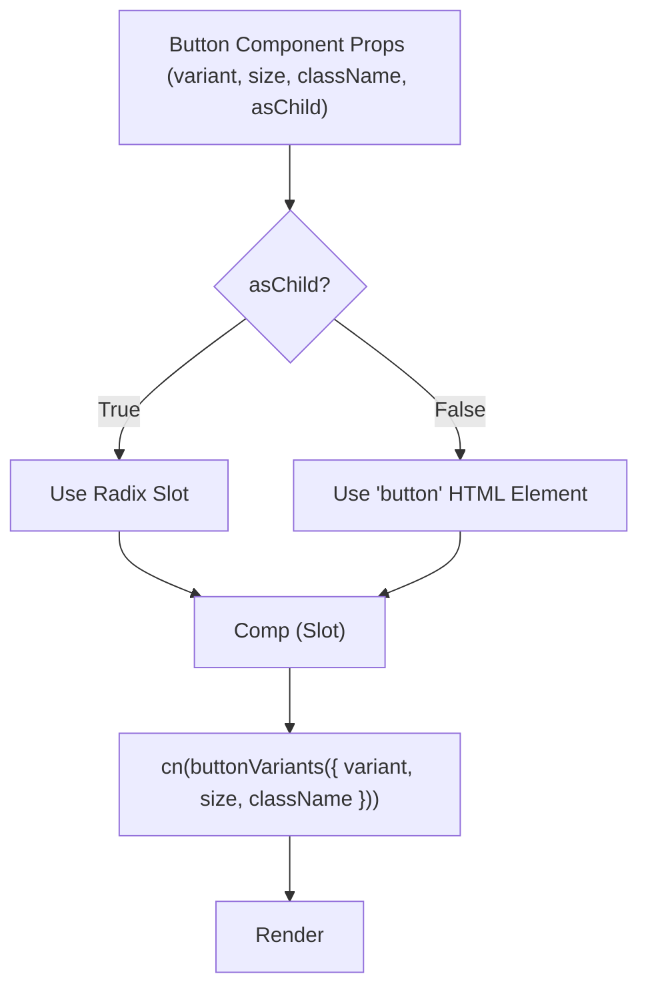

 # Reusable UI Components

This section provides comprehensive documentation for the user interface components utilized across the application. These components are primarily built upon the [Shadcn UI](https://ui.shadcn.com/) library, offering a robust and highly customizable foundation, augmented with custom extensions and styling to meet specific application requirements. By centralizing UI elements, we ensure consistency, maintainability, and a streamlined development process.

## Configuration and Aliases

The `components.json` file is central to configuring how Shadcn UI components are managed and integrated into the project. It defines important settings such as the styling framework, base color, and crucial path aliases that simplify imports.

### `components.json` Overview

The configuration in `components.json` dictates the behavior of Shadcn UI components, including styling preferences, whether React Server Components (RSC) are enabled, and how Tailwind CSS is integrated.

```json
{
  "$schema": "https://ui.shadcn.com/schema.json",
  "style": "new-york",
  "rsc": true,
  "tsx": false,
  "tailwind": {
    "config": "",
    "css": "src/styles/globals.css",
    "baseColor": "zinc",
    "cssVariables": true,
    "prefix": ""
  },
  "aliases": {
    "components": "@/components",
    "utils": "@/lib/utils",
    "ui": "@/components/ui",
    "lib": "@/lib",
    "hooks": "@/hooks"
  },
  "iconLibrary": "lucide"
}
```

Key aspects configured here include:
*   **`style`**: Set to `"new-york"`, indicating the chosen aesthetic for Shadcn components.
*   **`rsc`**: `true`, signifying that components are prepared for React Server Components.
*   **`tailwind`**: Specifies Tailwind CSS integration details, including the main CSS file and base color.
*   **`aliases`**: Crucial for defining short, absolute paths for various directories, making imports cleaner and more consistent across the codebase. For instance, `src/components/ui` can be imported as `@{path_to_root}/components/ui`.

These aliases are particularly important for referencing components and utility functions. For example, `ui: "@/components/ui"` allows importing `Button` as `import { Button } from "@/components/ui/button"`.

[View `components.json` on GitHub](https://github.com/sumedhcharjan/Track-Vault/blob/main/components.json)

## UI Components

This section details the core UI components, including `Button`, `Card`, and `Input`, showcasing their structure, props, and usage patterns.

### Button Component

The `Button` component provides a flexible and accessible way to render interactive buttons. It leverages `class-variance-authority` (cva) for managing different visual styles (variants) and sizes, ensuring a consistent look and feel across the application.

#### Variants and Sizes

The `buttonVariants` object defines the various `variant` and `size` options available for the button. This design pattern allows for easy extension and modification of button styles without altering the core component logic.

```jsx
// src/components/ui/button.jsx
const buttonVariants = cva(
  "inline-flex items-center justify-center gap-2 whitespace-nowrap rounded-md text-sm font-medium transition-all disabled:pointer-events-none disabled:opacity-50 [&_svg]:pointer-events-none [&_svg:not([class*='size-'])]:size-4 shrink-0 [&_svg]:shrink-0 outline-none focus-visible:border-ring focus-visible:ring-ring/50 focus-visible:ring-[3px] aria-invalid:ring-destructive/20 dark:aria-invalid:ring-destructive/40 aria-invalid:border-destructive",
  {
    variants: {
      variant: {
        default:
          "bg-primary text-primary-foreground shadow-xs hover:bg-primary/90",
        destructive:
          "bg-destructive text-white shadow-xs hover:bg-destructive/90 focus-visible:ring-destructive/20 dark:focus-visible:ring-destructive/40 dark:bg-destructive/60",
        outline:
          "border bg-background shadow-xs hover:bg-accent hover:text-accent-foreground dark:bg-input/30 dark:border-input dark:hover:bg-input/50",
        secondary:
          "bg-secondary text-secondary-foreground shadow-xs hover:bg-secondary/80",
        ghost:
          "hover:bg-accent hover:text-accent-foreground dark:hover:bg-accent/50",
        link: "text-primary underline-offset-4 hover:underline",
      },
      size: {
        default: "h-9 px-4 py-2 has-[>svg]:px-3",
        sm: "h-8 rounded-md gap-1.5 px-3 has-[>svg]:px-2.5",
        lg: "h-10 rounded-md px-6 has-[>svg]:px-4",
        icon: "size-9",
      },
    },
    defaultVariants: {
      variant: "default",
      size: "default",
    },
  }
)
```

The `Button` component accepts `variant`, `size`, `className`, and `asChild` props. The `asChild` prop, provided by Radix UI's `Slot` component, allows the `Button` to render its children as the actual button element, transferring all its props to the child. This is useful for integrating with other component libraries or custom elements while maintaining button styling and behavior.

```jsx
// src/components/ui/button.jsx
function Button({
  className,
  variant,
  size,
  asChild = false,
  ...props
}) {
  const Comp = asChild ? Slot : "button"

  return (
    <Comp
      data-slot="button"
      className={cn(buttonVariants({ variant, size, className }))}
      {...props} />
  );
}
```

#### Button Component Usage Flow

The following diagram illustrates how props are used to render the final `Button` component, highlighting the role of `cva` and `cn` utility.





[View `src/components/ui/button.jsx` on GitHub](https://github.com/sumedhcharjan/Track-Vault/blob/main/src/components/ui/button.jsx)

### Card Component

The `Card` component is a versatile container for grouping related content and actions. It follows a composable pattern, offering various sub-components like `CardHeader`, `CardTitle`, `CardDescription`, `CardAction`, `CardContent`, and `CardFooter` to construct complex layouts within a consistent visual boundary.

#### Structure and Sub-Components

The primary `Card` component establishes the main container with default styling. Its sub-components are designed to be used together to create a structured card layout.

```jsx
// src/components/ui/card.jsx
function Card({
  className,
  ...props
}) {
  return (
    <div
      data-slot="card"
      className={cn(
        "bg-card text-card-foreground flex flex-col gap-6 rounded-xl border py-6 shadow-sm",
        className
      )}
      {...props} />
  );
}

function CardHeader({
  className,
  ...props
}) {
  return (
    <div
      data-slot="card-header"
      className={cn(
        "@container/card-header grid auto-rows-min grid-rows-[auto_auto] items-start gap-1.5 px-6 has-data-[slot=card-action]:grid-cols-[1fr_auto] [.border-b]:pb-6",
        className
      )}
      {...props} />
  );
}
// ... other Card sub-components
```

Each sub-component, such as `CardTitle` or `CardContent`, accepts a `className` prop for further customization, leveraging the `cn` utility from `@/lib/utils` to merge default and custom Tailwind CSS classes. This allows for fine-grained control over the appearance of each part of the card while maintaining the base `Card` styling.

```jsx
// src/components/ui/card.jsx
function CardTitle({
  className,
  ...props
}) {
  return (
    <div
      data-slot="card-title"
      className={cn("leading-none font-semibold", className)}
      {...props} />
  );
}

function CardAction({
  className,
  ...props
}) {
  return (
    <div
      data-slot="card-action"
      className={cn(
        "col-start-2 row-span-2 row-start-1 self-start justify-self-end",
        className
      )}
      {...props} />
  );
}
```

[View `src/components/ui/card.jsx` on GitHub](https://github.com/sumedhcharjan/Track-Vault/blob/main/src/components/ui/card.jsx)

### Input Component

The `Input` component provides a styled and accessible HTML input element. It encapsulates common styling, including focus states, disabled states, and invalid states, ensuring a consistent user experience for form inputs.

#### Styling and Accessibility

The `Input` component includes comprehensive styling for various states and types. It uses the `cn` utility to merge base Tailwind classes with any additional `className` provided by the user, offering extensibility while maintaining core aesthetics.

```jsx
// src/components/ui/input.jsx
function Input({
  className,
  type,
  ...props
}) {
  return (
    <input
      type={type}
      data-slot="input"
      className={cn(
        "file:text-foreground placeholder:text-muted-foreground selection:bg-primary selection:text-primary-foreground dark:bg-input/30 border-input flex h-9 w-full min-w-0 rounded-md border bg-transparent px-3 py-1 text-base shadow-xs transition-[color,box-shadow] outline-none file:inline-flex file:h-7 file:border-0 file:bg-transparent file:text-sm file:font-medium disabled:pointer-events-none disabled:cursor-not-allowed disabled:opacity-50 md:text-sm",
        "focus-visible:border-ring focus-visible:ring-ring/50 focus-visible:ring-[3px]",
        "aria-invalid:ring-destructive/20 dark:aria-invalid:ring-destructive/40 aria-invalid:border-destructive",
        className
      )}
      {...props} />
  );
}
```

This component is designed to be highly customizable, supporting different input `type` attributes (e.g., "text", "email", "password", "file"). It also includes specific styling for file inputs and ensures proper visual feedback for focus and invalid states through Tailwind's `focus-visible` and `aria-invalid` pseudo-classes.

[View `src/components/ui/input.jsx` on GitHub](https://github.com/sumedhcharjan/Track-Vault/blob/main/src/components/ui/input.jsx)

## Key Integration Points

### Consistent Styling with `cn` Utility

A common practice across all custom and Shadcn UI components is the use of the `cn` utility function from `@/lib/utils`. This function, a wrapper around `clsx` and `tailwind-merge`, efficiently merges Tailwind CSS classes, resolving conflicts and ensuring that custom classes always take precedence while preserving default styles. This is critical for maintaining a clean and predictable styling system.

### Responsive Design

All components are built with responsiveness in mind. By leveraging Tailwind CSS utility classes, components automatically adapt to different screen sizes. For instance, the `CardHeader` uses `@container/card-header` to create a container query, allowing its internal layout to respond to the `CardHeader`'s own width, rather than the viewport's.

### Accessibility Focus

Accessibility (a11y) is a core consideration. Components like `Button` and `Input` include `focus-visible` styles for keyboard navigation and `aria-invalid` attributes for form validation feedback. This ensures that the application is usable and navigable for all users, including those relying on assistive technologies.

### Theming and Customization

The components are designed to be themeable. The `components.json` file configures `cssVariables` which allows for dynamic theming via CSS variables. This means that colors and other design tokens can be easily swapped or extended at a global level without modifying individual component files.

Best practices for extending these components involve:
1.  **Using `className` prop**: For minor style adjustments, pass additional Tailwind classes via the `className` prop.
2.  **Creating wrappers**: For significant deviations or adding complex logic, create a new component that wraps the base UI component, inheriting its functionality and styling while applying custom changes.
3.  **Modifying `buttonVariants`**: For the `Button` component, adding new variants or sizes to `buttonVariants` is the preferred way to introduce new visual styles.