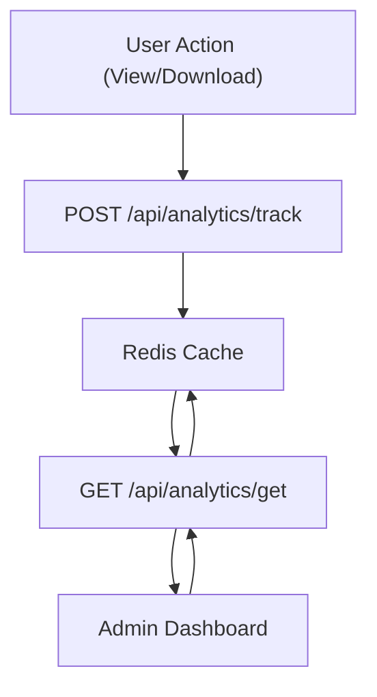

# Analytics Engine

The Analytics Engine provides real-time monitoring and performance tracking for shared files. By utilizing a high-performance Redis backend, Track-Vault tracks user interactions (views and downloads) without introducing significant latency to the file delivery process.

## System Architecture

The analytics flow is decoupled from the primary file storage, using an atomic increment pattern in Redis to ensure data consistency under high concurrency.



## Tracking Mechanism

The engine uses two primary API endpoints to manage file telemetry.

### 1. Event Tracking
**Endpoint:** `POST /api/analytics/track`

This endpoint is triggered whenever a public file is accessed. It performs atomic updates to the Redis store.

- **Payload:** `{ "id": "file_id", "type": "view" | "download" }`
- **Logic:**
    - If `type` is `view`, it increments `file:{id}:views`.
    - If `type` is `download`, it increments `file:{id}:downloads`.
    - Regardless of type, it updates `file:{id}:lastAccess` with the current timestamp (`Date.now()`).

### 2. Data Retrieval
**Endpoint:** `GET /api/analytics/get?id={id}`

Retrieves the accumulated metrics for a specific file.

- **Process:** Uses `Promise.all` to fetch views, downloads, and the last access timestamp concurrently from Redis.
- **Response:** 
  ```json
  {
    "views": 120,
    "downloads": 45,
    "lastAccess": "2023-10-27T10:00:00.000Z"
  }
  ```

## Monitoring Components

The frontend implements a real-time dashboard to visualize these metrics.

### Analytics Dashboard (`Analytics.jsx`)
The `Analytics` component provides a high-level overview of file performance:
- **Real-time Polling:** Implements a `setInterval` hook that polls the `/api/analytics/get` endpoint every 5 seconds to provide live updates.
- **Metric Visualization:** Displays Views, Downloads, and the formatted Last Access date via a grid of UI cards.
- **Quick Actions:** Includes a utility to copy the public access link along with the file password to the clipboard.

### Dynamic File Preview (`Preview.jsx`)
To enhance the management experience, the `Preview` component renders a contextual view of the file based on its MIME type:

| MIME Type | Rendering Method |
| :--- | :--- |
| `image/*` | Standard `` tag with responsive constraints |
| `application/pdf` | Embedded `<iframe>` for inline viewing |
| `text/*` | Direct anchor link to the raw text file |
| Others | "No preview available" fallback message |

## Data Schema (Redis)

The engine uses a key-value naming convention for efficient lookup:

| Key | Value Type | Description |
| :--- | :--- | :--- |
| `file:{id}:views` | Integer | Total number of times the file page was viewed |
| `file:{id}:downloads` | Integer | Total number of successful file downloads |
| `file:{id}:lastAccess` | Timestamp | Epoch time of the most recent interaction |