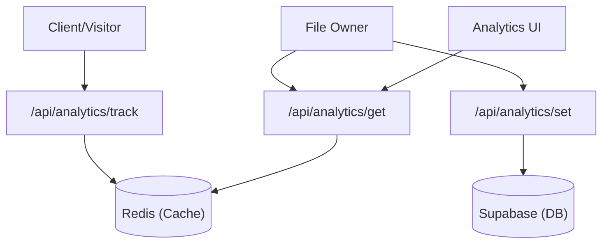

# Analytics Engine

The Analytics Engine in Track-Vault provides real-time tracking of file interactions and granular control over access permissions. It employs a hybrid storage strategy: **Redis** is used for high-frequency event tracking to ensure low latency, while **Supabase (PostgreSQL)** manages persistent configuration and access constraints.

## Architecture Overview

The system decouples telemetry (views/downloads) from configuration (limits/passwords) to optimize performance.



## Core Functionalities

### 1. Event Tracking
Every time a public file is accessed or downloaded, the system triggers a tracking event. This increments counters in Redis and updates the `lastAccess` timestamp.

**Key Logic:**
- **Views:** Increments the `file:{id}:views` key.
- **Downloads:** Increments the `file:{id}:downloads` key.
- **Timestamp:** Overwrites `file:{id}:lastAccess` with the current Unix epoch.

### 2. Real-time Monitoring
The `Analytics` component provides a live dashboard for file owners. It uses a polling mechanism to fetch the latest metrics from the Redis store every 5 seconds, ensuring the UI stays synchronized with actual traffic.

### 3. Access Control Management
Beyond tracking, the engine allows owners to set hard limits on file availability. These settings are stored in Supabase to ensure persistence and consistency across sessions.

**Controllable Parameters:**
- `maxViews` & `maxDownloads`: Thresholds for automatic access revocation.
- `expiresAt`: Time-based expiration.
- `password`: Password protection for the file.
- `deleteOnExpire` & `deleteOnLimit`: Boolean flags to trigger permanent file deletion when constraints are met.

## API Reference

### Track Event
`POST /api/analytics/track`

Updates the interaction counters for a specific file.

| Parameter | Type | Description |
| :--- | :--- | :--- |
| `id` | `string` | The unique identifier of the file. |
| `type` | `string` | Event type: `"view"` or `"download"`. |

### Fetch Analytics
`GET /api/analytics/get?id={id}`

Retrieves current statistics from the Redis cache.

**Response Body:**
```json
{
  "views": 120,
  "downloads": 45,
  "lastAccess": "2023-10-27T10:00:00.000Z"
}
```

### Update Access Controls
`POST /api/analytics/set`

Updates the file's security and limit configurations in the database.

**Request Body:**
```json
{
  "file_id": "uuid",
  "maxViews": 100,
  "maxDownloads": 50,
  "expiresAt": "ISO-Timestamp",
  "password": "securepassword123",
  "deleteOnExpire": true,
  "deleteOnLimit": false
}
```

## Implementation Details

### Performance Optimization
By using `Promise.all()` in the `GET` route, the engine fetches views, downloads, and access timestamps concurrently from Redis, minimizing the API response time.

```javascript
const [views, downloads, lastAccess] = await Promise.all([
  redis.get(`file:${id}:views`),
  redis.get(`file:${id}:downloads`),
  redis.get(`file:${id}:lastAccess`),
]);
```

### UI Synchronization
The `Analytics.jsx` component utilizes `setInterval` within a `useEffect` hook to implement a polling strategy. This avoids the complexity of WebSockets while providing "near real-time" updates for the end-user.