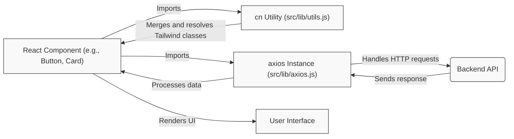

 # Core Components and Utilities

This section provides comprehensive documentation for the foundational UI components, essential utility functions, and the primary third-party integration used across the application. These elements are designed for reusability, consistency, and efficient development, forming the backbone of the user interface and data interaction layers.

## Reusable UI Components

The application leverages a set of carefully crafted React components for building consistent and accessible user interfaces. These components are often built on top of [Radix UI primitives](https://www.radix-ui.com/) and styled with [Tailwind CSS](https://tailwindcss.com/) using `class-variance-authority` for variant management and `tailwind-merge`/`clsx` for robust class merging.

### Button Component

The `Button` component is a versatile element used for various interactive actions. It supports different visual styles (variants) and sizes, and can render as a slot for integration with other components.

**Key Features:**

*   **Variants**: `default`, `destructive`, `outline`, `secondary`, `ghost`, `link` to cover diverse interaction needs.
*   **Sizes**: `default`, `sm`, `lg`, `icon` for appropriate sizing.
*   **`asChild` Prop**: Allows the `Button` to render as a child of another component (e.g., a `Link` from a routing library), passing its props and styling.
*   **Accessibility**: Built with `Radix UI Slot` for headless component primitive, ensuring accessibility best practices.

**Usage Example:**

```jsx filename="src/components/ui/button.jsx"
import { Button } from "@/components/ui/button";

function MyComponent() {
  return (
    <div className="flex gap-2">
      <Button onClick={() => console.log("Default clicked")}>Default Button</Button>
      <Button variant="destructive" size="sm">Delete Item</Button>
      <Button variant="outline" asChild>
        <a href="/dashboard">View Dashboard</a>
      </Button>
      <Button variant="icon">
        {/* An SVG icon would go here */}
        <svg xmlns="http://www.w3.org/2000/svg" viewBox="0 0 24 24" fill="currentColor" className="size-4">
          <path fillRule="evenodd" d="M12 2.25c-5.385 0-9.75 4.365-9.75 9.75s4.365 9.75 9.75 9.75 9.75-4.365 9.75-9.75S17.385 2.25 12 2.25ZM12.75 9a.75.75 0 0 0-1.5 0v3.75H7.5a.75.75 0 0 0 0 1.5h4.5a.75.75 0 0 0 .75-.75V9Z" clipRule="evenodd" />
        </svg>
      </Button>
    </div>
  );
}

export default MyComponent;
```

[View Button Component on GitHub](https://github.com/sumedhcharjan/Track-Vault/blob/main/src/components/ui/button.jsx)

The `buttonVariants` utility, exported alongside the `Button` component, utilizes `class-variance-authority` to define and manage the different Tailwind CSS classes based on `variant` and `size` props. This ensures a consistent styling approach and easy extension.

```js filename="src/components/ui/button.jsx" {10-38}
import { cva } from "class-variance-authority";

const buttonVariants = cva(
  "inline-flex items-center justify-center gap-2 whitespace-nowrap rounded-md text-sm font-medium transition-all disabled:pointer-events-none disabled:opacity-50 [&_svg]:pointer-events-none [&_svg:not([class*='size-'])]:size-4 shrink-0 [&_svg]:shrink-0 outline-none focus-visible:border-ring focus-visible:ring-ring/50 focus-visible:ring-[3px] aria-invalid:ring-destructive/20 dark:aria-invalid:ring-destructive/40 aria-invalid:border-destructive",
  {
    variants: {
      variant: {
        default:
          "bg-primary text-primary-foreground shadow-xs hover:bg-primary/90",
        destructive:
          "bg-destructive text-white shadow-xs hover:bg-destructive/90 focus-visible:ring-destructive/20 dark:focus-visible:ring-destructive/40 dark:bg-destructive/60",
        outline:
          "border bg-background shadow-xs hover:bg-accent hover:text-accent-foreground dark:bg-input/30 dark:border-input dark:hover:bg-input/50",
        secondary:
          "bg-secondary text-secondary-foreground shadow-xs hover:bg-secondary/80",
        ghost:
          "hover:bg-accent hover:text-accent-foreground dark:hover:bg-accent/50",
        link: "text-primary underline-offset-4 hover:underline",
      },
      size: {
        default: "h-9 px-4 py-2 has-[>svg]:px-3",
        sm: "h-8 rounded-md gap-1.5 px-3 has-[>svg]:px-2.5",
        lg: "h-10 rounded-md px-6 has-[>svg]:px-4",
        icon: "size-9",
      },
    },
    defaultVariants: {
      variant: "default",
      size: "default",
    },
  }
)
```

### Card Component

The `Card` component is a flexible container for grouping related content and actions. It provides a structured way to present information in a visually distinct block. The `Card` component is composed of several sub-components for enhanced organization: `CardHeader`, `CardTitle`, `CardDescription`, `CardAction`, `CardContent`, and `CardFooter`.

**Composition:**

*   `Card`: The main container, providing background, border, and shadow.
*   `CardHeader`: Top section, often containing title and description.
*   `CardTitle`: For prominent headings within the card.
*   `CardDescription`: For supplementary text, typically below the title.
*   `CardAction`: For actions positioned typically at the top-right of the header.
*   `CardContent`: Main content area of the card.
*   `CardFooter`: Bottom section, for actions or supplementary information.

**Usage Example:**

```jsx filename="src/components/ui/card.jsx"
import {
  Card,
  CardHeader,
  CardTitle,
  CardDescription,
  CardContent,
  CardFooter,
  CardAction
} from "@/components/ui/card";
import { Button } from "@/components/ui/button";

function UserProfileCard() {
  return (
    <Card className="w-[350px]">
      <CardHeader>
        <CardTitle>User Profile</CardTitle>
        <CardDescription>View and edit your profile information.</CardDescription>
        <CardAction>
          <Button variant="ghost" size="sm">Edit</Button>
        </CardAction>
      </CardHeader>
      <CardContent>
        <p>Name: John Doe</p>
        <p>Email: john.doe@example.com</p>
      </CardContent>
      <CardFooter>
        <Button>Save Changes</Button>
      </CardFooter>
    </Card>
  );
}

export default UserProfileCard;
```

[View Card Component on GitHub](https://github.com/sumedhcharjan/Track-Vault/blob/main/src/components/ui/card.jsx)

## Utility Functions

Utility functions encapsulate common logic, promoting code reuse and maintainability.

### `cn` Utility

The `cn` function, found in `src/lib/utils.js`, is a powerful utility for conditionally combining and merging Tailwind CSS classes. It leverages `clsx` for conditional class joining and `tailwind-merge` for intelligently resolving conflicting Tailwind classes (e.g., `p-4` and `p-6` would resolve to `p-6`).

**Benefits:**

*   **Conditional Classes**: Easily apply classes based on component props or state.
*   **Conflict Resolution**: Prevents issues when multiple utility classes define the same CSS property.
*   **Readability**: Improves the clarity of class string construction.

**Implementation:**

```js filename="src/lib/utils.js"
import { clsx } from "clsx";
import { twMerge } from "tailwind-merge"

export function cn(...inputs) {
  return twMerge(clsx(inputs));
}
```

[View `cn` Utility on GitHub](https://github.com/sumedhcharjan/Track-Vault/blob/main/src/lib/utils.js)

**Usage Example:**

```jsx
import { cn } from "@/lib/utils";

function MyConditionalDiv({ isActive }) {
  return (
    <div
      className={cn(
        "p-4 rounded-md",
        isActive ? "bg-blue-500 text-white" : "bg-gray-200 text-gray-800",
        "shadow-md", // This will be merged if there are other shadows
        "p-6" // This will override 'p-4'
      )}
    >
      Content here
    </div>
  );
}
```

## Third-Party Integrations

Effective data fetching and communication with backend services are critical.

### Axios HTTP Client

The application uses `axios` for making HTTP requests to the backend API. A pre-configured `axios` instance is provided to streamline API interactions, ensuring consistent base URL and credential handling.

**Configuration Details:**

*   **`baseURL`**: Dynamically set using `process.env.NEXT_PUBLIC_API_URL` for environment flexibility, defaulting to `http://localhost:3000/api` for local development.
*   **`withCredentials`**: Set to `true` to ensure that cookies, authorization headers, or TLS client certificates are sent with cross-site requests, crucial for authentication flows.

**Implementation:**

```js filename="src/lib/axios.js"
import axios from "axios";

const api = axios.create({
  baseURL: process.env.NEXT_PUBLIC_API_URL || "http://localhost:3000/api",
  withCredentials: true, // useful if you’re using cookies/auth
});

export default api;
```

[View Axios Integration on GitHub](https://github.com/sumedhcharjan/Track-Vault/blob/main/src/lib/axios.js)

**Usage Example:**

```jsx
import api from "@/lib/axios";

async function fetchData() {
  try {
    const response = await api.get("/users");
    console.log("Users:", response.data);
  } catch (error) {
    console.error("Error fetching users:", error);
  }
}

fetchData();
```

## Key Integration Points

The core components and utilities work together to establish a robust and maintainable frontend architecture.

### UI Component Interaction Flow

The UI components, particularly `Button` and `Card`, are designed to be composable and flexible.


<Mermaid chart="
graph TD
    A["User Interaction"] --> B["Button Component"];
    B --> C["Event Handler"];
    C --> D["API Call (axios)"];
    D --> E["Update State"];
    E --> F["Card Component"];
    F --> G["Display Updated Data"];

    style A fill:#ECECFF,stroke:#9370DB,stroke-width:2px,color:#222
    style B fill:#F9F9F9,stroke:#333,stroke-width:1px
    style C fill:#F9F9F9,stroke:#333,stroke-width:1px
    style D fill:#F9F9F9,stroke:#333,stroke-width:1px
    style E fill:#F9F9F9,stroke:#333,stroke-width:1px
    style F fill:#F9F9F9,stroke:#333,stroke-width:1px
    style G fill:#F9F9F9,stroke:#333,stroke-width:1px
"></Mermaid>


1.  **User Interaction**: A user interacts with a `Button` (e.g., "Submit", "Delete").
2.  **Event Handler**: The `Button` triggers an event handler (e.g., `onClick`).
3.  **API Call**: The event handler initiates an API request using the `axios` instance, potentially sending data collected from `Card` inputs.
4.  **Update State**: Upon successful API response, the application's state is updated.
5.  **Card Component**: The `Card` component, or its sub-components, receives new props based on the updated state.
6.  **Display Updated Data**: The `Card` re-renders to display the latest information to the user.

### Utility and Integration Layer

The `cn` utility plays a crucial role in styling components, while `axios` handles data fetching, both integrating seamlessly into the component lifecycle.





*   **React Components** import and utilize the `cn` function for dynamic and robust styling.
*   **React Components** import the `api` instance from `src/lib/axios.js` to perform data fetching.
*   The `cn` utility simplifies the complex task of managing CSS classes, ensuring a clean and maintainable codebase.
*   The `axios` instance centralizes API request logic, allowing for easy configuration of base URLs, headers, and credentials, critical for interaction with the **Backend API**.
*   The result of these integrations is a dynamic and responsive **User Interface**.

Next: [UI Kit and Reusable Components](./4.1_ui-kit-reusable-components.mdx)
