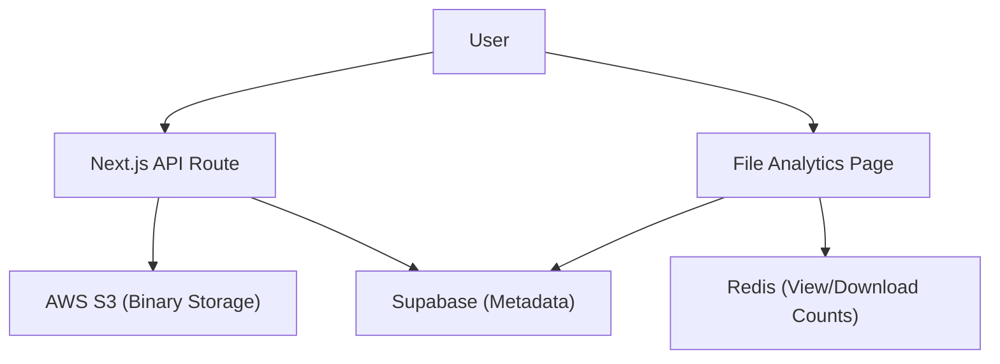

# File Management System

The File Management System in Track-Vault provides a secure, scalable infrastructure for uploading, storing, and tracking files. It leverages a hybrid architecture combining AWS S3 for binary storage, Supabase for metadata management, and Redis for real-time analytics.

## System Architecture

The following diagram illustrates the lifecycle of a file from upload to analytics tracking.




## File Upload Process

Files are processed through the `POST /api/file` endpoint. The system ensures that files are uniquely identified to prevent collisions in the S3 bucket.

### Technical Workflow
1. **Request Handling**: The API accepts `multipart/form-data` containing the file, `user_id`, and `file_name`.
2. **Unique Identification**: A `uuidv4` is generated to create a unique S3 key, while the original filename is preserved in the database for user reference.
3. **S3 Storage**: The file is converted to a buffer and uploaded using the `PutObjectCommand` from the `@aws-sdk/client-s3`.
4. **Metadata Persistence**: The system stores the following details in the Supabase `files` table:
    - `user_id`: Owner of the file.
    - `file_name`: Original name.
    - `file_key`: The UUID-based key used in S3.
    - `file_url`: The public accessible URL.
    - `file_type` & `file_size`: File attributes for UI rendering.

## Viewing and Organizing Files

The system provides a centralized dashboard (`/uploadedfiles`) where users can manage their assets.

### File Categorization
Files are split into two categories based on their `is_active` status:
- **Active Files**: Visible and accessible via generated links.
- **Inactive Files**: Hidden from public view but retained in the vault.

### Dynamic Thumbnails
The `FileCard` component implements a smart preview system based on the file extension:
- **Images**: Direct render of the S3 URL.
- **PDFs**: Rendered via Google Docs viewer embedded iframe.
- **Videos**: HTML5 video element with metadata preloading.
- **Other Types**: Context-aware icons (e.g., `FileSpreadsheet` for `.xlsx`, `FileCode` for `.js`, `FileArchive` for `.zip`).

## File Analytics & Management

Each file has a dedicated management page (`/uploadedfiles/[id]`) that provides deep insights and administrative controls.

### Real-time Analytics
To ensure high performance and low latency, Track-Vault uses **Redis** to track usage metrics instead of traditional database increments. The following keys are tracked:
- `file:{id}:views`: Total number of times the file was accessed.
- `file:{id}:downloads`: Total download count.
- `file:{id}:lastAccess`: Timestamp of the most recent interaction.

### File Deletion
When a user deletes a file, the system performs a coordinated cleanup:
1. **S3 Purge**: The `DeleteObjectCommand` removes the binary object from the AWS bucket using the `file_key`.
2. **Database Purge**: The corresponding record is deleted from the Supabase `files` table using the `file_id`.

## API Reference

### Upload File
`POST /api/file`

| Field | Type | Description |
| :--- | :--- | :--- |
| `file` | File | The binary file to upload |
| `user_id` | String | The Kinde user ID |
| `file_name` | String | The desired display name |

### Delete File
`DELETE /api/file`

**Request Body:**
```json
{
  "file_id": "uuid-from-supabase",
  "file_key": "uuid-from-s3"
}
```