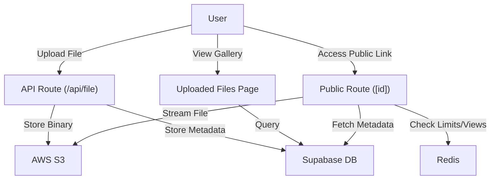

# File Management System

The File Management System in Track-Vault provides a robust pipeline for uploading, organizing, and serving files. It leverages a hybrid storage architecture combining AWS S3 for binary data, Supabase for metadata persistence, and Redis for real-time access tracking.

## System Architecture

The following diagram illustrates the lifecycle of a file from upload to public consumption.

## Upload Workflow

Files are processed through a serverless API route that ensures data integrity and uniqueness.

### Technical Process
1. **Payload Reception**: The system accepts `multipart/form-data` containing the file and the `user_id`.
2. **Unique Identification**: To prevent collisions in S3, a `uuidv4` is generated to create a unique `file_key`, while the original filename is preserved in the database.
3. **S3 Integration**: The file is converted to an `ArrayBuffer` and uploaded via the `PutObjectCommand` from the AWS SDK.
4. **Metadata Persistence**: Upon successful S3 upload, the following details are stored in the Supabase `files` table:
   - `user_id`: Owner of the file.
   - `file_key`: The S3 object key.
   - `file_url`: The public S3 URL.
   - `file_type`: The MIME type for correct rendering.
   - `file_size`: Size of the asset.

## File Gallery & Management

The `/uploadedfiles` page serves as the central hub for users to manage their assets.

### Gallery Logic
- **Server-Side Fetching**: Uses `getKindeServerSession` to authenticate users and fetch only files associated with their specific `user_id`.
- **State Categorization**: Files are partitioned into **Active** and **Inactive** tabs based on the `is_active` boolean flag in the database.
- **Dynamic Previews**: The `FileCard` component implements a smart thumbnail system:
  - **Images**: Direct render via `img` tags.
  - **PDFs**: Rendered via Google Docs Viewer embedded frames.
  - **Videos**: Uses HTML5 `<video>` with a 1-second offset (`#t=1`) to generate a frame preview.
  - **Generic Files**: Map file extensions (e.g., `.zip`, `.py`, `.xlsx`) to specific Lucide icons and color schemes.

## Public Delivery & Security

Public files are served through a dynamic route `pages/public/[id].jsx` that implements several layers of access control.

### Access Control Layers
| Layer | Mechanism | Implementation |
| :--- | :--- | :--- |
| **Authentication** | Password Protection | If `file_password` exists, the user must provide the correct string before the UI unlocks. |
| **Expiration** | Time-based Access | Checks `expires_at` against current time; triggers `deletepipeline` if `delete_on_expire` is true. |
| **View Limits** | Atomic Increment | Uses `redis.incr` to track views; restricts access if `max_views` is exceeded. |

### Download Tracking
Downloads are not direct links. Instead, they trigger a tracking event:
1. Request sent to `/api/analytics/track`.
2. System verifies if the download limit is reached.
3. Upon success, the file is fetched as a `blob` and triggered as a client-side download to hide the raw S3 URL.

## File Deletion

Deletion is a synchronized operation ensuring no orphaned files remain in storage.

1. **S3 Purge**: The `DeleteObjectCommand` removes the binary from the bucket using the `file_key`.
2. **DB Cleanup**: The corresponding record is removed from the Supabase `files` table using the `file_id`.
3. **Pipeline Integration**: For expired or limit-reached files, the system calls a `/deletepipeline` endpoint to handle cleanup asynchronously.