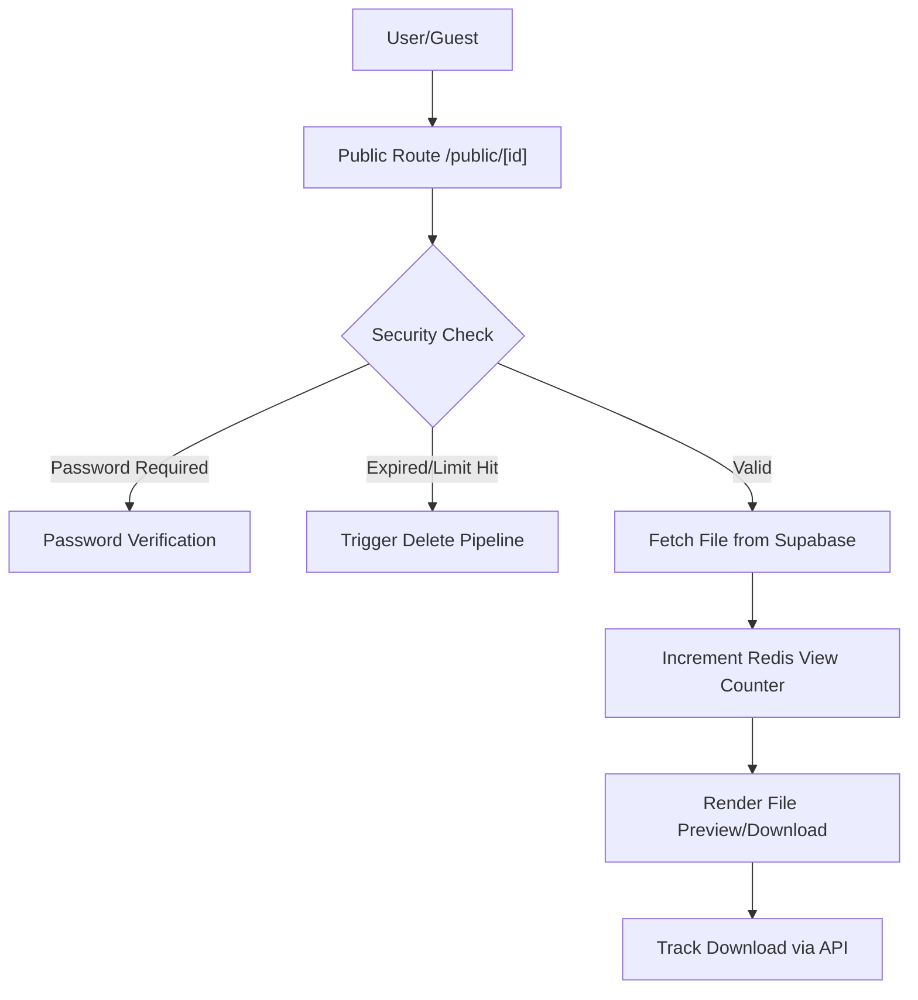

# File Management System

The File Management System in Track-Vault provides a secure pipeline for uploading, managing, and distributing files with granular control over visibility, access limits, and real-time analytics.

## Architecture Overview

The system leverages a hybrid storage and caching strategy to ensure high performance and strict access control. Metadata and physical files are stored in **Supabase**, while volatile access metrics (views, downloads) are handled by **Redis** for low-latency updates.

## Vault Management

Users can manage their uploaded assets through a dedicated dashboard. The system categorizes files into two primary states: **Active** and **Inactive**.

### File Listing and Filtering
The vault uses a tabbed interface to separate files based on their `is_active` status. This allows users to "soft-disable" files without permanently deleting them from the storage bucket.

- **Active Files**: Currently available for public or private access.
- **Inactive Files**: Hidden from public view and marked as disabled in the vault.

### File Analytics
Each file has a dedicated management page (`/uploadedfiles/[id]`) that provides:
- **Real-time Metrics**: Views, total downloads, and the timestamp of the last access retrieved from Redis.
- **Configuration**: An `Editanalytics` component to modify file settings (e.g., passwords, expiration dates).
- **Visual Preview**: A dedicated preview window to verify content before distribution.

## File Visualization Logic

Track-Vault employs a dynamic rendering engine to provide the best possible preview based on the file extension.

| File Type | Rendering Method | Preview Implementation |
| :--- | :--- | :--- |
| **Images** | Direct Render | `` tag with `object-cover` |
| **PDFs** | External Embed | Google Docs Viewer or `<iframe>` |
| **Videos** | HTML5 Player | `<video>` with metadata preloading |
| **Code/Data** | Icon-based | Lucide-React icons (e.g., `FileCode`, `FileJson`) |
| **Archives** | Icon-based | `FileArchive` icon with extension label |

## Public Distribution & Security

When a file is shared via a public link, the system executes a multi-step validation pipeline before serving the content.

### Access Control
1. **Password Protection**: If `file_password` is set, the system renders a password prompt. The file content remains hidden until the password is verified client-side.
2. **Expiration Logic**: The system checks `expires_at`. If the current date exceeds this value, the file is marked as expired.
3. **View Limits**: Using `redis.incr`, the system tracks the total number of views. If `views > max_views`, access is revoked.

### Automated Cleanup
The system integrates with a deletion pipeline (`/deletepipeline`). This is triggered automatically under two conditions:
- The file reaches its **expiration date** and `delete_on_expire` is true.
- The file reaches its **maximum view limit** and `delete_on_limit` is true.

### Download Tracking
Downloads are not served as direct links to prevent hotlinking and to ensure accurate tracking. The `handleDownload` process:
1. Sends a POST request to `/api/analytics/track`.
2. Verifies if the download limit has been reached.
3. Fetches the file as a `blob`.
4. Generates a temporary object URL for the browser to trigger the save dialog.