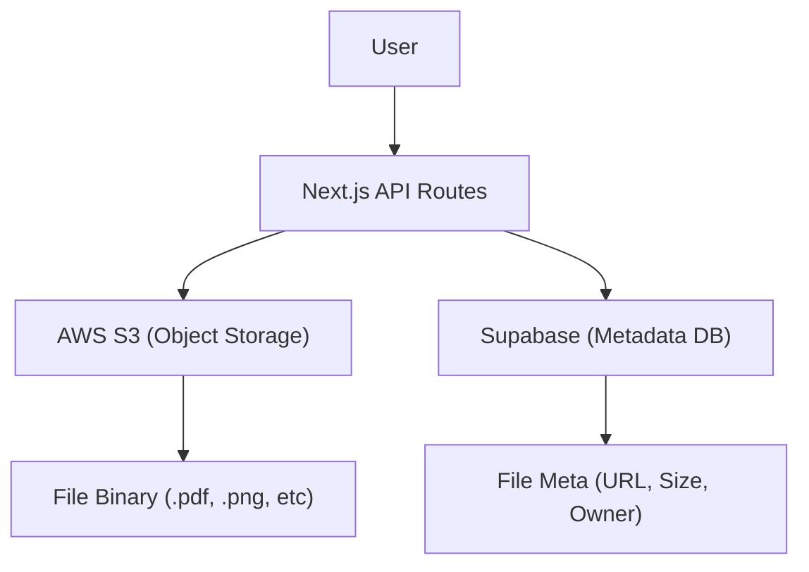

# File Vault Management

The File Vault is the core storage engine of Track-Vault, providing a secure pipeline for uploading, tracking, and removing files. It leverages a hybrid architecture combining **AWS S3** for binary object storage and **Supabase (PostgreSQL)** for metadata persistence.

## System Architecture

The file lifecycle follows a strict sequence to ensure that storage in S3 remains synchronized with the database records.



## File Upload Pipeline

Files are uploaded via a `multipart/form-data` POST request. The system ensures uniqueness by generating a UUID for the S3 key, preventing filename collisions.

### `POST /api/file`

**Request Payload:**
- `file`: The binary file object.
- `user_id`: Unique identifier of the authenticated user.
- `file_name`: The original name of the file for display purposes.

**Internal Logic:**
1. **UUID Generation**: A unique filename is created using `uuidv4()` while preserving the original extension.
2. **S3 Upload**: The file is converted to a Buffer and streamed to AWS S3 using the `PutObjectCommand`.
3. **Metadata Persistence**: A record is inserted into the Supabase `files` table containing:
   - `file_key`: The S3 object key.
   - `file_url`: The public accessibility link.
   - `file_size` and `file_type`: Extracted from the upload stream.

## File Deletion Strategies

Track-Vault implements two distinct deletion patterns depending on the required outcome.

### 1. Hard Deletion (`DELETE /api/file`)
Used for permanent removal of data.
- **Action**: Completely removes the object from the S3 bucket and deletes the row from the Supabase `files` table.
- **Result**: The file is unrecoverable.

### 2. Soft Deletion/Pipeline Cleanup (`DELETE /api/deletepipeline`)
Used for archival or expiration logic.
- **Action**: 
    1. Deletes the binary object from AWS S3 to save storage costs.
    2. Updates the Supabase record: sets `is_active` to `false` and updates `expires_at` to the current timestamp.
- **Result**: The metadata remains for auditing/history, but the file content is gone.

## User File Management

The `/uploadedfiles` page provides a centralized dashboard for users to manage their assets.

### Data Retrieval
The page utilizes Server Components to fetch data directly from Supabase:
```javascript
const { data: files } = await supabase
  .from("files")
  .select("*")
  .eq("user_id", user.id)
  .order("created_at", { ascending: false });
```

### Visibility Logic
Files are segmented into two categories using a Tab-based UI:
- **Active Files**: Records where `is_active === true`. These are displayed using the `FileCard` component.
- **Inactive Files**: Records where `is_active === false`. These are displayed using the `InactiveFileCard` component, signaling that the file is no longer available for download.

## Technical Specifications

| Component | Technology | Responsibility |
| :--- | :--- | :--- |
| **Storage** | AWS S3 | Hosting raw file buffers |
| **Database** | Supabase | Storing file relations and status |
| **Auth** | Kinde | User session validation |
| **ID Gen** | uuid | Ensuring unique S3 object keys |
| **API** | Next.js App Router | Handling request orchestration |