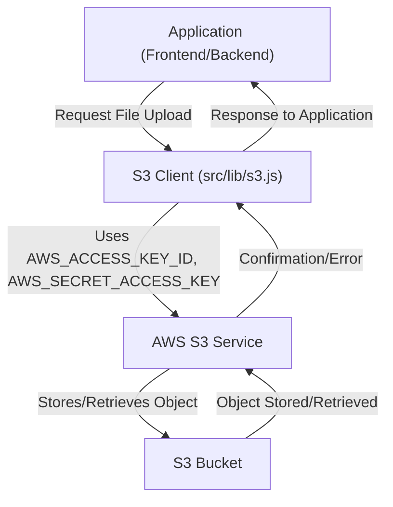
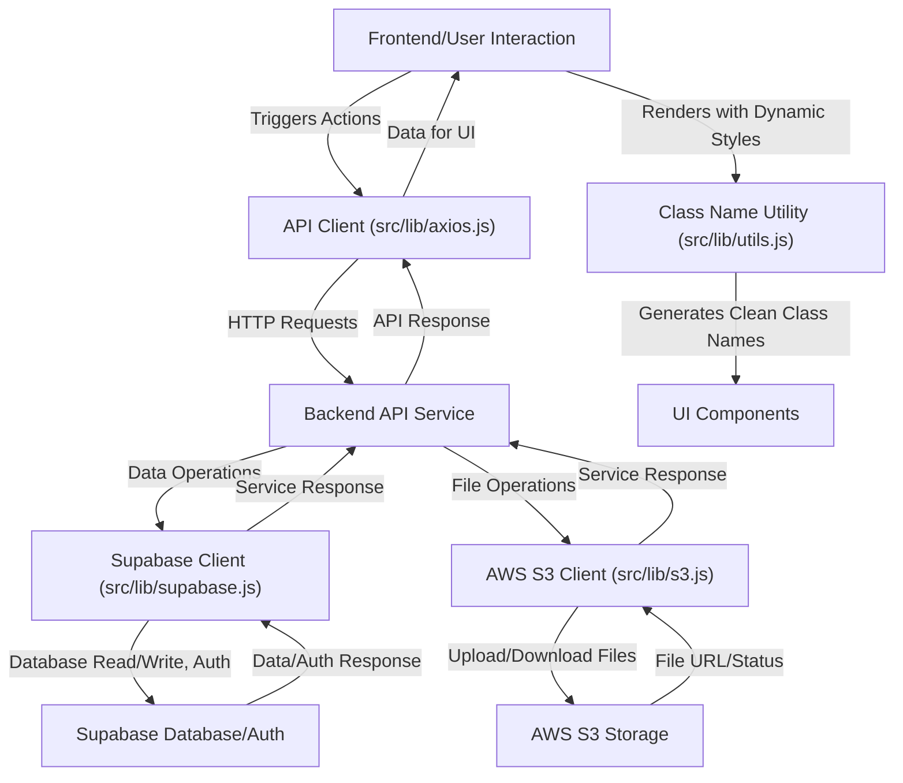

 # Infrastructure and Utilities

This section provides a comprehensive overview of the core infrastructure and utility components that underpin the application. It details how external services like AWS S3 and Supabase are integrated, how API communications are managed with Axios, and how front-end utilities like `clsx` and `tailwind-merge` are leveraged for efficient UI development. Understanding these foundational elements is crucial for anyone looking to contribute to or extend the application's capabilities.

## External Service Integrations

The application relies on several external services to provide robust data storage, authentication, and API communication. These integrations are configured to be flexible and secure, primarily using environment variables for sensitive credentials.

### API Client (Axios)

The `src/lib/axios.js` file configures a pre-initialized Axios instance for making HTTP requests to the backend API. This setup ensures consistent API communication across the application, handling base URL configuration and credentials.

The `baseURL` is dynamically set, prioritizing `NEXT_PUBLIC_API_URL` from environment variables, defaulting to `http://localhost:3000/api` for local development. The `withCredentials: true` option is critical for authentication mechanisms that rely on cookies, ensuring that credentials like session tokens are sent with each request.

```javascript
// src/lib/axios.js
import axios from "axios";

const api = axios.create({
  baseURL: process.env.NEXT_PUBLIC_API_URL || "http://localhost:3000/api",
  withCredentials: true, // useful if you’re using cookies/auth
});

export default api;
```
[View on GitHub](https://github.com/sumedhcharjan/Track-Vault/blob/main/src/lib/axios.js)

This client is the primary method for interacting with the application's own backend services, ensuring that all API calls adhere to a standardized format and include necessary authentication headers or cookies.

### AWS S3 Client

For robust and scalable file storage, the application integrates with AWS S3. The `src/lib/s3.js` module initializes an S3 client, abstracting away the configuration details for interacting with S3 buckets.

The `S3Client` is configured with `region`, `accessKeyId`, and `secretAccessKey`, all sourced from environment variables. This practice ensures that sensitive credentials are not hardcoded and can be managed securely.

```javascript
// src/lib/s3.js
import { S3Client } from "@aws-sdk/client-s3";

export const s3 = new S3Client({
  region: process.env.AWS_REGION,
  credentials: {
    accessKeyId: process.env.AWS_ACCESS_KEY_ID,
    secretAccessKey: process.env.AWS_SECRET_ACCESS_KEY,
  },
});
```
[View on GitHub](https://github.com/sumedhcharjan/Track-Vault/blob/main/src/lib/s3.js)

This client enables operations like uploading user-generated content, fetching media files, or managing backups, leveraging the scalability and reliability of AWS S3.





### Supabase Client

Supabase provides a powerful open-source alternative to Firebase, offering a PostgreSQL database, authentication, real-time subscriptions, and storage. The `src/lib/supabase.js` file initializes the Supabase client for seamless integration.

The `createClient` function is used, taking `NEXT_PUBLIC_SUPABASE_URL` and `NEXT_PUBLIC_SUPABASE_ANON_KEY` from environment variables. These keys are essential for connecting to the Supabase project and interacting with its various services.

```javascript
// src/lib/supabase.js
import { createClient } from '@supabase/supabase-js'

export const  supabase = createClient(
  process.env.NEXT_PUBLIC_SUPABASE_URL,
  process.env.NEXT_PUBLIC_SUPABASE_ANON_KEY
)
```
[View on GitHub](https://github.com/sumedhcharjan/Track-Vault/blob/main/src/lib/supabase.js)

This client is instrumental for database interactions, user authentication, and potentially real-time features, providing a managed backend solution for the application.

## Utility Functions

Beyond external services, the application also incorporates useful utility functions that simplify common tasks, particularly in the UI layer.

### Class Name Utility (`cn`)

The `src/lib/utils.js` file exports a utility function `cn` designed to streamline the management of CSS class names in components. It combines the power of `clsx` and `tailwind-merge` to handle conditional class names and resolve Tailwind CSS conflicts gracefully.

`clsx` is used for conditionally joining class names together, making it easy to apply classes based on props or state. `tailwind-merge` then takes the combined classes and resolves any conflicting Tailwind CSS utility classes, ensuring that the most specific or latest applied utility takes precedence.

```javascript
// src/lib/utils.js
import { clsx } from "clsx";
import { twMerge } from "tailwind-merge"

export function cn(...inputs) {
  return twMerge(clsx(inputs));
}
```
[View on GitHub](https://github.sumedhcharjan/Track-Vault/blob/main/src/lib/utils.js)

This `cn` function is invaluable for building dynamic and maintainable UIs, especially when working with component libraries or complex layouts where classes might conflict or need to be applied conditionally.

**Example Usage:**

```javascript
import { cn } from "@/lib/utils";

function Button({ className, variant, ...props }) {
  return (
    <button
      className={cn(
        "px-4 py-2 rounded-md font-medium",
        variant === "primary" && "bg-blue-500 text-white",
        variant === "secondary" && "bg-gray-200 text-gray-800",
        className // Allows overriding or adding more classes
      )}
      {...props}
    />
  );
}

// Result:
// <Button className="text-lg" variant="primary" /> => "px-4 py-2 rounded-md font-medium bg-blue-500 text-white text-lg"
// Note how `text-lg` from `className` correctly overrides or adds to existing styles.
```

## Key Integration Points

The infrastructure and utility modules form the backbone of the application's functionality. Understanding their interplay is crucial for developing new features and maintaining existing ones.

*   **Data Flow:** User actions often trigger API requests via the Axios client. Depending on the request, data might be stored in Supabase (e.g., user profiles, application data) or files might be uploaded to AWS S3 (e.g., images, documents).
*   **Authentication:** Both Axios (via `withCredentials`) and Supabase are configured to handle authentication. Supabase provides client-side utilities for user management, while Axios ensures authenticated requests to backend APIs.
*   **UI Consistency:** The `cn` utility function ensures that UI components maintain a consistent look and feel, even when dynamic class names are applied, by resolving styling conflicts and combining classes efficiently.
*   **Environment Variables:** A critical best practice observed across all external service integrations is the heavy reliance on environment variables for sensitive credentials and configuration. This enhances security and simplifies deployment across different environments (development, staging, production).


