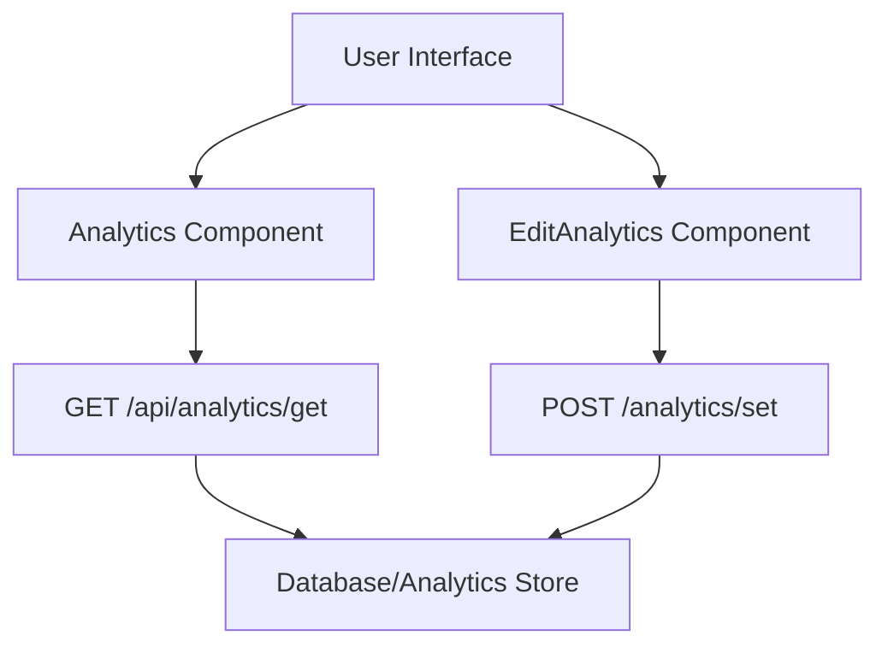

# Analytics Management UI

The Analytics Management UI provides a comprehensive suite of components for monitoring file engagement, managing access control rules, and previewing uploaded content. It enables users to track real-time metrics and enforce security constraints on shared files.

## Architectural Overview

The analytics system operates on a polling mechanism for real-time updates and a RESTful interface for modifying file constraints.



## Component Documentation

### 1. Analytics Dashboard (`Analytics.jsx`)
The `Analytics` component serves as the monitoring hub for a specific file. It provides a high-level overview of how a file is being consumed.

**Key Features:**
- **Real-time Polling:** Utilizes a `setInterval` hook to fetch updated metrics every 5 seconds from the backend.
- **Metric Tracking:** Displays total views, total downloads, and the timestamp of the last access.
- **Public Link Distribution:** A utility function `handleCopy` that formats the public URL and the file password into a clipboard-ready string.

**Data State:**
| State | Type | Description |
| :--- | :--- | :--- |
| `data` | Object | Contains `views`, `downloads`, and `lastAccess`. |
| `formattedDate` | String | A human-readable locale string derived from `lastAccess`. |

---

### 2. Access Control Manager (`Editanalytics.jsx`)
This component allows administrators to modify the lifecycle and security parameters of a file. It implements a toggleable form to prevent accidental modifications.

**Configurable Parameters:**
- **Expiry Date:** Set a `datetime-local` value after which the file is no longer accessible.
- **View/Download Limits:** Define hard caps on the number of times a file can be viewed or downloaded.
- **Password Protection:** Update or set a password required for file access.
- **Auto-Deletion:** 
  - `deleteOnExpire`: Trigger file deletion immediately upon reaching the expiry date.
  - `deleteOnLimit`: Trigger file deletion once view or download thresholds are met.

**API Interaction:**
The component sends a `POST` request to `/analytics/set` with the following payload:
```json
{
  "file_id": "string",
  "expiresAt": "ISO Date String | null",
  "maxViews": "number | null",
  "maxDownloads": "number | null",
  "password": "string | null",
  "deleteOnExpire": "boolean",
  "deleteOnLimit": "boolean"
}
```

---

### 3. File Previewer (`Preview.jsx`)
The `Preview` component provides a conditional rendering engine that determines how to display a file based on its MIME type.

**Supported MIME Types:**
| MIME Type | Rendering Method | UI Element |
| :--- | :--- | :--- |
| `image/*` | Direct Source | `` tag with max-height constraints. |
| `application/pdf` | Embedded Document | `<iframe>` with a fixed height of 500px. |
| `text/*` | External Link | `<a>` tag opening in a new browser tab. |
| Others | Fallback Text | "No preview available" message. |

## Technical Implementation Details

### Polling Logic
To ensure data freshness without requiring a full page reload, the `Analytics` component implements the following effect:

```javascript
useEffect(() => {
  if (!file?.id) return;
  const interval = setInterval(async () => {
    const res = await axios.get(`/api/analytics/get?id=${file.id}`);
    setData(res.data);
  }, 5000);
  return () => clearInterval(interval);
}, [file?.id]);
```

### Security Considerations
- **Password Handling:** The public URL copy function bundles the password with the link, ensuring the sender can provide all necessary credentials to the recipient in one action.
- **Client-Side Validation:** The `Editanalytics` component casts numeric inputs (Max Views/Downloads) using `Number()` before submission to ensure type consistency with the backend schema.