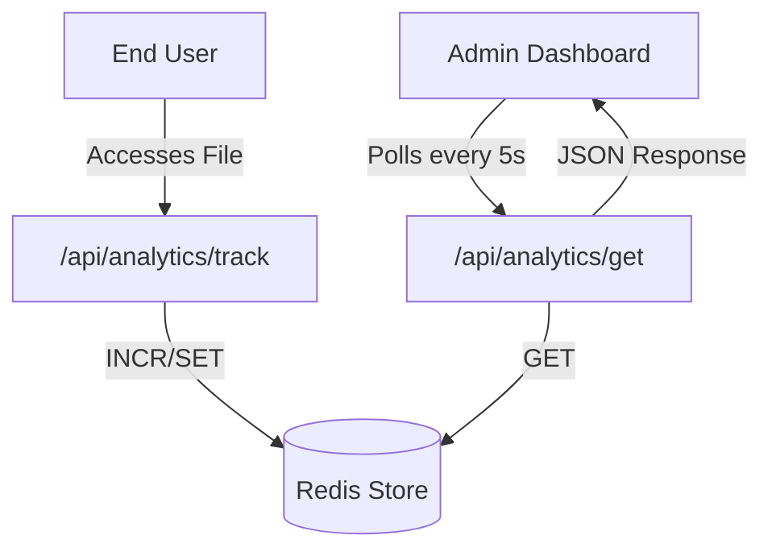

# Analytics Engine

The Analytics Engine in Track-Vault provides real-time tracking and visualization of file interactions. It utilizes a high-performance Redis backend to store atomic counters and timestamps, ensuring minimal latency during the tracking process and high availability for the dashboard.

## Architecture Overview

The system follows a decoupled pattern where tracking events are decoupled from data retrieval. When a public file is accessed, a trigger is sent to the tracking endpoint, which updates the Redis store. The administrative dashboard then polls this data to provide a live view of file performance.




## Backend Implementation

### Tracking Endpoint
**File:** `src/app/api/analytics/track/route.js`

The tracking system uses a POST request to increment specific metrics. It employs Redis atomic increments (`incr`) to prevent race conditions when multiple users access a file simultaneously.

- **Logic**: 
  - `view`: Increments the `file:{id}:views` key.
  - `download`: Increments the `file:{id}:downloads` key.
  - **Last Access**: Always updates `file:{id}:lastAccess` with the current Unix timestamp.

### Retrieval Endpoint
**File:** `src/app/api/analytics/get/route.js`

The retrieval endpoint fetches the current state of a file's metrics using `Promise.all` to minimize round-trip time to the Redis server.

- **Response Schema**:
```json
{
  "views": number,
  "downloads": number,
  "lastAccess": "ISOString | null"
}
```

## Frontend Integration

### Analytics Dashboard
**File:** `src/components/analyticsContol/Analytics.jsx`

The `Analytics` component serves as the primary monitoring interface. It implements a **polling mechanism** to ensure data freshness without requiring a full page reload.

- **Real-time Updates**: An `setInterval` hook triggers a request to the retrieval API every 5,000ms.
- **URL Management**: Includes a utility function to generate and copy the public access link along with the file password to the clipboard.
- **UI Components**: Utilizes a grid of `Card` components to display:
  - Total Views
  - Total Downloads
  - Formatted Last Access Date
  - File Password & Public URL

### File Preview System
**File:** `src/components/analyticsContol/Preview.jsx`

To enhance the user experience, the `Preview` component provides a conditional rendering engine based on the file's MIME type:

| MIME Type | Rendering Method |
| :--- | :--- |
| `image/*` | `` tag with optimized styling |
| `application/pdf` | `<iframe>` for embedded viewing |
| `text/*` | Direct external link for raw text access |
| Other | Fallback "No preview available" message |

## Technical Specifications

| Feature | Implementation | Detail |
| :--- | :--- | :--- |
| **Storage** | Redis | Key-value store for O(1) access |
| **Polling Rate** | 5 Seconds | Client-side `setInterval` |
| **Data Format** | JSON | Standardized REST responses |
| **State Management** | React `useState` | Local component state for metrics |