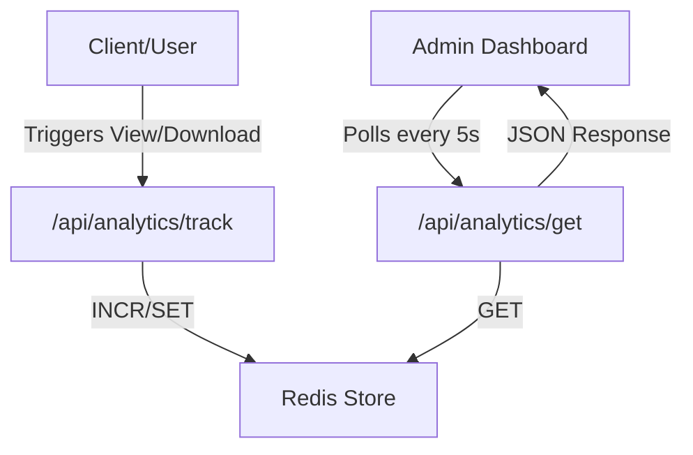

# Analytics Engine

The Analytics Engine in Track-Vault provides real-time insights into how shared files are interacting with end-users. By leveraging a high-performance key-value store, the system tracks views, downloads, and access timestamps without impacting the primary database performance.

## Architecture Overview

The analytics system follows a decoupled pattern where event tracking is separated from data retrieval. Redis is used as the primary data store to ensure atomic increments and low-latency updates.



## Data Tracking Logic

Tracking is handled by the `/api/analytics/track` endpoint. It accepts a `type` parameter to distinguish between different interaction events.

### Storage Schema
Data is stored in Redis using a namespaced key pattern: `file:{id}:{metric}`.

| Metric | Redis Key | Operation | Description |
| :--- | :--- | :--- | :--- |
| **Views** | `file:${id}:views` | `INCR` | Incremented every time the file page is loaded. |
| **Downloads** | `file:${id}:downloads` | `INCR` | Incremented when the file is successfully downloaded. |
| **Last Access** | `file:${id}:lastAccess` | `SET` | Stores the Unix timestamp of the most recent interaction. |

### Implementation Detail
Whenever a tracking request is made, the `lastAccess` timestamp is updated regardless of the event type, ensuring the user always knows the last time their file was touched.

## Data Retrieval

The `/api/analytics/get` endpoint aggregates the distributed Redis keys into a single JSON response. To optimize performance, the engine uses `Promise.all` to fetch all metrics concurrently:

```javascript
const [views, downloads, lastAccess] = await Promise.all([
  redis.get(`file:${id}:views`),
  redis.get(`file:${id}:downloads`),
  redis.get(`file:${id}:lastAccess`),
]);
```

## Frontend Visualization

The analytics data is presented through a set of specialized React components that prioritize real-time updates and accessibility.

### Real-time Polling
The `Analytics` component implements a polling mechanism using `setInterval`. Every 5 seconds, the component fetches the latest metrics from the API, ensuring the dashboard stays current without requiring a page refresh.

### UI Components
- **Metrics Grid**: A responsive layout of cards displaying total views, total downloads, and a formatted "Last Access" date.
- **Access Management**: A utility button that allows owners to copy a pre-formatted message containing the public URL and the file password to the clipboard.
- **File Preview**: The `Preview` component provides conditional rendering based on the file's MIME type:
    - **Images**: Rendered via `` tags.
    - **PDFs**: Embedded via `<iframe>` for inline viewing.
    - **Text**: Provided as a direct external link.
    - **Others**: Displays a "No preview available" fallback.