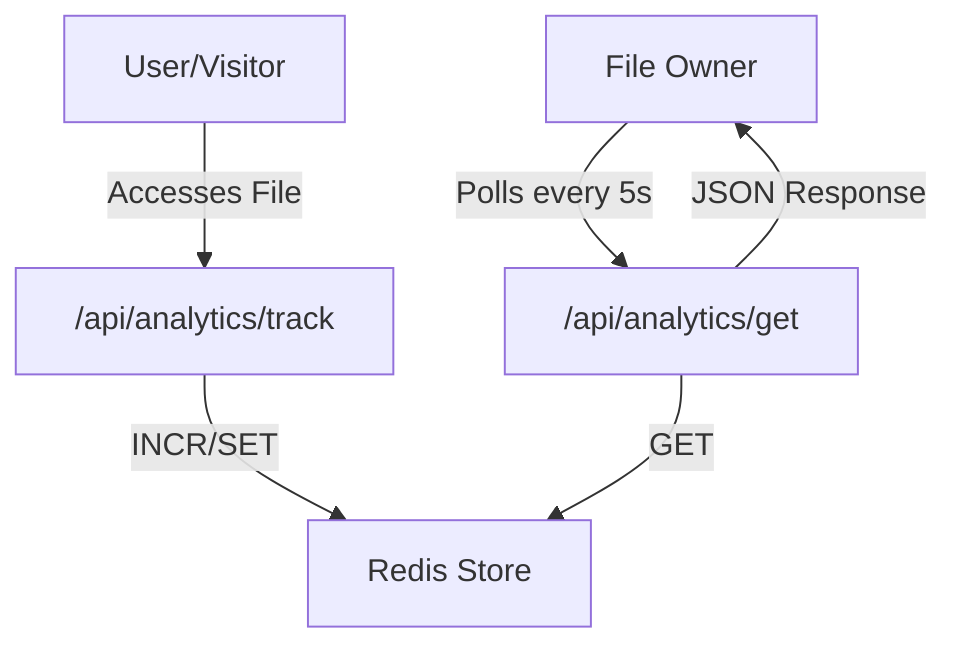

# Analytics Engine

The Analytics Engine in Track-Vault provides real-time monitoring of file interactions. By leveraging a high-performance Redis backend, the system tracks views and downloads with minimal latency, providing users with immediate insights into how their shared files are being accessed.

## System Architecture

The analytics flow operates on a decoupled event-based system where client-side interactions trigger API updates, which are then persisted in Redis and polled by the management dashboard.

## Tracking Mechanism

Tracking is handled via a dedicated POST endpoint that manages three specific metrics for every file ID.

### `POST /api/analytics/track`

When a file is accessed or downloaded, the system sends a request containing the `id` and the `type` of interaction.

**Logic Flow:**
1. **Validation**: Ensures `id` and `type` are present in the request body.
2. **Conditional Increment**: 
   - If `type === 'view'`, the key `file:${id}:views` is incremented.
   - If `type === 'download'`, the key `file:${id}:downloads` is incremented.
3. **Timestamp Update**: The `file:${id}:lastAccess` key is updated to the current `Date.now()` regardless of the interaction type.

## Data Retrieval

The retrieval system is optimized for speed using `Promise.all` to fetch multiple Redis keys concurrently, reducing the total round-trip time to the database.

### `GET /api/analytics/get`

This endpoint accepts a query parameter `id` and returns the current state of the file's metrics.

**Data Transformation:**
- **Numeric Conversion**: Redis stores values as strings; the engine casts `views` and `downloads` to `Number`.
- **Date Formatting**: The `lastAccess` timestamp is converted from a Unix epoch to an ISO string for frontend compatibility.

## Management Controls

The frontend implementation consists of two primary components: `Analytics` and `Preview`.

### Real-time Dashboard (`Analytics.jsx`)
The dashboard provides a live view of file performance through the following features:
- **Polling Mechanism**: A `setInterval` hook fetches updated data from `/api/analytics/get` every 5 seconds, ensuring the UI stays synchronized without requiring a page refresh.
- **Public URL Management**: A utility function generates a shareable link combining the origin and file ID, which can be copied to the clipboard along with the file password.
- **State Management**: Local state handles the transition from raw API data to human-readable localized date strings.

### Content Preview (`Preview.jsx`)
To enhance the management experience, the engine includes a conditional rendering system based on MIME types:

| MIME Type | Preview Method |
| :--- | :--- |
| `image/*` | Rendered via `` tag |
| `application/pdf` | Rendered via `<iframe>` |
| `text/*` | External link to raw text |
| Other | "No preview available" fallback |

## API Reference

| Endpoint | Method | Payload | Description |
| :--- | :--- | :--- | :--- |
| `/api/analytics/track` | `POST` | `{ id, type }` | Increments view/download counts and updates access time. |
| `/api/analytics/get` | `GET` | `?id={id}` | Retrieves current analytics for a specific file. |