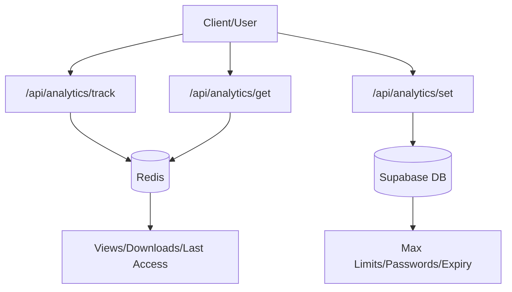

# Analytics System

The Analytics System in Track-Vault provides real-time tracking of file interactions and management of access constraints. To ensure high performance and low latency, the system employs a hybrid storage strategy: **Redis** is used for volatile, high-frequency counter increments, while **Supabase (PostgreSQL)** manages persistent access configurations.

## Architecture Overview

The system separates the "tracking" of events from the "configuration" of file limits.



## API Reference

### 1. Track Event
Increments usage counters and updates the last access timestamp.

- **Endpoint:** `POST /api/analytics/track`
- **Storage:** Redis
- **Payload:**
  ```json
  {
    "id": "file_id_here",
    "type": "view" | "download"
  }
  ```
- **Logic:**
  - Uses `redis.incr` to atomically increment the specific metric (`file:{id}:views` or `file:{id}:downloads`).
  - Updates the `file:{id}:lastAccess` key with the current epoch timestamp (`Date.now()`) on every request.

### 2. Retrieve Analytics
Fetches the current statistics for a specific vault file.

- **Endpoint:** `GET /api/analytics/get?id={id}`
- **Storage:** Redis
- **Response:**
  ```json
  {
    "views": 120,
    "downloads": 45,
    "lastAccess": "2023-10-27T10:00:00.000Z"
  }
  ```
- **Implementation Detail:** The system utilizes `Promise.all` to fetch `views`, `downloads`, and `lastAccess` concurrently, minimizing API response time.

### 3. Configure Access Controls
Updates the rules governing how a file is accessed and when it should be deleted.

- **Endpoint:** `POST /api/analytics/set`
- **Storage:** Supabase
- **Payload:**
  ```json
  {
    "file_id": "uuid",
    "maxViews": 100,
    "maxDownloads": 50,
    "expiresAt": "ISO_DATE",
    "password": "secure_password",
    "deleteOnExpire": true,
    "deleteOnLimit": true
  }
  ```
- **Logic:** Performs a partial update on the `files` table in Supabase. It dynamically builds an `updateData` object to ensure only provided fields are modified, preserving existing settings for omitted parameters.

## Data Mapping

| Metric/Setting | Storage | Key/Column | Type |
| :--- | :--- | :--- | :--- |
| Total Views | Redis | `file:{id}:views` | Integer |
| Total Downloads | Redis | `file:${id}:downloads` | Integer |
| Last Accessed | Redis | `file:${id}:lastAccess` | Timestamp |
| Max Views | Supabase | `max_views` | Integer |
| Max Downloads | Supabase | `max_downloads` | Integer |
| Expiry Date | Supabase | `expires_at` | Timestamp |
| File Password | Supabase | `file_password` | String |
| Auto-Delete (Expire) | Supabase | `delete_on_expire` | Boolean |
| Auto-Delete (Limit) | Supabase | `delete_on_limit` | Boolean |