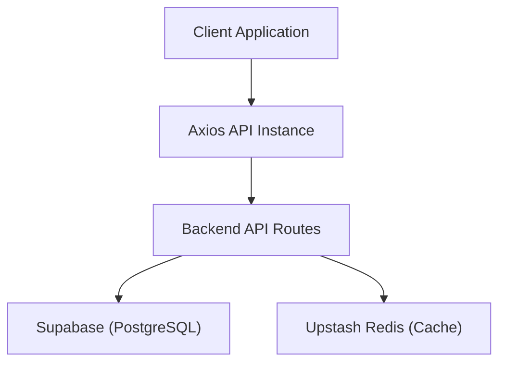

# Data Infrastructure

Track-Vault utilizes a modern, decoupled data layer designed for scalability and low-latency access. The architecture separates persistent relational data from transient cached data, orchestrated via a centralized API client.

## System Architecture

The following diagram illustrates the data flow between the client application and the infrastructure providers.



## Database Management (Supabase)

The primary data store is managed via **Supabase**, providing a PostgreSQL database with real-time capabilities and built-in authentication.

The integration is initialized in `src/lib/supabase.js` using the `@supabase/supabase-js` client. This client allows the application to perform CRUD operations directly or via server-side functions.

```javascript
import { createClient } from '@supabase/supabase-js'

export const supabase = createClient(
  process.env.NEXT_PUBLIC_SUPABASE_URL,
  process.env.NEXT_PUBLIC_SUPABASE_ANON_KEY
)
```

**Key Configuration:**
- `NEXT_PUBLIC_SUPABASE_URL`: The unique endpoint for the project.
- `NEXT_PUBLIC_SUPABASE_ANON_KEY`: The public API key for client-side requests.

## Caching Layer (Redis)

To optimize performance and reduce database load for frequently accessed data, Track-Vault implements **Upstash Redis**. This serverless Redis instance provides fast key-value storage.

The client is configured in `src/lib/redis.js` using the `@upstash/redis` SDK:

```javascript
import { Redis } from "@upstash/redis";

export const redis = new Redis({
  url: process.env.UPSTASH_REDIS_REST_URL,
  token: process.env.UPSTASH_REDIS_REST_TOKEN,
});
```

**Use Cases:**
- Session management.
- Caching heavy query results.
- Rate limiting for API endpoints.

## API Communication (Axios)

The application uses a pre-configured **Axios** instance to standardize network requests. This ensures consistent base URLs and credential handling across all service calls.

Defined in `src/lib/axios.js`:

```javascript
import axios from "axios";

const api = axios.create({
  baseURL: process.env.NEXT_PUBLIC_API_URL || "http://localhost:3000/api",
  withCredentials: true,
});

export default api;
```

### Communication Standards
- **Base URL**: Defaults to `http://localhost:3000/api` unless `NEXT_PUBLIC_API_URL` is provided.
- **Credentials**: `withCredentials: true` is enabled to support cookie-based authentication and secure session handling.