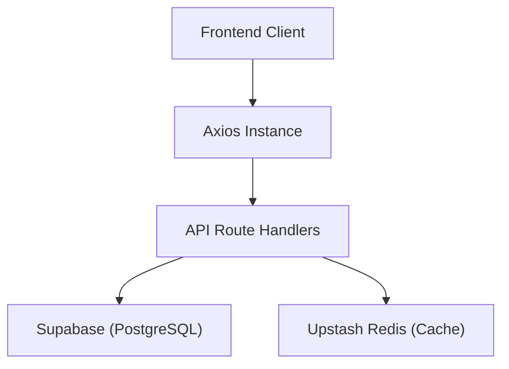

# Infrastructure and Data Layer

The Track-Vault data layer is designed for high availability and low latency, utilizing a hybrid approach that combines a persistent relational database, a distributed cache, and a standardized HTTP client for API communication.

## Architecture Overview

The system follows a layered data access pattern where the frontend communicates via a configured Axios instance to the backend, which then orchestrates data between the persistent store (Supabase) and the caching layer (Redis).



## Component Integration

### 1. Supabase (Persistence Layer)
Supabase serves as the primary backend-as-a-service, providing a PostgreSQL database and authentication. The client is initialized in `src/lib/supabase.js` to allow both client-side and server-side interactions.

```javascript
import { createClient } from '@supabase/supabase-js'

export const supabase = createClient(
  process.env.NEXT_PUBLIC_SUPABASE_URL,
  process.env.NEXT_PUBLIC_SUPABASE_ANON_KEY
)
```

### 2. Upstash Redis (Caching Layer)
To reduce database load and decrease response times for frequently accessed data, Track-Vault integrates Upstash Redis. This is particularly useful for session management, rate limiting, or caching heavy query results.

```javascript
import { Redis } from "@upstash/redis";

export const redis = new Redis({
  url: process.env.UPSTASH_REDIS_REST_URL,
  token: process.env.UPSTASH_REDIS_REST_TOKEN,
});
```

### 3. Axios (Communication Layer)
A centralized Axios instance is used to standardize all outgoing API requests. This ensures consistent base URLs and allows for the global configuration of credentials (cookies/auth headers).

```javascript
import axios from "axios";

const api = axios.create({
  baseURL: process.env.NEXT_PUBLIC_API_URL || "http://localhost:3000/api",
  withCredentials: true, // Ensures cookies are sent with requests
});

export default api;
```

## Environment Configuration

To ensure the infrastructure initializes correctly, the following environment variables must be defined in your `.env.local` file:

| Variable | Source | Description |
| :--- | :--- | :--- |
| `NEXT_PUBLIC_SUPABASE_URL` | Supabase Dashboard | The unique URL for your Supabase project. |
| `NEXT_PUBLIC_SUPABASE_ANON_KEY` | Supabase Dashboard | The anonymous key for client-side access. |
| `UPSTASH_REDIS_REST_URL` | Upstash Console | The REST endpoint for your Redis database. |
| `UPSTASH_REDIS_REST_TOKEN` | Upstash Console | The authentication token for Redis access. |
| `NEXT_PUBLIC_API_URL` | Deployment Env | The base URL for the API endpoints. |