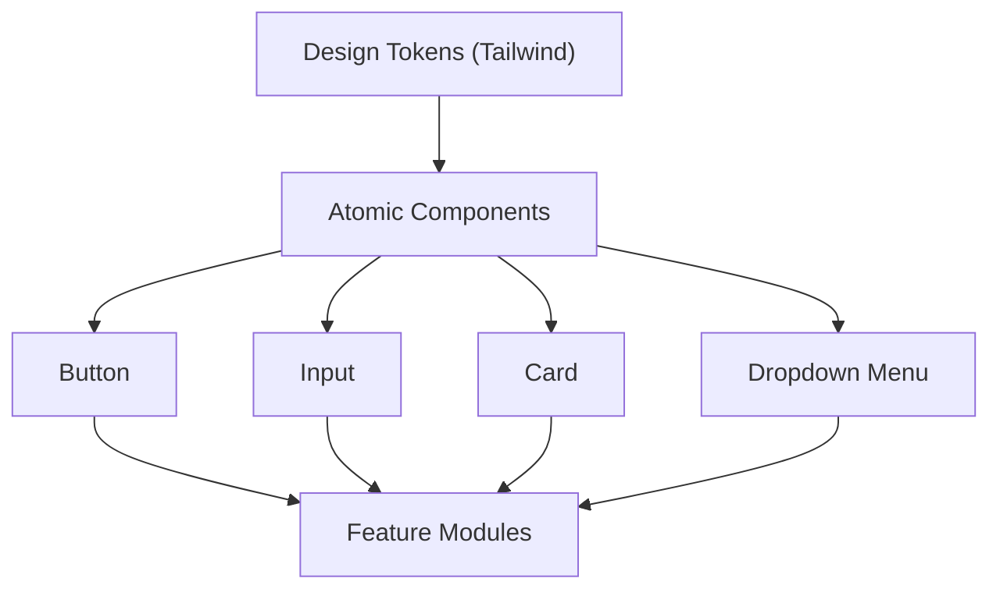

# Shared Component Library

The Shared Component Library provides a set of atomic, reusable UI components designed for consistency, accessibility, and rapid development. Built using **Radix UI** primitives and styled with **Tailwind CSS**, these components follow a strict design system to ensure a unified look and feel across the Track-Vault application.

## Architecture Overview

The library follows an atomic design pattern where small, single-responsibility components are composed to create complex interfaces.



---

## Components

### Button
A versatile button component that supports multiple visual styles and sizes. It utilizes `class-variance-authority` (CVA) for type-safe styling.

#### Props
| Prop | Type | Default | Description |
| :--- | :--- | :--- | :--- |
| `variant` | `default` \| `destructive` \| `outline` \| `secondary` \| `ghost` \| `link` | `default` | The visual style of the button |
| `size` | `default` \| `sm` \| `lg` \| `icon` | `default` | The size of the button |
| `asChild` | `boolean` | `false` | If true, the component will merge its props onto its immediate child (via Radix Slot) |

#### Usage
```jsx
import { Button } from "@/components/ui/button"

export default function Example() {
  return (
    <div className="flex gap-2">
      <Button variant="default">Click Me</Button>
      <Button variant="destructive" size="sm">Delete</Button>
      <Button variant="outline" asChild>
        <a href="/settings">Settings</a>
      </Button>
    </div>
  )
}
```

---

### Input
A styled text input wrapper that provides consistent focus states and validation styling.

#### Props
| Prop | Type | Description |
| :--- | :--- | :--- |
| `type` | `string` | Standard HTML input types (e.g., `text`, `password`, `email`) |
| `className` | `string` | Additional Tailwind classes for custom styling |

#### Usage
```jsx
import { Input } from "@/components/ui/input"

export default function Example() {
  return (
    <div className="grid w-full max-w-sm items-center gap-1.5">
      <Input type="email" placeholder="Email" />
    </div>
  )
}
```

---

### Card
A flexible container for grouping related content. The Card is broken down into several sub-components to allow for precise layout control.

#### Component Hierarchy
- `Card`: The main container.
- `CardHeader`: Top section for titles and descriptions.
- `CardTitle`: The primary heading of the card.
- `CardDescription`: Supporting text below the title.
- `CardAction`: Positioned in the top-right of the header.
- `CardContent`: The main body of the card.
- `CardFooter`: The bottom section for primary actions.

#### Usage
```jsx
import { 
  Card, CardHeader, CardTitle, CardDescription, 
  CardContent, CardFooter, CardAction 
} from "@/components/ui/card"
import { Button } from "@/components/ui/button"

export default function Example() {
  return (
    <Card>
      <CardHeader>
        <CardTitle>Account Balance</CardTitle>
        <CardDescription>Your current vault total</CardDescription>
        <CardAction>
          <Button size="sm">Refresh</Button>
        </CardAction>
      </CardHeader>
      <CardContent>
        <p className="text-2xl font-bold">$12,450.00</p>
      </CardContent>
      <CardFooter>
        <Button variant="outline" className="w-full">View Details</Button>
      </CardFooter>
    </Card>
  )
}
```

---

### Dropdown Menu
An accessible dropdown menu based on Radix UI, supporting nested sub-menus, checkboxes, and radio groups.

#### Component Structure
- `DropdownMenu`: Root provider.
- `DropdownMenuTrigger`: The element that opens the menu.
- `DropdownMenuContent`: The wrapper for the menu items.
- `DropdownMenuItem`: A clickable menu option.
- `DropdownMenuCheckboxItem`: An item with a toggleable check state.
- `DropdownMenuRadioItem`: A single-selection item within a `DropdownMenuRadioGroup`.
- `DropdownMenuSeparator`: A visual divider.
- `DropdownMenuSub`: Wrapper for nested menus.

#### Usage
```jsx
import {
  DropdownMenu, DropdownMenuTrigger, DropdownMenuContent,
  DropdownMenuItem, DropdownMenuSeparator, DropdownMenuLabel
} from "@/components/ui/dropdown-menu"

export default function Example() {
  return (
    <DropdownMenu>
      <DropdownMenuTrigger asChild>
        <button>Open Menu</button>
      </DropdownMenuTrigger>
      <DropdownMenuContent>
        <DropdownMenuLabel>My Account</DropdownMenuLabel>
        <DropdownMenuSeparator />
        <DropdownMenuItem>Profile</DropdownMenuItem>
        <DropdownMenuItem>Billing</DropdownMenuItem>
        <DropdownMenuSeparator />
        <DropdownMenuItem variant="destructive">Log out</DropdownMenuItem>
      </DropdownMenuContent>
    </DropdownMenu>
  )
}