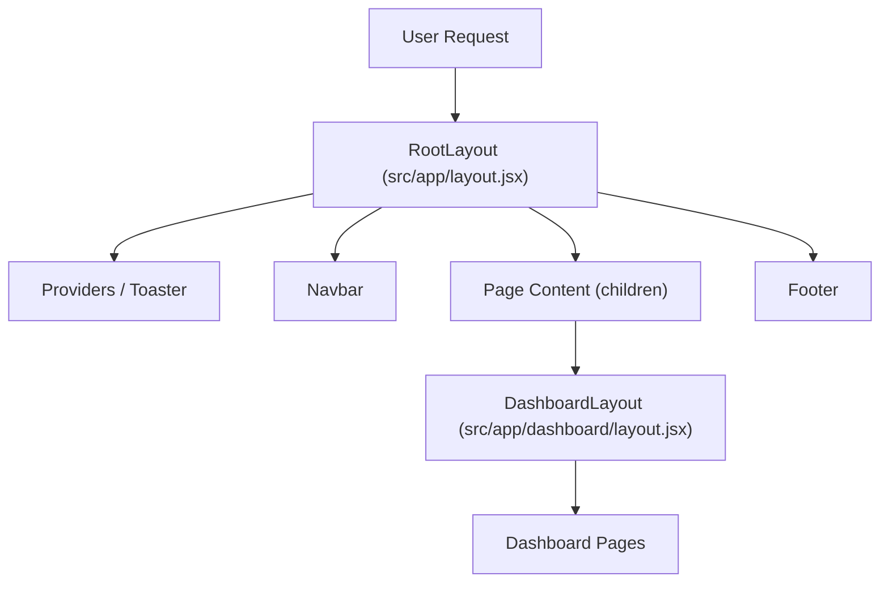

# Frontend Architecture

Track Vault is built on **Next.js 14+** utilizing the **App Router**, providing a highly performant, server-first rendering architecture. The frontend is designed with a modular component strategy, leveraging Tailwind CSS for styling and Kinde for identity management.

## Application Structure

The project follows a hierarchical layout pattern to ensure consistent UI across different user states (guest vs. authenticated).

## Layout Hierarchy

### Root Layout
The `RootLayout` serves as the primary entry point for all pages. It manages global configurations, fonts, and high-level wrappers.

- **Providers**: Wraps the application in necessary context providers for state management and authentication.
- **Global UI**: Integrates the `Navbar` and `Footer` globally, ensuring navigation is always accessible.
- **Styling**: Uses the `Inter` font and a custom `cn` utility to handle conditional Tailwind classes for a consistent theme (`bg-background`).

### Dashboard Layout
The `DashboardLayout` provides a dedicated wrapper for authenticated user views. This allows for specific dashboard-only sidebars or styles to be implemented without affecting the public-facing landing pages.

## Navigation & Authentication Flow

The `Navbar` component is a **Server Component** that dynamically adjusts based on the user's authentication state using `getKindeServerSession`.

| User State | Navigation Links | Primary Action |
| :--- | :--- | :--- |
| **Guest** | About | Login Button |
| **Authenticated** | Your Files, Dashboard | Logout Button + User Avatar |

The logic utilizes `isAuthenticated()` to toggle between public and private views, ensuring that sensitive navigation links (like `/uploadedfiles`) are only visible to logged-in users.

## UI Component System

Track Vault employs an atomic design pattern for UI components, focusing on reusability and accessibility.

### The Card Component
The `Card` system is a composite component used to encapsulate content sections. It is split into several sub-components to allow maximum flexibility in layout:

- `<Card>`: The main container with border and shadow.
- `<CardHeader>`: Top section for titles and descriptions.
- `<CardTitle>`: Semantically bold heading.
- `<CardDescription>`: Muted text for supplementary info.
- `<CardContent>`: The primary body area.
- `<CardFooter>`: Bottom section for actions or metadata.

**Implementation Detail:** The components use the `cn` utility to merge default styles with custom `className` props, enabling developers to override styles on a per-instance basis without breaking the base design.

## Technical Stack Summary

- **Framework**: Next.js (App Router)
- **Styling**: Tailwind CSS
- **Authentication**: Kinde Auth
- **UI Pattern**: Composite Components (Slot-based)
- **Notification System**: Sonner (Toaster)