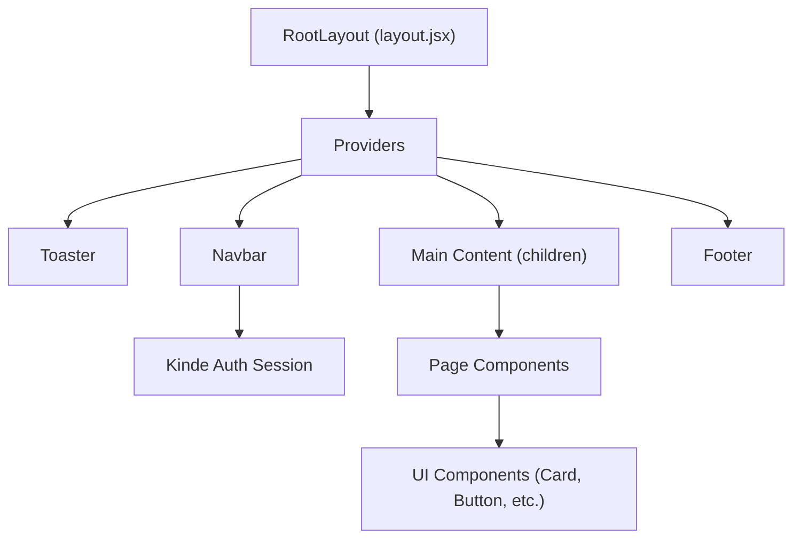

# Frontend Architecture

Track Vault utilizes a modern frontend stack built on **Next.js 14+ (App Router)**, **Tailwind CSS**, and **Kinde Auth**. The architecture follows a modular pattern, separating global layout concerns from atomic UI components to ensure scalability and maintainability.

## UI Structure

The application is organized into a hierarchical structure where the root layout defines the global shell, and page-specific content is injected dynamically.

### Root Layout
The `RootLayout` serves as the entry point for the application. It manages:
- **Global State**: Wrapped in a `<Providers>` component to handle context and authentication.
- **Metadata**: SEO configuration for the secure file sharing platform.
- **Typography**: Implementation of the `Inter` font for a clean, professional aesthetic.
- **Global Shell**: A flexbox column layout that ensures the footer stays at the bottom (`min-h-screen flex flex-col`).

### Navigation System
The `Navbar` is implemented as a **Server Component**, allowing it to handle authentication checks directly on the server using `getKindeServerSession`. This prevents "flicker" during client-side hydration. It dynamically renders:
- **Guest View**: Links to "About" and a "Login" button.
- **Authenticated View**: Access to "Your Files," user profile avatars, and a logout trigger.

## Shared Components

The project employs an atomic design philosophy, separating high-level layout components from low-level UI primitives.

### Atomic UI Components
Components like `Card` are built to be highly composable. Instead of a single monolithic component, the system provides fragmented pieces:
- `Card`: The primary container.
- `CardHeader`, `CardTitle`, `CardDescription`: For structured top-sections.
- `CardContent`: The main body of the card.
- `CardFooter`: For action buttons or metadata.

These components utilize a `cn()` utility function (likely combining `clsx` and `tailwind-merge`) to allow developers to override styles via props without causing CSS class conflicts.

## Global Styling System

The styling system is powered by **Tailwind CSS** with a heavy emphasis on CSS variables for theme consistency and accessibility.

### OKLCH Color Space
Unlike standard RGB or HEX, Track Vault uses the **OKLCH** color space in `globals.css`. This provides:
- **Perceptual Uniformity**: Colors maintain consistent brightness across different hues.
- **Better Dark Mode**: Seamless transitions between light and dark palettes by adjusting lightness and chroma.

### Theming Implementation
The system defines a comprehensive set of semantic tokens:

| Token | Purpose |
| :--- | :--- |
| `--background` | The primary page background |
| `--foreground` | Default text color |
| `--primary` | Primary brand actions and highlights |
| `--muted` | De-emphasized text and backgrounds |
| `--destructive` | Error states and logout actions |
| `--border` | Subtle separators and component outlines |

### Dark Mode Support
Dark mode is implemented using a `.dark` class selector. When applied to the root element, the CSS variables are redefined to shift from light-based OKLCH values to dark-based counterparts, ensuring a native-feeling dark theme across the entire UI.