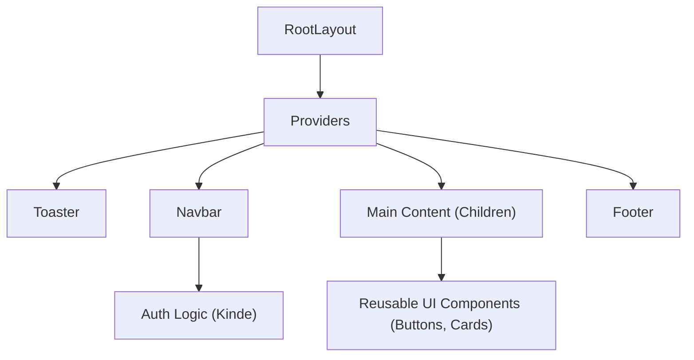

# Frontend & UI Components

Track Vault utilizes a modern frontend stack built with **Next.js**, **Tailwind CSS**, and **Radix UI**. The architecture focuses on a modular component-based design, ensuring consistency across the application through a set of reusable atomic UI components.

## UI Architecture Overview

The frontend is structured as a hierarchical tree where a root layout provides global context and shared navigation, wrapping page-specific content.



## Layout Structure

The application entry point is defined in `src/app/layout.jsx`. This file establishes the global HTML structure and integrates essential wrappers:

- **Providers**: Wraps the application to provide necessary global contexts.
- **Toaster**: Integrated via `sonner` for non-blocking, high-performance notifications.
- **Global Styling**: Implements the `Inter` font family and a `min-h-screen` flexbox layout to ensure the footer remains pinned to the bottom.

## Navigation System

The `Navbar` is a server-side component that dynamically adjusts based on the user's authentication state using `@kinde-oss/kinde-auth-nextjs`.

### Auth-Driven Rendering
- **Unauthenticated State**: Displays the application branding, an "About" link, and a "Login" button.
- **Authenticated State**: Displays the branding (linking to `/dashboard`), a "Your Files" navigation link, the user's profile avatar (fetched from Kinde), and a "Logout" button.

The Navbar utilizes a floating design with `backdrop-blur-lg` and a semi-transparent border to maintain visibility across different page backgrounds.

## Reusable UI Components

The project follows a "Headless UI" pattern, leveraging `class-variance-authority` (CVA) for styling variants and `radix-ui` for accessibility.

### Button Component
The `Button` component is a highly flexible primitive supporting multiple visual styles and sizes.

| Variant | Use Case | Styling |
| :--- | :--- | :--- |
| `default` | Primary actions | Primary background, high contrast |
| `destructive` | Deletion or warnings | Red background, white text |
| `outline` | Secondary actions | Bordered, transparent background |
| `secondary` | Neutral actions | Subtle background shift |
| `ghost` | Low-emphasis actions | No background until hover |
| `link` | Inline navigation | Underlined text |

**Key Feature**: It uses the `Slot` component from Radix UI via the `asChild` prop, allowing the button to be rendered as a different HTML element (like a `Link`) while maintaining button styling.

### Card Component
The `Card` system uses a compositional pattern, allowing developers to build complex layouts by nesting specialized sub-components:

- `<Card>`: The main container with border and shadow.
- `<CardHeader>`: Top section for titles and descriptions.
- `<CardTitle>`: Bold heading for the card.
- `<CardDescription>`: Muted text for supplementary information.
- `<CardContent>`: The primary body area for main data/forms.
- `<CardFooter>`: Bottom section for action buttons.
- `<CardAction>`: Specifically positioned for top-right aligned actions.

## Styling Utility

The project uses a utility function `cn()` (likely a wrapper around `clsx` and `tailwind-merge`) to handle conditional class merging without style conflicts:

```javascript
// Example usage in components
className={cn("base-styles", condition && "conditional-styles", className)}