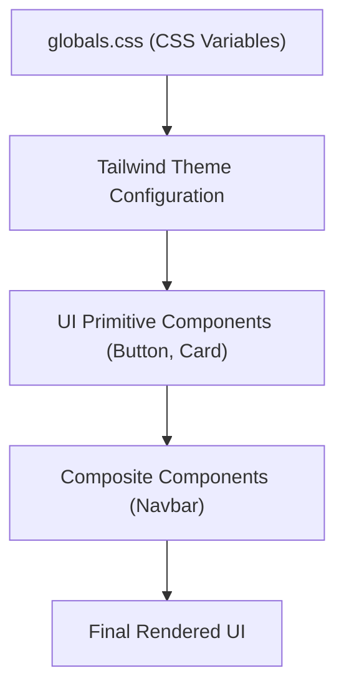

# UI Components and Styling

Track Vault employs a modern, scalable design system built on **Tailwind CSS**, **Radix UI**, and **class-variance-authority (CVA)**. The styling architecture is designed for high accessibility, consistent spacing, and seamless theme switching between light and dark modes.

## Design System Architecture

The visual foundation of the application relies on a CSS variable-driven theme. Instead of hard-coding colors, the system uses **OKLCH** color spaces for better perceptual uniformity and wider gamut support.

### Global Styles and Theming

Global styles are managed in `src/styles/globals.css`. The system utilizes a custom theme block that maps CSS variables to Tailwind utility classes.

- **Color Palette**: Uses `oklch` for high-precision color control.
- **Theming**: A `.dark` class toggle shifts the root variables from light to dark values.
- **Border Radius**: A centralized `--radius` variable ensures consistency across all cards, buttons, and inputs.

## Shared UI Components

The application follows a "primitive-first" approach, creating low-level components in `src/components/ui/` that are then composed into larger features.

### Button Component
The `Button` component is a highly flexible primitive using `class-variance-authority` to handle multiple visual states.

**Key Features:**
- **Polymorphism**: Uses the `asChild` prop via Radix UI's `Slot` to allow the button to render as a different element (e.g., a Next.js `Link`) while maintaining button styles.
- **Variants**:
  - `default`: Primary brand action.
  - `destructive`: Error or delete actions.
  - `outline`: Subtle boundaries.
  - `secondary`: De-emphasized actions.
  - `ghost`: Minimalist interaction.
  - `link`: Text-based navigation.
- **Sizing**: Supports `sm`, `default`, `lg`, and `icon` sizes.

### Card Component
The `Card` system uses a compound component pattern, allowing developers to pick and choose which sections of the card to render.

| Component | Description |
| :--- | :--- |
| `Card` | The main container with background and border. |
| `CardHeader` | Top section for titles and descriptions. |
| `CardTitle` | Bolded heading for the card content. |
| `CardDescription` | Muted sub-text for additional context. |
| `CardContent` | The primary body area of the card. |
| `CardFooter` | Bottom section for action buttons. |
| `CardAction` | A specialized slot for positioning elements in the header. |

## Layout Components

### Navbar
The `Navbar` is a server-side component that integrates authentication state with the design system.

**Implementation Details:**
- **Visuals**: Uses `backdrop-blur-lg` and `border-border/40` to create a modern, frosted-glass effect.
- **Logic**: Dynamically renders content based on the `isAuthenticated` state from Kinde Auth.
- **Integration**: Combines the `Button` primitive and `Avatar` components to provide a cohesive user identity experience in the header.

## Styling Guidelines

To maintain consistency when adding new components, follow these patterns:

1. **Utility First**: Use Tailwind classes for layout and spacing.
2. **Theme Variables**: Always use `text-foreground`, `bg-background`, or `border-border` instead of specific hex codes to ensure dark mode compatibility.
3. **Composition**: Create small, reusable primitives in `src/components/ui/` before building complex features.
4. **Transitions**: Use `transition-colors` or `transition-all` on interactive elements to ensure smooth UI state changes.