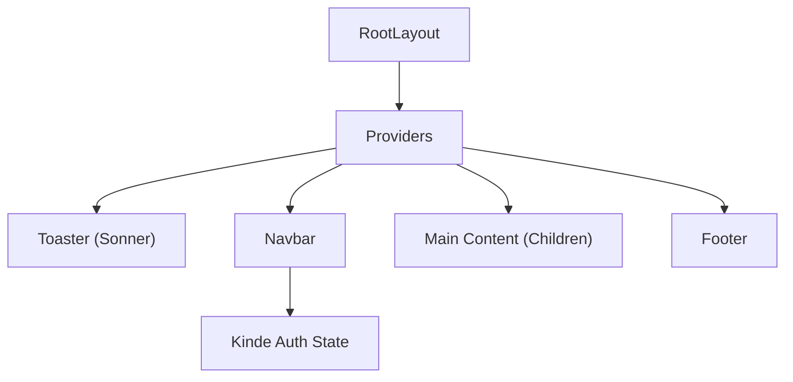

# UI Framework

The Track Vault UI framework is built on a modern stack leveraging **Next.js**, **Tailwind CSS**, and a custom design system based on the **OKLCH** color space to ensure high accessibility and visual consistency across light and dark modes.

## Architecture Overview

The UI is structured as a hierarchical shell where the `RootLayout` serves as the entry point, injecting global providers and shared navigation elements across all pages.



## Design System

### Styling Strategy
The application utilizes a CSS-variable driven theme defined in `globals.css`. Instead of standard RGB or HSL, it employs **OKLCH**, which provides more uniform perceived brightness across different hues.

- **Theming**: Implemented via `@theme inline` in Tailwind CSS.
- **Dark Mode**: Handled via a `.dark` class selector that overrides the root CSS variables.
- **Dynamic Radius**: A tiered rounding system (`--radius-sm` to `--radius-xl`) ensures consistent curvature across all UI elements.

### Color Palette
The system uses semantic naming for colors to decouple the visual value from its purpose:

| Variable | Purpose | Description |
| :--- | :--- | :--- |
| `--primary` | Brand Identity | Main action color for buttons and links. |
| `--background` | Page Surface | The base background color of the application. |
| `--muted` | Subtle Elements | Used for secondary text and disabled-state backgrounds. |
| `--destructive` | Error/Danger | Used for logout actions and critical warnings. |
| `--border` | Dividers | Subtle lines used for layout separation. |

## Core Components

### Root Layout (`layout.jsx`)
The root layout defines the HTML document structure and manages global state providers. It implements:
- **Font Optimization**: Uses `next/font/google` (Inter) for consistent typography.
- **Layout Shell**: A flexbox column layout ensuring the footer stays at the bottom of the viewport via `flex-1` on the main content area.
- **Providers**: Wraps the application in a `Providers` component to handle context and a `Toaster` for real-time notifications.

### Navigation (`Navbar.jsx`)
The Navbar is an asynchronous server component that integrates directly with **Kinde Auth** to provide a dynamic user experience.

- **Conditional Rendering**:
    - **Unauthenticated**: Displays "About" and "Login" buttons.
    - **Authenticated**: Displays "Your Files," the user's avatar (with fallback initials), and a "Logout" button.
- **Visual Style**: Features a `backdrop-blur-lg` effect with a floating rounded-full border for a modern, "glassmorphic" appearance.

### Footer (`Footer.jsx`)
A lightweight, responsive component that provides:
- **Dynamic Dating**: Automatically updates the copyright year.
- **External Links**: Direct integration with the project's GitHub repository.
- **Consistency**: Uses `border-t border-border/40` to blend seamlessly with the page background.

## Utility Integration

The framework uses a `cn` (class name) utility function based on `clsx` and `tailwind-merge`. This allows for conditional class application without style conflicts:

```javascript
// Example usage in layout.jsx
className={cn(
  "min-h-screen flex flex-col bg-background font-sans antialiased",
  inter.className
)}