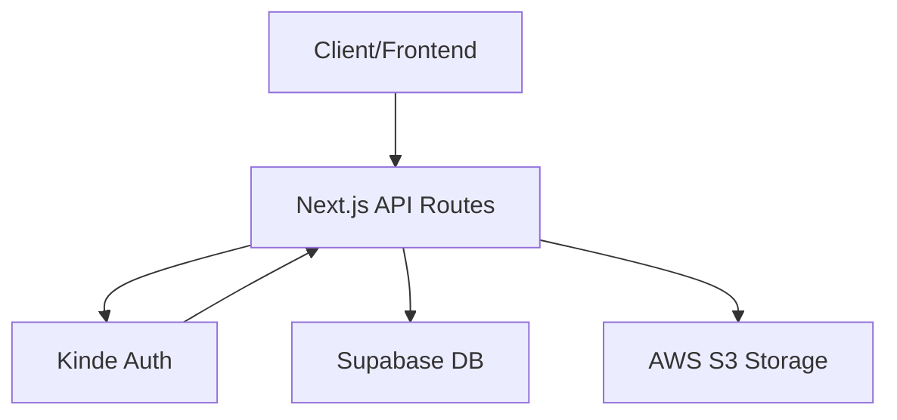

# API Reference

This section provides detailed specifications for the internal API endpoints used by Track-Vault to manage user registration, file lifecycle, and system connectivity tests.

## System Architecture Flow



---

## User Management

### Register User
Syncs the authenticated Kinde session user with the internal Supabase database.

- **Endpoint:** `/api/register`
- **Method:** `POST`
- **Authentication:** Required (Kinde Session)

#### Logic Flow
1. Retrieves the current session via `getKindeServerSession`.
2. Performs an `upsert` operation on the `users` table.
3. Maps `email`, `given_name + family_name`, and `auth_user_id`.

#### Responses
| Status | Description | Payload |
| :--- | :--- | :--- |
| `200 OK` | User synced successfully | User object |

---

## Pipeline & File Management

### Delete Pipeline/File
Removes a file from S3 storage and marks the record as inactive in the database.

- **Endpoint:** `/api/deletepipeline`
- **Method:** `DELETE`
- **Authentication:** Internal/Admin

#### Request Body
```json
{
  "file_id": "string"
}
```

#### Logic Flow
1. **Validation:** Checks if `file_id` is provided.
2. **Lookup:** Fetches `file_key` from Supabase `files` table.
3. **Storage Deletion:** Sends `DeleteObjectCommand` to AWS S3 using the `file_key`.
4. **Database Update:** Updates the record to set `is_active: false` and sets `expires_at` to the current timestamp.

#### Responses
| Status | Description | Payload |
| :--- | :--- | :--- |
| `200 OK` | File deleted and deactivated | `{ "success": true, "message": "..." }` |
| `400 Bad Request` | Missing `file_id` | `{ "success": false, "error": "file_id is required" }` |
| `404 Not Found` | File record not found in DB | `{ "success": false, "error": "File not found" }` |
| `500 Internal Error` | S3 or Database failure | `{ "success": false, "error": "...", "details": "..." }` |

---

## System Testing

### S3 Connectivity Test
Internal utility to verify the pipeline's ability to upload buffers to AWS S3.

- **Endpoint:** `/api/test`
- **Method:** `POST`
- **Content-Type:** `multipart/form-data`

#### Request Body
| Field | Type | Description |
| :--- | :--- | :--- |
| `file` | File | The binary file to be uploaded |

#### Logic Flow
1. Extracts the file from `formData`.
2. Converts the file into an `ArrayBuffer` $\rightarrow$ `Buffer`.
3. Uploads the buffer to the `test/` directory in S3 with a timestamped key.

#### Responses
| Status | Description | Payload |
| :--- | :--- | :--- |
| `200 OK` | Upload successful | `{ "success": true, "url": "s3-link" }` |
| `400 Bad Request` | No file provided | `{ "error": "No file uploaded" }` |
| `500 Internal Error` | AWS SDK failure | `{ "error": "error message" }` |