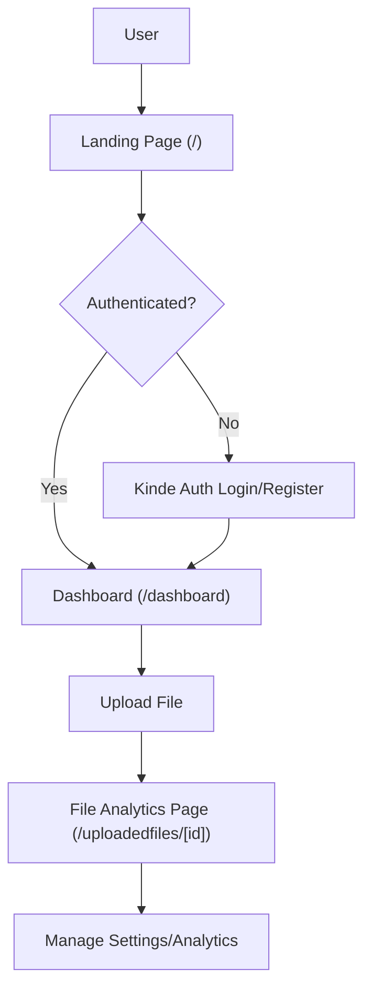

# Application Routing

Track-Vault utilizes the Next.js App Router to manage its file-sharing ecosystem. The routing architecture is designed to separate public landing content from protected user dashboards and dynamic file management views.

## Routing Map

| Path | Component | Description | Access |
| :--- | :--- | :--- | :--- |
| `/` | `Home` | Landing page featuring product value propositions. | Public |
| `/dashboard` | `Dashboard` | Central hub for secure file uploads. | Authenticated |
| `/uploadedfiles/[id]` | `FileAnalyticsPage` | Detailed analytics and settings for a specific file. | Owner Only |

## Navigation Flow

The following diagram illustrates the user journey from the landing page through authentication to file management.

## Route Details

### 1. Root Route (`/`)
The landing page serves as the entry point. It implements a server-side check using `getKindeServerSession`. If a user is already authenticated, they are automatically redirected to the `/dashboard` to reduce friction.

### 2. Dashboard (`/dashboard`)
A client-side route (`"use client"`) that handles the core file upload logic.
- **Functionality**: Integrates with an Axios instance to send `multipart/form-data` to the `/file` endpoint.
- **User Context**: Utilizes `useKindeAuth` to associate uploaded files with the specific `user.id`.
- **Side Effects**: Triggers a `/register` API call on mount to ensure the user is synced with the backend database.

### 3. Dynamic File Route (`/uploadedfiles/[id]`)
This is a dynamic server component used to manage and monitor individual files.
- **Dynamic Segment**: The `[id]` parameter is extracted from the URL to fetch specific file metadata from Supabase.
- **Security**: 
    - Redirects unauthenticated users to the login page.
    - Validates that the `file.user_id` matches the current session's `user.id` to prevent unauthorized access to file analytics.
- **Data Integration**: Combines data from **Supabase** (file metadata) and **Redis** (real-time view/download counts).

## Layout Architecture

The application employs a nested layout strategy defined in `src/app/layout.jsx`:

- **Global Wrapper**: Wraps the entire application in a `Providers` component for state and context management.
- **Shared UI**: The `Navbar` and `Footer` are persisted across all route transitions to maintain a consistent user experience.
- **Notification System**: A global `Toaster` (via `sonner`) is placed at the root level to handle success/error notifications from any route.