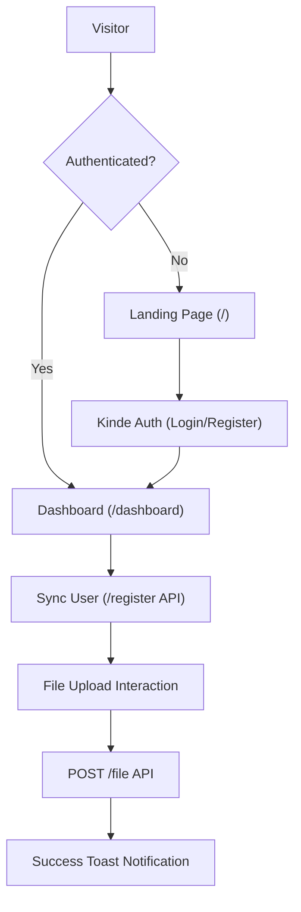

# Dashboard & User Flow

The Track-Vault user journey is designed as a secure pipeline, ensuring that only authenticated users can access the file upload system. The flow transitions from a public-facing landing page to a protected dashboard managed by Kinde Auth.

## User Journey Map

The following diagram illustrates the path a user takes from the initial landing page through authentication to the functional dashboard.

## Detailed Flow Breakdown

### 1. Entry Point: Landing Page
The root route (`src/app/page.jsx`) acts as a gatekeeper. It utilizes server-side session checking via `getKindeServerSession`.

- **Authenticated State**: If a session exists, the user is immediately redirected to `/dashboard` using Next.js `redirect`.
- **Guest State**: The user sees a high-conversion landing page featuring value propositions (Access Control, Analytics, Self-Destruct) and two primary call-to-actions:
    - `LoginLink`: Redirects to the Kinde login portal.
    - `RegisterLink`: Redirects to the Kinde registration portal.

### 2. Authentication Layer
Authentication is handled globally by the `KindeProvider` within `src/components/Provider.jsx`. This provider wraps the application, injecting the necessary `clientId`, `domain`, and `redirectUris` to maintain a secure session across the app.

### 3. Dashboard Initialization
Once the user lands on the `/dashboard` route:

- **Session Retrieval**: The `Dashboard` component uses the `useKindeAuth()` hook to access the current user's profile and unique `id`.
- **User Synchronization**: An `useEffect` hook triggers a `POST` request to the `/register` endpoint. This ensures the authenticated Kinde user is registered or updated within the internal Track-Vault database.

### 4. The File Upload Process
The core functionality of the dashboard is the secure file upload interface.

**The technical sequence is as follows:**
1. **Selection**: The user selects a file via a custom-styled input; the file object is stored in the `file` state.
2. **Validation**: The `handleFileSubmit` function verifies that both a file is selected and a `user.id` is present.
3. **Payload Construction**: The app creates a `FormData` object containing:
   - `file`: The raw binary file.
   - `user_id`: The Kinde unique identifier.
   - `file_name`: The original name of the file.
4. **Transmission**: The payload is sent via an Axios instance (`api.post("/file", ...)`) with the `multipart/form-data` content type.
5. **Feedback**: 
   - **Loading**: The upload button enters a `saving` state, displaying a spinner.
   - **Completion**: Upon success, a `sonner` toast notification confirms the upload, and the file state is reset.

## Implementation Summary

| Component | Responsibility | Key Technology |
| :--- | :--- | :--- |
| `Home` | Session gating & Marketing | `getKindeServerSession` |
| `Providers` | Auth Context | `KindeProvider` |
| `Dashboard` | File orchestration & User Sync | `useKindeAuth`, `FormData` |
| `DashboardLayout` | Structural wrapper | Next.js Layout Pattern |