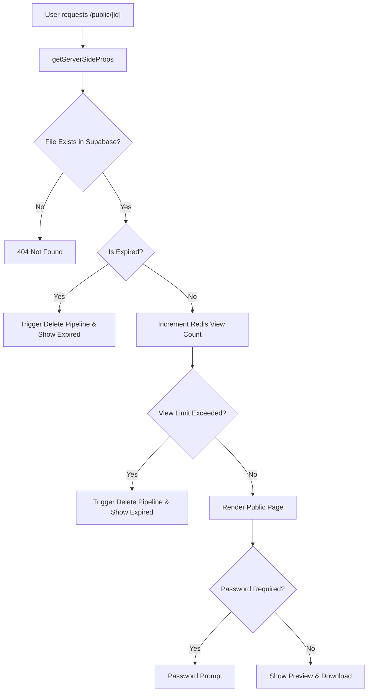

# Public Access and Routing

Track-Vault employs a dual-routing strategy to separate the administrative management of files from the public delivery of assets. This ensures that while file owners have full control over analytics and settings, external users can access shared files via secure, trackable, and conditional links.

## Routing Architecture

The application utilizes two distinct routing patterns based on the access level required:

1.  **Administrative Routing (`/uploadedfiles/[id]`):** A protected route using the Next.js App Router. It requires authentication via Kinde and validates that the authenticated user is the owner of the requested file.
2.  **Public Routing (`/public/[id]`):** An unprotected route using the Next.js Pages Router. This serves as the gateway for external users to view or download shared assets.

## Public Access Lifecycle

When a user accesses a public link, the system executes a series of server-side validations before rendering the page to ensure the file is still available and within its usage limits.

## Access Control Mechanisms

### 1. Temporal Expiration
The system checks the `expires_at` timestamp stored in Supabase. If the current time exceeds this value, the file is marked as expired. If the `delete_on_expire` flag is enabled, the system automatically triggers a deletion pipeline via the `/deletepipeline` API endpoint.

### 2. View Rate Limiting
Track-Vault uses **Redis** to maintain high-performance counters for file access.
- **Increment:** Every request to a public ID triggers `redis.incr(file:[id]:views)`.
- **Limit Validation:** If `max_views` is set, the system compares the current Redis count against the limit.
- **Auto-Deletion:** If `delete_on_limit` is true and the limit is reached, the asset is queued for deletion.

### 3. Password Protection
For files with a `file_password` assigned, the client-side UI intercepts the preview and download actions. The user must provide the correct password, which is validated against the file metadata before the `passwordRequired` state is toggled to false.

## Analytics and Delivery

### View Tracking
Views are tracked server-side within `getServerSideProps` using Redis to ensure that every single hit is recorded before the page is served to the client.

### Download Tracking
Downloads are tracked via a client-side trigger. When a user clicks "Download File," the following sequence occurs:
1. A POST request is sent to `/api/analytics/track` with the type `download`.
2. The API validates if download limits are still available.
3. Upon success, the file is fetched as a blob and triggered for download in the browser.

## Administrative Management

The route `/uploadedfiles/[id]` provides the file owner with a comprehensive dashboard. Unlike the public route, this page:
- **Validates Ownership:** Compares the Kinde session `user.id` with the Supabase `user_id`.
- **Aggregates Data:** Performs a `Promise.all` fetch from Redis to retrieve `views`, `downloads`, and `lastAccess` timestamps.
- **Provides Control:** Allows the owner to modify the settings that govern the public routing behavior (e.g., updating passwords or expiration dates).