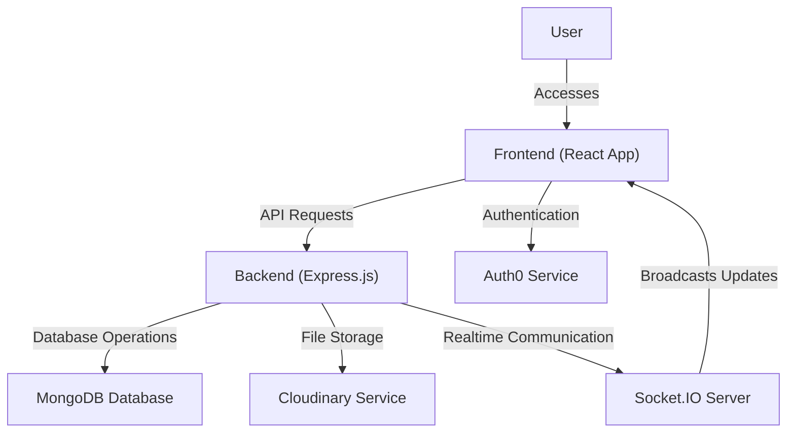

# Local Development Guide

This guide provides comprehensive instructions for setting up and running the White Board Project locally. It covers both the frontend and backend components, detailing environment configuration, dependency installation, and startup procedures for a smooth development experience.

## Prerequisites

Before you begin, ensure you have the following software installed on your system:

*   **Node.js**: Version 18 or higher.
*   **npm** (Node Package Manager): Comes bundled with Node.js.
*   **MongoDB**: A running instance of MongoDB (local or cloud-hosted).
*   **Cloudinary Account**: Required for image and asset management.
*   **Auth0 Account**: Required for user authentication.

## Backend Setup

Follow these steps to set up and run the backend application:

1.  **Navigate to the Backend Directory**:
    Open your terminal or command prompt and change your current directory to the `backend` folder of the project:

    ```bash
    cd backend
    ```

2.  **Install Dependencies**:
    Install all the required Node.js packages as listed in `package-lock.json`:

    ```bash
    npm install
    ```

3.  **Environment Configuration**:
    The backend uses `dotenv` to manage environment variables. Create a `.env` file in the `backend` directory and add the following variables. Replace the placeholder values with your actual credentials:

    ```plaintext
    PORT=8000
    MONGO_URI="your_mongodb_connection_string"
    CLOUDINARY_CLOUD_NAME="your_cloudinary_cloud_name"
    CLOUDINARY_API_KEY="your_cloudinary_api_key"
    CLOUDINARY_API_SECRET="your_cloudinary_api_secret"
    ```

    *   `PORT`: The port on which the backend server will listen.
    *   `MONGO_URI`: Your MongoDB connection string (e.g., `mongodb://localhost:27017/whiteboard-db` or a cloud URI).
    *   `CLOUDINARY_CLOUD_NAME`, `CLOUDINARY_API_KEY`, `CLOUDINARY_API_SECRET`: Your Cloudinary account credentials.

    <details>
    <summary><code>server.js</code> excerpt showing environment variable usage:</summary>

    ```javascript
    import { config } from 'dotenv';
    import express from 'express'
    import cors from 'cors'
    // ... other imports ...

    config(); // This loads variables from .env into process.env
    const P = process.env.port; // Note: there's a typo in the provided code, should be process.env.PORT
    app.use(cors({
        origin: ["http://localhost:5173", "https://collabboard-cyan.vercel.app"],
        credentials: true,
    }));
    // ... rest of the server setup ...
    ```
    </details>

4.  **Start the Backend Server**:
    To start the backend server in development mode (which typically uses `nodemon` for auto-reloading), run:

    ```bash
    npm start
    # Or if a 'dev' script is configured:
    # npm run dev
    ```

    You should see a message indicating the server is running and connected to the database:

    ```bash
    Server is running on 8000
    Connected to MongoDB
    ```

## Frontend Setup

Follow these steps to set up and run the frontend application:

1.  **Navigate to the Frontend Directory**:
    Open a *new* terminal or command prompt and change your current directory to the `frontend` folder of the project:

    ```bash
    cd frontend
    ```

2.  **Install Dependencies**:
    Install all the required Node.js packages as listed in `package-lock.json`:

    ```bash
    npm install
    ```

3.  **Environment Configuration**:
    The frontend uses Auth0 for authentication. Create a `.env.local` file in the `frontend` directory and add the following variables. Replace the placeholder values with your actual Auth0 application credentials:

    ```plaintext
    VITE_AUTH0_DOMAIN="dev-eiqbf3dufeploub7.us.auth0.com"
    VITE_AUTH0_CLIENT_ID="fIIXOxWwmSkOM3N6vrX7Qvt2G88hCbSo"
    # VITE_REDIRECT_URI is dynamically set in main.jsx but a base URL might be needed for specific configurations.
    ```

    <details>
    <summary><code>main.jsx</code> excerpt showing Auth0 configuration:</summary>

    ```jsx
    import { StrictMode } from 'react'
    import { createRoot } from 'react-dom/client'
    import './style/index.css'
    import App from './App.jsx'
    import { Auth0Provider } from '@auth0/auth0-react';

    createRoot(document.getElementById('root')).render(
      <Auth0Provider
        domain="dev-eiqbf3dufeploub7.us.auth0.com" // Use process.env.VITE_AUTH0_DOMAIN in real scenario
        clientId="fIIXOxWwmSkOM3N6vrX7Qvt2G88hCbSo" // Use process.env.VITE_AUTH0_CLIENT_ID in real scenario
        authorizationParams={{
          redirect_uri: window.location.origin + "/dashboard"
        }}
        cacheLocation="localstorage"
        useRefreshTokens={true}
      >
        <StrictMode>
          <App />
        </StrictMode>
      </Auth0Provider>
    )
    ```
    </details>

4.  **Start the Frontend Development Server**:
    To start the frontend application, typically using Vite, run:

    ```bash
    npm run dev
    ```

    The application will usually open in your browser at `http://localhost:5173` (or another port if 5173 is in use).

## Project Architecture Flow

Here's a high-level overview of how the different components interact in your local development environment:





## Key Takeaways

*   Both frontend and backend require separate `npm install` steps and environment variable configurations.
*   Ensure your `.env` files (or `.env.local` for frontend) are correctly populated with credentials for MongoDB, Cloudinary, and Auth0.
*   The backend runs on a specified port (defaulting to `8000` as per `server.js`'s `P` variable, though typically `process.env.PORT` is used).
*   The frontend typically runs on `http://localhost:5173` during development.
*   Cross-Origin Resource Sharing (CORS) is configured on the backend to allow requests from the local frontend development server (`http://localhost:5173`) and the deployed Vercel app.